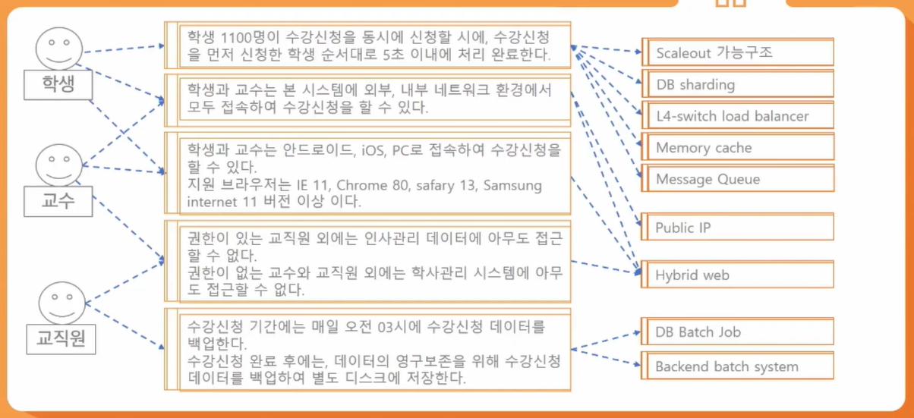
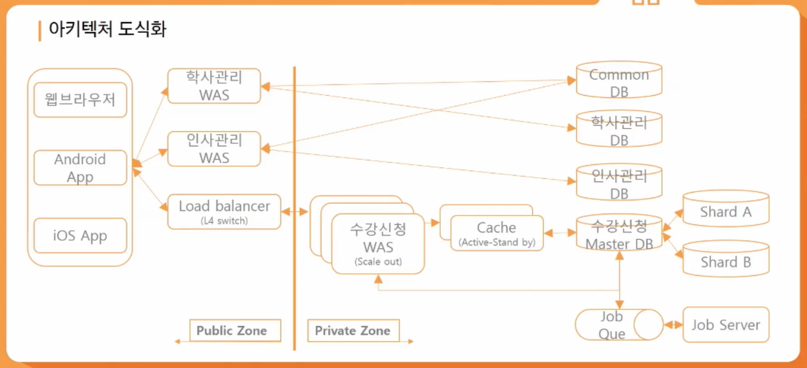

# 아키텍처 그리기

### 개론

#### 어떻게 사용되는가?

- 초기 설계 과정의 결정 사항
  - 구현에 대한 제약사항 검토 및 시스템에 대한 구조 결정
- 커뮤니케이션의 기준점
  - 서비스나 시스템의 이해 당사자들 간의 공통분모
- 재사용 가능한 레퍼런스
  - 아키텍처를 결정 짓게 한, 유사한 요구사항 및 설계 경험의 재사용

#### 이렇게 쓰자!

- 구현 방법에 대한 고도화 전략 수립 및 검토
- Sequence 등 상세 구현 방법 결정 및 도식화의 근거자료
- 팀내 의사결정 내용 Synchronized
- 레퍼런스 축적

### 학사관리 시스템 설계 예시

#### 결정요인 도출

- 이해관계자 선별
  - 학생 
  - 교수
  - 교직원
  - 외부시스템(인사관리 시스템, 학사관리 시스템)
- 기능 요구사항
  - 학사 관리 기능
  - 수업 관리 기능
  - 수강 관리 기능
  - 사용자 관리 기능
- 비기능 요구사항(품질속성)
  - 강의신청 기간에 원활한 진행
  - 언제 어디서나 접근 가능
  - 모바일에서도 접속 가능
  - 권한은 통한 정보 보안
  - 데이터 손실 방지

#### 품질속성을 만족하기 위한 전략

- 스파이크 성 트래픽에 대한 처리, public 환경, 하이브리드 웹
  - 학생 **N명**이 동시 수강신청 시 **순서대로 Y초 이내**에 처리 완료한다
  - 학생과 교수는 시스템에 **외부, 내부** 네트워크 환경에서 **모두 접속**하여 수강신청을 할 수 있다
  - 안드로이드, iOS, PC 접속 가능, 지원브라우저는 IE 11, Chrome 80, ... , 이다 (버전까지 명시)
- 권한을 통한 정보 보안, 주기적 데이터 백업
  - **매일 Z 시**에 수간신청 데이터를 백업한다

### 아키텍처 도식화

### 정리

#### 아키텍처 그리기 순서

> 비기능 요구사항 도출 > 품질속성 시나리오 작성 > 아키텍처 패턴 결정 > 아키텍처 도식화

1. 품질속성을 정확히 정의
2. 품질속성 별로 전략 도출
3. 도출된 전략을 잘 보여 줄 수 있게 도식화
4. 아키텍처 검증(평가)