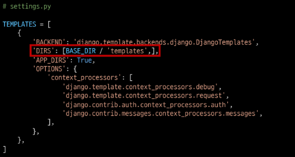

# :sparkles:Django

#### 목차

1. [Django Intro](#1-Intro)

2. [Django 구조 이해하기 (MTV Design Pattern)](#2-Django-구조-이해하기)

3. [Django Quick start](#3-Django-Quick-start)

4. [Django Template](#4-Django-Template)

5. [Sending and Retrieving form data](#5-Sending-and-Retrieving-form-data)

6. [Django URLs](#6-Django-URLs)

7. [마무리](#7-마무리)

## 1. Intro

#### :sparkles:Django를 배워야하는 이유

1. Python으로 작성된 프레임워크

2. 수많은 여러 유용한 기능들

3. 검증된 웹 프레임워크
   
   - 화해, Toss, 두나무, 당근 마켓, 요기요 등

## 2. Django 구조 이해하기

#### :sparkles: Django에서의 디자인 패턴

- Django에 적용된 디자인 패턴은 **MTV 패턴**이다.

- MTV패턴은 **MVC 디자인 패턴**을 기반으로 조금 변형된 패턴이다.

#### :sparkles: MVC 소프트웨어 디자인 패턴

- MVC는 Model - View - Controller의 준말

- 데이터 및 논리 제어를 구현하는데 널리 사용되는 소프트웨어 디자인 패턴

- 하나의 큰 프로그램을 세가지 역할로 구분한 개발 방법론
1. Model : 데이터와 관련된 로직을 관리

2. View : 레이아웃과 화면을 처리

3. Controller : 명령을 model과 view 부분으로 연결

    

| MVC        | MTV      |
|:----------:|:--------:|
| Model      | Model    |
| View       | Template |
| Controller | View     |

#### :sparkles: MTV 디자인 패턴

- Model
  
  - MVC 패턴에서 Model의 역할에 해당
  
  - 데이터와 관련된 로직을 관리
  
  - 응용프로그램의 데이터 구조를 정의하고 데이터베이스의 기록을 관리

- Template
  
  - 레이아웃과 화면을 처리
  
  - 화면상의 사용자 인터페이스 구조와 레이아웃을 정의
  
  - MVC 패턴에서 View의 역할에 해당

- View
  
  - Model & Template과 관련한 로직을 처리해서 응답을 반환
  
  - 클라이언트의 요청에 대해 처리를 분기하는 역할
  
  - 동작 예시
    
    - 데이터가 필요하다면 mode에 접근해서 데이터를 가져오고 가져온 데이터를 template로 보내 화면을 구성하고 구성된 화면을 응답으로 만들어 클라이언트에 반환
  
  - MVC패턴에서 Controller의 역할에 해당


#### :sparkles: 정리

- Django는 MTV 디자인 패턴을 가지고 있음
  
  - Model : 데이터 관련
  
  - Template : 화면 관련
  
  - View : Model & Template 중간 처리 및 응답 반환

## 3. Django Quick start

#### :sparkles: 가상환경 만들기

- 생성 : 바탕화면 Git bash에서 `$ python -m venv [이름]` 명령어 입력

- 접속 : `$ source [이름]/scripts/activate` 로 가상환경 접속

- 해제 : `$ deactivate`로 가상환경 나오기

    

- [참고] 
  
  - Git Bash에서는 가상환경 명령어가 `source`지만 윈도우 터미널에서는 없어도 된다!

#### :sparkles: Django 설치

- Django 4.0 릴리즈로 인해 3.2(LTS) 버전을 명시해서 설치
  
  - `$ pip install django==3.2.13`

- 패키지 목록 생성
  
  - `$ pip freeze > requirement.txt`
    
    - [참고]
      
      - `$ cat requirements.txt` 로 내용 확인
      
      - `$ pip install -r requirements.txt` 로 안쪽 install 가능가능

- [참고] LTS
  
  - Long Term Support (장기 지원 버전)
  
  - 일반적인 경우보다 장기간에 걸쳐 지원하도록 고안된 소프트웨어의 버전
  
  - 컴퓨터 소프트웨어의 제품 수명주기 관리 정책
  
  - 배포자는 LTS 황적을 통해 장기적이고 안정적인 지원을 보장

#### :sparkles: Django Project

- 프로젝트 생성
  
  - `$ django-admin startproject fristpjt .`

- 서버 실행
  
  - `$ python manage.py runserver`

#### :sparkles: 프로젝트 구조

- `__init__.py`
  
  - python에게 이 디렉토리를 하나의 Python 패키지로 다루도록 지시
  
  - 별도로 추가 코드를 작성하지 않음

- `asgi.py`
  
  - Asynchronous Server Gateway Interface
  
  - Django 애플리케이션이 비동기식 웹 서버와 연결 및 소통하는 것을 도움
  
  - 추후 배포 시에 사용하며 지금은 수정하지 않음

- `settings.py`
  
  - Django 프로젝트 설정을 관리

- `urls.py`
  
  - 사이트의 url과 적절한 views의 연결을 지정

- `wsgi.py`
  
  - Web server Gateway Interface
  
  - Django 애플리케이션이 웹서버와 연결 및 소통하는 것을 도움
  
  - 추후 배포 시에 사용하며 지금은 수정하지 않음

- `manage.py`
  
  - Django 프로젝트와 다양한 방법으로 상호작용하는 커맨드라인 유틸리티
  
  - ```python
    # manage.py Usage
    $ python manage.py <command> [options]
    ```

#### :sparkles: Django Application

- 애플리케이션(앱) 생성
  
  - `$ python manage.py startapp articles`

- 애플리케이션 구조
  
  - `admin.py`
    
    - 관리자용 페이지를 설정 하는 곳
  
  - `apps.py`
    
    - 앱의 정보가 작성된 곳
    
    - 별도로 추가 코드를 작성하지 않음
  
  - `models.py`
    
    - 애플리케이션에서 사용하는 Model을 정의하는 곳
    
    - MTV 패턴의 M에 해당
  
  - `tests.py`
    
    - 프로젝트의 테스트 코드를 작성하는 곳
  
  - `views.py`
    
    - view 함수들이 정의 되는 곳
    
    - MTV 패턴의 V에 해당

- 애플리케이션 등록
  
  - 프로젝트에서 앱을 사용하기 위해서는 반드시 INSTALLED_APPS 리스트에 반드시 추가해야 함
  
  - INSTALLED_APPS
    
    - Django installation에 활성화 된 모든 앱을 지정하는 문자열 목록

#### :sparkles: Project & Application

- Project
  
  - "collection of apps"
  
  - 프로젝트는 앱의 집합
  
  - 프로젝트는 여러 앱이 포함될 수 있음
  
  - 앱은 여러 프로젝트에 있을 수 있음

- Application
  
  - 앱은 실제 요청을 처리하고 페이지를 보여주는 등의 역할을 담당
  
  - 일반적으로 앱은 하나의 역할 및 기능 단위로 작성하는 것을 권장함

#### :sparkles: 애플리케이션 주의사항

1. 반드시 생성 후 등록
   
   - INSTALLED_APPS에 먼저 작성(등록)하고 생성하려면 앱이 생성되지 않음
     2- 순서 지키기
   
   

#### :sparkles: 정리

1. 바탕화면 git bash 실행

2. `$ mkdir 00_django_intro` 폴더 생성

3. `$ cd 00_django_intro` 폴더로 이동

4. `$ python -m venv [venv]` 가상환경 생성

5. `$ source [venv]/scripts/activate` 가상환경 접속

6. `$ pip install django==3.2.15` 로 설치

7. `$ pip freeze > requirements.txt` 

8. `$ django-admin startproject [firstpjt] .` 프로젝트 생성

9. `$ python manage.py startapp articles`

10. settings.py -> INSTALLED_APPS 안에 `'articles',` 추가

11. `$ python manage.py runserver` 프로젝트 서버 실행

#### :sparkles:요청과 응답

URL -> VIEW -> TEMPLATE 순의 작성 순서로 코드를 작성해보고 데이터의 흐름을 이해하기

- URLs
  
  ```python
  # urls.py
  from django.contrib import admin
  from django.urls import path
  from articles import views 
  urlpatterns = [
      path('admin/', admin.site.urls)
      path('index/', views.index)
  ]
  ```

- View
  
  ```python
  # articles/views.py
  def index(request):
      return render(request, 'index.html')
  ```
  
  - HTTP 요청을 수신하고 HTTP 응답을 반환하는 함수 작성
  
  - Template에게 HTTP 응답 서식으 맡김

- render()
  
  - `render(request, template_name, context)`
  
  - 주어진 템플릿을 주어진 컨텍스트 데이터와 결합하고 렌더링 된 텍스트와 함께 HttpResponse(응답) 객체를 반환하는 함수
  1. request
     
     - 응답을 생성하는 데 사용되는 요청 객체
  
  2- template_name
  
  - 템플릿의 전체 이름 또는 템플릿 이름의 경로
  
  3- context
  
  - 템플릿에서 사용할 데이터(딕셔너리 타입으로 작성)

## 4. Django Template

#### :sparkles: Django Template

- 데이터 표현을 제어하는 도구이자 표현에 관련된 로직

- Django Template을 이용한 HTML 정적 부분과 동적 컨텐츠 삽입

- Template System의 기본 목표를 숙지

#### :sparkles: Django Template Language(DTL)

- Django template에서 사용하는 built-in template system

- 조건, 반복, 변수 치환, 필터 등의 기능을 제공
  
  - Python처럼 일부 프로그래밍 구조(if, for 등)를 사용할 수 있지만 이것은 Python 코드로 실행되는 것이 아님
  
  - Django 템플릿 시스템은 단순히 Python이 HTML에 포함 된 것이 아니니 주의

- 프로그래밍적 로직이 아니라 프레젠테이션을 표현하기 위한 것임을 명심할 것

#### :sparkles: DTL Syntax

1. Variable
   
   - `{{ variable }}`
   
   - 변수명은 영어, 숫자와 밑줄(_)의 조합으로 구성될 수 있으나 밑줄로는 시작 할 수 없음. 공백이나 구두점 문자 또한 사용할 수 없음
   
   - dot(.)을 사용하여 변수 속성에 접근할 수 있음
   
   - render()의 세번째 인자로 {'key': 'value'} 와 같이 딕셔너리 형태로 넘겨주며, 여기서 정의한 key에 해당하는 문자열이 template에서 사용 가능한 변수명이 됨

2. FIlters
   
   - `{{ variable|filter }}`
   
   - 표시할 변수를 수정할 때 사용
   
   - 예시)
     
     - name 변수를 모두 소문자로 출력 : `{{ name|lower }}`
   
   - 60개의 built-in template filters를 제공
   
   - chained가 가능하며 일부 필터는 인자를 받기도 함 : `{{ name|truncatewords:30 }}`

3. Tags
   
   - ``
   
   - 출력 텍스트를 만들거나, 반복 또는 논리를 수행하여 제어 흐름을 만드는 등 변수보다 복잡한 일들을 수행
   
   - 일부 태그는 시작과 종료 태그가 필요 : ``
   
   - 약 24개의 built-in template tags를 제공

4. Comments
   
   - `{# #}`
   
   - Django template에서 라인의 주석을 표현하기 위해 사용
   
   - 아래처럼 유효하지 않은 템플릿 코드가 포함될 수 있음
     
     - `{#  text  #}`
   
   - 한 줄 주석에만 사용할 수 있음 (줄 바꿈이 허용되지 않음)
   
   - 여러 줄 주석은 `  ` 사이에 입력

#### :sparkles: Template inheritance

- 템플릿 상속은 기본적으로 코드의 재사용성에 초점을 맞춤

- 템플릿 상속을 사용하면 사이트의 모든 공통 요소를 포함하고, 하위 템플릿이 재정의(override) 할 수 있는 블록을 정의하는 기본 'skeleton' 템플릿을 만들 수 있음

- 만약 모든 템플릿에 부트스트랩을 적용하려면 어떻게 해야 할까?
  
  - 모든 템플릿에 부트스트랩 CDN을 작성해야 할까?

#### :sparkles: 템플릿 상속에 관련된 태그

- ``
  
  - 자식(하위) 템플릿이 부모 템플릿을 확장한다는 것을 알림
  
  - 반드시 템플릿 최상단에 작성 되어야 함 (즉, 2개 이상 사용할 수 없음)

- ``
  
  - 하위 템플릿에서 재지정(overridden)할 수 있는 블록을 정의
  
  - 즉, 하위 템플릿이 채울 수 있는 공간
  
  - 가독성을 높이기 위해 선택적으로 endblock 태그에 이름을 지정할 수 있음

#### :sparkles: 추가 템플릿 경로 추가하기

- base.html의 위치를 앱 안의 template 디렉토리가 아닌 프로젝트 최상단의 templates 디렉토리 안에 위치하고 싶다면 어떻게 해야 할까?

- 기본 template 경로가 아닌 다른 경로를 추가하기 위해 다음과 같은 코드를 작성
  
  

## 

## 5. Sending and Retrieving form data

#### :sparkles: Sending form data(Client)

- #### :sparkles: HTML `<form>` element
  
  - 데이터가 전송되는 방법을 정의
  
  - 웹에서 사용자 정보를 입력하는 여러 방식(text, button, submit 등)을 제공하고, 사용자로부터 할당된 데이터를 서버로 전송하는 역할을 담당
  
  - "데이터를 어디(action)로 어떤 방식(method)으로 보낼지"
  
  - 핵심 속성
    
    - action
    
    - method

- #### :sparkles: HTML form's attributes
  
  1. action
     
     - 입력 데이터가 전송될 URL을 지정
     
     - 데이터를 어디로 보낼 것인지 지정하는 것이며 이 값은 반드시 유효한 URL이어야 함
     
     - 만약 이 속성을 지정하지 않으면 데이터는 현재 form이 있는 페이지의 URL로 보내짐
  
  2- method
  
  - 데이터를 어떻게 보낼 것인지 정의
  
  - 입력 데이터의 HTTP request methods를 지정
  
  - HTML form 데이터는 오직 2가지 방법으로만 전송 할 수 있는데 바로 GET 방식과 POST방식

- #### :sparkles: HTML `<input>` element
  
  - 사용자로부터 데이터를 입력 받기 위해 사용
  
  - "type" 속성에 따라 동작 방식이 달라진다.
    
    - input 요소의 동작 방식은 type 특성에 따라 현격히 달라지므로 각각의 type은 별도로 MDN 문서에서 참고하여 사용하도록 함
    
    - type을 지정하지 않은 경우, 기본값은 "text"
  
  - 핵심 속성
    
    - name

- #### :sparkles: HTML input's attribute
  
  - name
    
    - form을 통해 데이터를 제출(submit)했을 때 name 속성에 설정된 값을 서버로 전송하고, 서버는 name 속성에 설정된 값을 통해 사용자가 입력한 데이터 값에 접근할 수 있음
    
    - 주요 용도는 GET/POST 방식으로 서버에 전달하는 파라미터(name은 key, value는 value)로 매핑하는 것
      
      - GET 방식에서는 URL에서 `'?key=value&key=value/'` 형식으로 데이터를 전달

#### :sparkles: Retrieving the data(server)

- #### :sparkles: Retrieving the data(server)
  
  - 데이터 가져오기(검색하기)
  
  - 서버는 클라이언트로 받은 key-value 쌍의 목록과 같은 데이터를 받게 됨
  
  - 이러한 목록에 접근하는 방법은 사용하는 특정 프레임워크에 따라 다름
  
  - 우리는 Django 프레임워크에서 어떻게 데이터를 가져올 수 있을지 알아볼 것
    
    - throw가 보낸 데이터를 catch에서 가져오기

- #### :sparkles: 데이터 가져오기
  
  - catch 페이지가 잘 응답되어 출력됨을 확인
  
  - 그런데 throw 페이지의 form이 보낸 데이터는 어디에 들어 있는 걸까?
    
    - catch 페이지의 url 확인 `http://127.0.0.1:8000/catch/?message=데이터`
    
    - GET method로 보내고 있기 때문에 데이터를 서버로 전송할 때 Query String Parameters를 통해 전송
    
    - 즉, 데이터는 URL에 포함되어 서버로 보내짐
  
  - 그러면 우리가 작성해야 하는 view 함수에서는 해당 데이터에 어떻게 접근 가능할까?
    
    - 모든 요청 데이터는 view함수의 첫번째 인자 `request`에 들어있다.


## 6. Django URLs

#### :sparkles: App URL mapping

- 앱이 많아졌을 때 urls.py를 각 app에 매핑하는 방법을 이해하기

- 두번째 app인 **pages**를 생성 및 등록 하고 진행

- app의 view함수가 많아지면서 사용하는 path() 또한 많아지고, app 또한 더 많이 작성되기 떄문에 프로젝트의 urls.py에서 모두 관리하는 것은 프로젝트 유지보수에 좋지 않음

- ~~각 앱의 view 함수를 다른 이름으로 import 할 수 있음 -> 안좋은 방법!!~~

- 하나의 프로젝트에 여러 앱이 존재한다면, 각각의 앱 안에 urls.py를 만들고 프로젝트 urls.py에서 각 앱의 urls.py 파일로 URL 매핑을 위탁할 수 있음

- **각각의 app 폴더 안에 urls.py를 작성**하고 다음과 같이 수정 진행
  
  


#### :sparkles: Including other URLconfs (1/2)

- urlpattern은 언제든지 다른 URLconf 모듈을 포함(include)할 수 있음

- include되는 앱의 url.py에 urlpatterns가 작성되어 있지 않다면 에러가 발생
  
  - 예를 들어, pages 앱의 urlpatterns가 빈 리스트라도 작성되어 있어야 함

- 이제 메인  페이지의 주소는 이렇게 바뀌었음
  
  - http://127.0.0.1:8000/index/ -> http://127.0.0.1:8000/articles/index/


- include()
  
  - 다른 URLconf(app1/urls.py)들을 참조할 수 있도록 돕는 함수
  
  - 함수 include()를 만나게 되면 URL의 그 시점까지 일치하는 부분을 잘라내고, 남은 문자열 부분을 후속 처리를 위해 include된 URLconf로 전달


#### :sparkles: Naming URL patterns

- 이제는 링크에 URL을 직접 작성하는 것이 아니라 path() 함수의 name 인자를 정의해서 사용

- DTL의 Tag중 하나인 URL 태그를 사용해서 path() 함수에 작성한 name을 사용할 수 있음

- 이를 통해 URL 설정에 정의된 특정한 경로들의 의존성을 제거할 수 있음

- Django는 URL에 이름을 지정하는 방법을 제공함으로써 view 함수와 템플릿에서 특정 주소를 쉽게 참조할 수 있도록 도움
  
  


- Built-in tag - "url"
  
  - ``
  
  - 주어진 URL 패턴 이름 및 선택적 매개 변수와 일치하는 절대 경로 주소를 반환
  
  - 템플릿에 URL을 하드 코딩하지 않고도 DRY 원칙을 위반하지 않으면서 링크를 출력하는 방법
    
    
