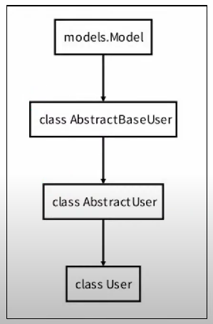

# Django

<br>

## 목차

- [authentication system](#authentication-system)
- [Substituting a cutstom User model](#Substituting-a-cutstom-User-model)
- [HTTP Cookies](#HTTP-Cookies)
- [쿠키](#쿠키)
- [Login](#Login)
- [Logout](#Logout)
- [Authentication with User](#Authentication-with-User)
  - 개요
  
  - 회원가입
  
  - Custom user & built-in auth forms
  
  - UserCreationForm() 커스텀 하기
  
  - 회원탈퇴
  
  - 회원정보 수정
  
  - 비밀번호 변경
- [Limiting access to logged-in users](#Limiting-access-to-logged-in-users)

<br> 

## authentication system

#### 1. 개요

- Authentication (인증)
  - 신원 확인
  - 사용자가 자신이 누구인지 확인하는 것
- Authorization (권한, 허가)
  - 권한 부여
  - 인증된 사용자가 수행할 수 있는 작업을 결정

이 둘을 합쳐서 인증 시스템이라고 한다. 

<br>

#### 2. 사전 설정

- 두번째 app accounts 생성 및 등록 (accounts 절 대 권 장)
  
  1. python manage.py startapp accounts
  
  2. settings.py에 APP 등록
  
  3. accounts/urls.py 파일 생성
  
  4. projects/urls.py에 accounts 경로 include

<br>

<br>

## Substituting a cutstom User model

#### 1. 개요

- 커스텀 User 모델로 대체하기
  - bulit-in User model의 기본 인증 요구사항이 적절하지 않음
  - 그래서 Django는 현재 프로젝트에서 나타낼 User를 참조하는 `AUTH_USER_MODEL` 설정값을 제공하여 default user model을 재정의(override)할 수 있도록 함

<br>

#### 2. How to substituting a custom User model

1. AbstrackUser를 상속받는 커스텀 User 클래스 작성
   
   - 기존 User 클래스도 AbstractUser를 상속받기 때문에 커스텀 User 클래스도 완전히 같은 모습을 가지게 됨
     
     ```python
     # accounts/models.py
     from django.db import models
     from django.contrib.auth.models import AbstractUser
     
     class User(AbstractUser):
         pass
     ```

2. Django 프로젝트에서 User를 나타내는데 사용하는 모델을 방금 생성한 커스텀 User 모델로 지정
   
   - 프로젝트 시작 시 설정하기 위한 것이며, 참조하는 모델은 첫 번째 마이그레이션에서 사용할 수 있어야 함 즉, 첫번째 마이그레이션 전에 확정 지어야 하는 값
     
     ```python
     # settings.py
     
     ATUH_USER_MODEL = 'accounts.User'
     ```

3. admin.py 에 커스텀 User 모델을 등록
   
   - 기본 User 모델이 아니기 때문에 등록하지 않으면 admin site에 출력되지 않음
     
     ```python
     # accounts/admin.py
     
     from django.contrib import admin
     from django.contrib.auth.admin import UserAdmin
     from .models import User
     
     admin.site.register(User, UserAdmin)
     ```



<br>

#### [주의사항]

- 커스텀 User 모델은 기본 User 모델과 동일하게 작동 하면서도 필요한 경우 나중에 맞춤 설정할 수 있음

- 단, User 모델 대체 작업은 프로젝트의 모든 migrations 혹은 첫 migrate 실행하기 전에 이 작업을 마쳐야 함

- 데이터베이스 초기화 방법
  
  1. migrations 파일 삭제
     
     - migrations 폴더 및 `__init__.py` 는 삭제하지 않음
     
     - 번호가 붙은 파일만 삭제
  
  2. db.sqlite3 삭제
  
  3. migrations 진행
     
     1. python manage.py makemigrations
     2. python manage.py migrate

<br>

#### [참고] AbstractUser

- "관리자 권한과 함께 완전한 기능을 가지고 있는 User model을 구현하는 추상 기본 클래스"
- Abstract base classes (추상 기본 클래스)
  - 몇 가지 공통 정보를 여러 다른 모델에 넣을 때 사용하는 클래스
  - 데이터베이스 테이블을 만드는 데 사용되지 않으며, 대신 다른 모델의 기본 클래스로 사용되는 경우 해당 필드가 하위 클래스의 필드에 추가 됨

<br>

<br>

## HTTP Cookies

#### 1. 요청과 응답

- 요청(requests) : 클라이언트(브라우저)에 의해 전송되는 메세지
- 응답(response) : 서버에서 응답으로 전송되는 메세지

<br>

#### 2. HTTP 특징

1. 비 연결 지향(connectingless)
   - 서버는 요청에 대한 응답을 보낸 후 연결을 끊음
     - 예를 들어 우리가 네이버 메인 페이지를 보고 있을 때 우리는 네이버 서버와 연결되어 있는 것이 아님
     - 네이버 서버는 우리에게 메인 페이지를 응답하고 연결을 끊은 것
2. 무상태(stateless)
   - 연결을 끊는 순간 클라이언트와 서버 간의 통신이 끝나며 상태 정보가 유지되지 않음
   - 클라이언트와 서버가 주고받는 메세지들은 서로 완전히 독립적

<br>

<br>

## 쿠키

#### 1. 개념

- 서버가 사용자의 웹 브라우저에 전송하는 작은 데이터 조각
- 사용자가 웹사이트를 방문할 경우 해당 웹사이트의 서버를 통해 사용자의 컴퓨터에 설치되는 작은 기록 파일
  1. 브라우저(클라이언트)는 쿠키를 로컬에 **KEY-VALUE** 의 데이터 형식으로 저장
  2. 이렇게 쿠키를 저장해 놓았다가, **동일한 서버에 재요청 시 저장된 쿠키를 함께 전송**

<br>

#### 2. 쿠키 사용 목적

1. 세션 관리 (Session management)
   - 로그인, 아이디 자동완성, 공지 하루 안보기, 팝업 체크, 장바구니 등의 정보 관리
2. 개인화 (Personalization)
   - 사용자 선호, 테마 등의 설정
3. 트래킹 (Tracking)
   - 사용자 행동을 기록 및 분석

<br>

#### 3. 세션

- 사이트와 특정 브라우저 사이의 "state(상태)" 를 유지시키는 것
- 클라이언트가 서버에 접속하면 서버가 특정 session id를 발급하고, 클라이언트는 session id를 쿠키에 저장
  - 클라이언트가 다시 동일한 서버에 접속하면 요청과 함께 쿠키를 서버에 전달
  - 쿠키는 요청 때마다 서버에 함께 전송 되므로 서버에 session id를 확인해 알맞은 로직을 처리
- session id는 세션을 구별하기 위해 필요하며, 쿠키에는 session id만 저장
- session 정보는 Django DB의 **django_session 테이블**에 저장

<br>

#### 4. 쿠키 Lifetime (수명)

1. Session cookie
   - 현재 세션이 종료되면 삭제됨
   - 브라우저 종료와 함께 세션이 삭제됨
2. Persistent cookies
   - Expires 속성에 지정된 날짜 혹은 Max-Age 속성에 지정된 기간이 지나면 삭제됨

<br>

<br>

## Login

#### 1. 개요

- 로그인은 Session을 CREATE 하는 과정

- AuthenticationForm
  
  - 로그인을 위한 built-in form
    - 로그인 하고자 하는 사용자 정보를 입력 받음
    - 기본적으로 username과 passsword를 받아 데이터가 유효한지 검증
  - requests를 첫번째 인자로 취함

<br>

#### 2. login()

- login(request, user, backend=None)
- 인증된 사용자를 로그인 시키는 로직으로 **view 함수에서 사용됨**
- 현재 세션에 연결하려는 인증 된 사용자가 있는 경우 사용
- HttpRequest 객체와 User 객체가 필요

<br>

#### 3. get_user()

- AuthenticationForm의 인스턴스 메서드
- 유효성 검사를 통과했을 경우 로그인 한 사용자 객체를 반환

<br>

#### 4. 실습 예제

1. accounts/views.py
   
   ```python
   from django.shortcuts import render, redirect
   from django.contrib.auth.forms import AuthenticationForm
   from django.contrib.auth import login as auth_login
   
   def login(request):
       if requests.method == 'POST':
           form = AuthenticationForm(request, request.POST)
           # form = AuthenticationForm(request, data=request.POST)
           if form.is_valid():
               # 로그인
               auth_login(requests, 유저정보)
               return redirect('articles:index')
       else:
           form = AuthenticationForm()
       context = { 
       'form': form,
       }
       return render(request, 'accounts/login', context)
   ```

2. accounts/templates/accounts/login.html
   
   ```html
   
   
   
     <h1>LOGIN</h1>
     <form action="" method="POST">
       
       {{ form.as_p }}
   </form>
   
   
   ```

<br>

<br>

## Logout

#### 1. 개요

- 로그아웃은 Session을 Delete하는 과정

<br>

#### 2. logout()

- logout(request)

- HttpRequest 객체를 인자로 받고 반환 값이 없음

- 사용자가 로그인하지 않은 경우 오류를 발생시키지 않음

- 다음 2가지 일을 처리한다
  
  1. 현재 요청에 대한 session data를 DB에서 삭제
  
  2. 클라이언트의 쿠키에서도 sessionid를 삭제
  - 이는 다른 사람이 동일한 웹 브라우저를 사용하여 로그인하고, 이전 사용자의 세션 데이터에 엑세스하는 것을 방지하기 위함

<br>

#### 3. 실습 예제

1. accounts/views.py
   
   ```python
   from django.shortcuts import render, redirect
   from django.contrib.auth.forms import AuthenticationForm
   from django.contrib.auth import login as auth_login
   from django.contrib.auth import logout as auth_logout
   
   def logout(request):
       # 로그아웃
       auth_login(request)
       return redirect('articles:index')
   ```

<br>

#### [참고] 현재 로그인 되어있는 유저 정보 출력하기

- 어떻게 base 템플릿에서 context 데이터 없이 user 변수를 사용할 수 있는 걸까?
  
  - settings.py 의 **context processors** 설정 값 때문

- context에 user를 담으면 충돌하니 주의하기!!

- 로그인되어 있다면 User 객체를 반환!!, 로그인되어 있지 않으면 AnonymousUser 객체로 반환!!

<br>

<br>

## Authentication with User

#### 1. 개요

- User Object와 User CRUD에 대한 이해
  - 회원 가입, 회원 탈퇴, 회원정보 수정, 비밀번호 변경

<br>

#### 2. 회원가입

회원가입은 User를 **CREATE** 하는 것이며 **UserCreationForm** built-in-form을 사용

- UserCreationForm
  
  - 주어진 username과 password로 권한이 없는 새 user를 생성하는 ModelForm
  - 3개의 필드를 가짐
    1. username (from the user model)
    2. password1
    3. passwrod2

- 실습 예제
  
  1. views.py
     
     ```python
     def signup(request):
         if request.method == 'POST':
             form = UserCreationForm(request.POST)
             if form.is_valid():
                 user = form.save()
                 auth_login(requests, user)                     # 회원가입 후 자동 로그인
                 return redirect('articles:index')
         else:
             form = UserCreationForm()
         context = {
             'form': form,
         }
         return render(request, 'accounts/signup.html', context) 
     ```
  
  2. signup.html
     
     ```python
     
     
     
       <h1>SIGNUP</h1>
       <form action="" method="POST">
         
         {{ form.as_p }}
     </form>
     
     
     ```

<br>

#### 3. Custom user & built-in auth forms

- 아래 Form 클래스는 User 모델을 대체하더라도 커스텀 하지 않아도 사용가능
- 기존 User 모델을 참조하는 Form이 아니기 때문
  1. AuthenticationForm
  2. SetPasswordForm
  3. PasswordChangeForm
  4. AdminPasswordChangeForm

- 커스텀 유저 모델을 사용하려면 다시 작성하거나 확장해야 하는 forms
- 두 form 모두 **class Meta: model = User** 가 등록된 form 이기 때문에 반드시 커스텀해야함
  1. UserCreationForm
  2. UserChangeForm

<br>

#### 4. UserCreationForm() 커스텀 하기

1. forms.py
   
   ```python
   # accounts/forms.py
   
   from django.contrib.auth import get_user_model
   from django.contrib.auth.forms import UserCreationForm, UserChangeForm
   
   class CustomUserCreationForm(UserCreationForm):
   
       class Meta(UserCreationForm.Meta):
           model = get_user_model()
   
   class CustomUserChangeForm(UserChangeForm):
   
       class Meta(UserChangeForm.Meta):
           model = get_user_model()
   ```

2. views.py
   
   ```python
   # accounts/views.py
   
   from django.contrib.auth.forms import AuthenticationForm, UserCreationForm
   from .forms import CustomUserCreationForm, CustomUserChangeForm
   
   def signup(request):
       if request.method == 'POST':
           form = CustomUserCreationForm(request.POST)        # 여기 수정됨!
           if form.is_valid():
               user = form.save()
               auth_login(requests, user)                     # 회원가입 후 자동 로그인
               return redirect('articles:index')
       else:
           form = CustomUserCreationForm()                    # 여기 수정됨!
       context = {
           'form': form,
       }
       return render(request, 'accounts/signup.html', context) 
   ```

<br>

#### 5. 회원 탈퇴

1. views.py
   
   ```python
   # accounts/views.py
   
   def delete(request):
       request.user.delete()
       #auth_logout(request)                # 회원탈퇴와 동시에 세션 지우기
       return redirect('articles:index')
   
   # 먼저 로그아웃 해버리면 해당 요청 객체 정보가 없어지기 때문에 탈퇴를 먼저해야함!
   ```

<br>

#### 6. 회원정보 수정

회원정보 수정은 User를 **UPDATE** 하는 것이며 **UserChangeForm** bulit-in form을 사용한다

1. views.py
   
   ```python
   def update(request):
       if request.method == 'POST':
           form = CustomUserChangeForm(request.POST, instance=request.user)
           if form.is_valid():
               form.save()
           return redirect('articles:index')
       else:
           form = CustomUserChangeForm(instance=request.user)
       context = {
           'form': form,
       }
       return render(request, 'article/update.html', context)
   ```

2. update.html
   
   ```python
   
   
   
     <h1>UPDATE</h1>
     <form action="" method="POST">
       
       {{ form.as_p }}
   </form>
   
   
   ```

UserChangeForm에는  사용자가 접근하면 안될 관리자 권한의 fields까지 나오니 forms.py 의 CustomUserchangeForm Class의 **fields 정의하기**

<br>

#### 7. 비밀번호 변경

- PasswordChangeForm
  
  - 사용자가 비밀번호를 변경할 수 있도록 하는 Form
  - 이전 비밀번호 입력하여 비밀번호 변경할 수 있도록 함
  - 이전 비밀번호를 입력하지 않고 설정하는 SetPasswordForm을 상속받는 서브 클래스

- 실습 예제
  
  1. urls.py
     
     ```python
     path('password/', views.change_password, name='change_password'),
     ```
  
  2. views.py
     
     ```python
     def change_password(requeset):
         if request.method == 'POST':
             form = PasswordChangeForm(request.user, request.POST)
             if form.is_valid():
                 form.save()
                 return redirect('articles:index')
         else:
             form = PasswordChangeForm(request.user)        # 필수 인자 필요!!
         context = {
             'form': form,
         }
         return render(request, 'accounts/change_password,html', context)
     ```
  
  3. change_password.html
     
     ```python
     
     
     
       <h1>비밀번호 변경</h1>
       <form action="" method="POST">
         
         {{ form.as_p }}
         <input type="submit">
     </form>
     
     
     ```

- 비밀번호를 변경하면 세션이 DB의 정보와 달라지기 때문에 로그아웃이 된다!
  
  - update_session_auth_hash() 사용하면 해결 됨
  
  - views.py 함수 수정
    
    ```python
    from django.contrib.auth import update_session_auth_hash        # 이줄 추가!
    
    def change_password(requeset):
        if request.method == 'POST':
            form = PasswordChangeForm(request.user, request.POST)
            if form.is_valid():
                form.save()
                update_session_auth_hash(request, form.user)        # 이 줄 추가!
                return redirect('articles:index')
        else:
            form = PasswordChangeForm(request.user)        
        context = {
            'form': form,
        }
        return render(request, 'accounts/change_password,html', context)
    ```

<br>

<br>

## Limiting access to logged-in users

#### 1. 개요

- 로그인 사용자에 대한 접근 제한하기

<br>

#### 2. 로그인 사용자에 대해 접근을 제한하는 2가지 방법

1. The raw way (속성으로 하기)
   
   - **is_authenticated** attribute
     
     - User 인스턴스에 대해 항상 True / AnonymousUser 인스턴스에 대해 항상 False 
     - 일반적으로 request.user에서 이 속성을 사용 **(request.user.is_authenticated)**
   
   - 이렇게 바꾸면 url만 알면 들어가지기 때문에  근본적으로 막진 않음.
   
   - 해결법 views.py 수정
     
     ```python
     def login(request):
         if request.user.is_authenticated:            # 여기
             return redirect('articles:index')        # 2줄 추가!
     
         if requests.method == 'POST':
             form = AuthenticationForm(request, request.POST)
             # form = AuthenticationForm(request, data=request.POST)
             if form.is_valid():
                 # 로그인
                 auth_login(requests, 유저정보)
                 return redirect('articles:index')
         else:
             form = AuthenticationForm()
         context = { 
         'form': form,
         }
         return render(request, 'accounts/login', context)
     ```

2. The **login_required** decorator (데코레이터 사용)
   
   - articles/views.py 수정
     
     ```python
     # 비로그인 일 때 는 CRUD에 권한을 줄 수 없다.
     # @login_required 를 각 CURD 함수위에 적어주기
     
     @login_required
     ```
   
   - 비로그인시 로그인이 필요한 url로 이동하면 @login_required은 **accounts/login** url로 보내줌
   
   - next 파라미터를 가지고 로그인 후 되돌아갈 페이지를 저장중
     
     - 하지만 next를 사용하기 위해선 login.html 의 **form action을 비워둬야함**
       
       ```python
       def login(request):
           if request.user.is_authenticated:        
               return redirect('articles:index')
       
           if requests.method == 'POST':
               form = AuthenticationForm(request, request.POST)
               if form.is_valid():
                   auth_login(requests, 유저정보)
                   return redirect(request.GET.get('next') or 'articles:index') 
           else:
               form = AuthenticationForm()
           context = { 
           'form': form,
           }
           return render(request, 'accounts/login', context)
       ```

<br>

#### 3. 두 데코레이터로 인해 발생하는 구조적 문제 해결

- 문제점
  
  1. 먼저 비로그인 상태로 detail 페이지에서 게시글 삭제 시도
  
  2. delete view 함수의 @login_required로 인해 로그인 페이지로 리다이렉트
  
  3. redirect로 이동한 로그인 페이지에서 로그인 진행
  
  4. delete view 함수의 @require_POST로 인해 405 상태 코드를 받음

- 해결법
  
  1. 두 데코레이터 중 하나를 포기
  2. 나머지 데코레이터의 역할을 하는 코드를 함수 내부에 짜기
