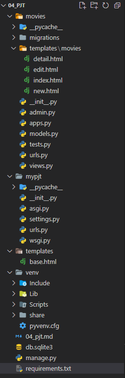
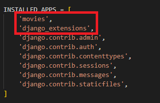
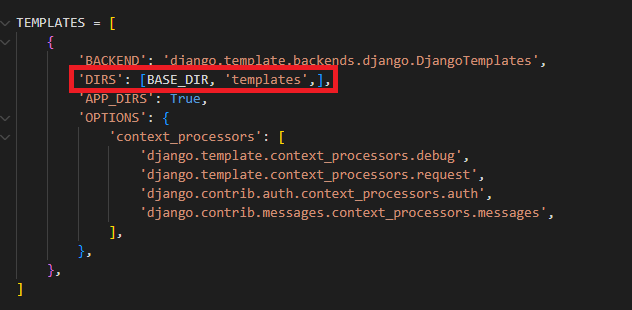
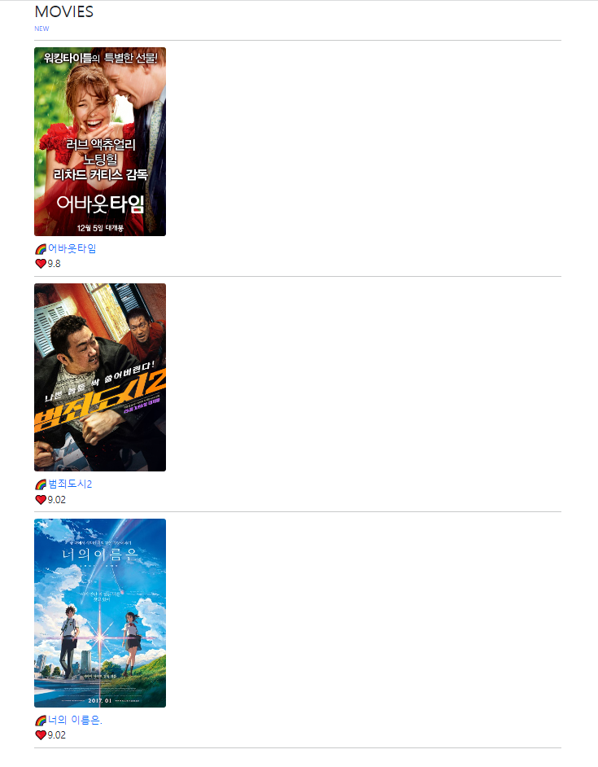
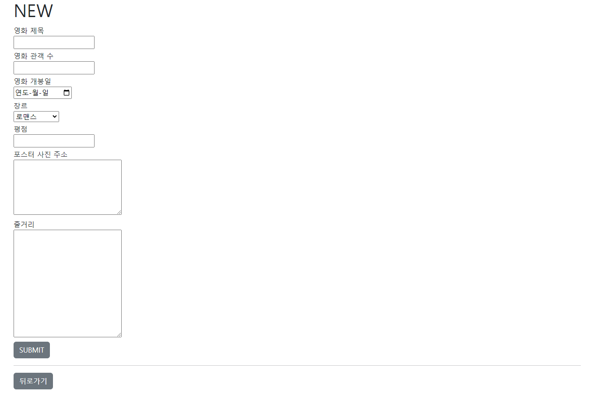
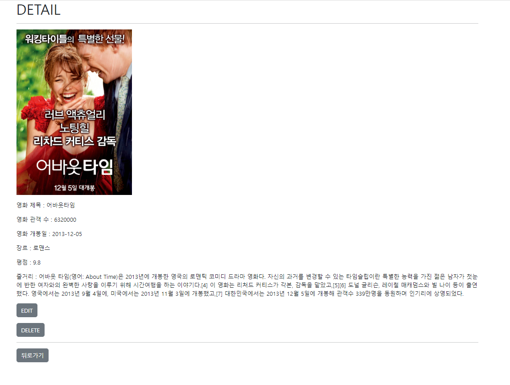
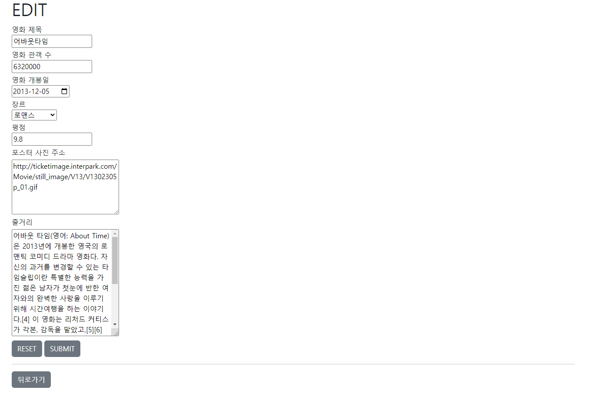
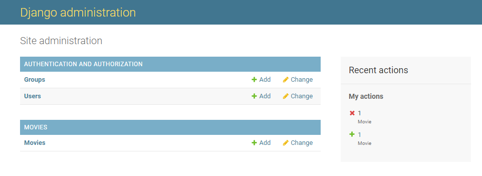
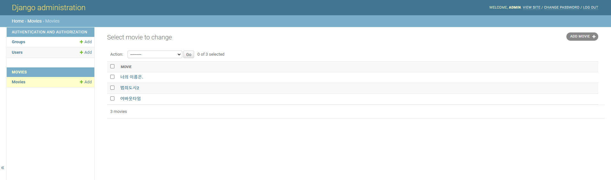

# 04_PJT 프레임워크 기반 웹 페이지 구현

#### 1. 폴더 구조



#### 

#### 2. 세팅

- 앱 등록
  
  

- base.html 설정 
  
  
  
  ```html
  <!DOCTYPE html>
  <html lang="en">
  <head>
    <meta charset="UTF-8">
    <meta http-equiv="X-UA-Compatible" content="IE=edge">
    <meta name="viewport" content="width=device-width, initial-scale=1.0">
    <link href="https://cdn.jsdelivr.net/npm/bootstrap@5.2.0-beta1/dist/css/bootstrap.min.css" rel="stylesheet" integrity="sha384-0evHe/X+R7YkIZDRvuzKMRqM+OrBnVFBL6DOitfPri4tjfHxaWutUpFmBp4vmVor" crossorigin="anonymous">
    <title>Document</title>
  </head>
  <body>
    <div class="container">
      
      
    </div>
    <script src="https://cdn.jsdelivr.net/npm/bootstrap@5.2.0-beta1/dist/js/bootstrap.bundle.min.js" integrity="sha384-pprn3073KE6tl6bjs2QrFaJGz5/SUsLqktiwsUTF55Jfv3qYSDhgCecCxMW52nD2" crossorigin="anonymous"></script>
  </body>
  </html>
  ```

- project/urls.pt
  
  ```python
  from django.contrib import admin
  from django.urls import path, include
  from movies import views
  
  urlpatterns = [
      path('admin/', admin.site.urls),
      path('movies/', include('movies.urls')),
  ]
  ```

#### 

#### 3. index.html 작성

- movies/urls.py
  
  ```python
  from django.urls import path
  from . import views
  
  app_name = 'movies'
  urlpatterns = [
      path('', views.index, name="index"),
  ```

- movies/views.py
  
  ```python
  from django.shortcuts import render, redirect
  from .models import Movie
  
  # Create your views here.
  def index(request):
      movies = Movie.objects.all()
      context = {
          'movies': movies,
      }
      return render(request, 'movies/index.html', context)
  ```

- movies/templates/movies/index.html
  
  ```python
  
  
  
  <h1>MOVIES</h1>
  <a href="" class="text-decoration-none">NEW</a>
  <hr>
  
    <br>
    <a href="" class="text-decoration-none"><h4>🌈{{ movie.title }}</h4></a>
    <h4>❤{{ movie.score }}</h4>
    <hr>
  
  
  
  ```

- 결과화면
  
  

#### 4. new.html 작성

- movies/urls.py
  
  ```python
  from django.urls import path
  from . import views
  
  app_name = 'movies'
  urlpatterns = [
      ...
      path('new/', views.new, name="new"),
      path('create/', views.create, name="create"),
  ]
  ```

- movies/views.py
  
  ```python
  from django.shortcuts import render, redirect
  from .models import Movie
  
  ...
  
  def new(request):
      return render(request, 'movies/new.html')ntext)
  
  def create(request):
      title = request.POST.get('title')
      audience = request.POST.get('audience')
      release_date = request.POST.get('release_date')
      genre = request.POST.get('genre')
      score = request.POST.get('score')
      poster_url = request.POST.get('poster_url')
      description = request.POST.get('description')
  
      movie = Movie(title=title, audience=audience, release_date=release_date, genre=genre, score=score, poster_url=poster_url, description=description)
      movie.save()
  
      return redirect('movies:index')
  ```

- movies/templates/movies/new.html
  
  ```python
  
  
  
    <h1>NEW</h1>
    <form action="" method="POST">
      
      <label for="title" class="mt-1">영화 제목</label><br>
      <input type="text" name="title" id="title"><br>
      <label for="audience" class="mt-1">영화 관객 수</label><br>
      <input type="text" name="audience" id="audience"><br>
      <label for="release_date" class="mt-1">영화 개봉일</label><br>
      <input type="date" name="release_date" id="release_date"><br>
      <label for="genre" class="mt-1">장르</label><br>
      <select name="genre" id="genre">
          <option value="로맨스">로맨스</option>
          <option value="스릴러">스릴러</option>
          <option value="코미디">코미디</option>
          <option value="액션">액션</option>
          <option value="판타지">판타지</option>
          <option value="애니메이션">애니메이션</option>
      </select><br>
      <label for="score" class="mt-1">평점</label><br>
      <input type="text" name="score" id="score"><br>
      <label for="poster_url" class="mt-1">포스터 사진 주소</label><br>
      <textarea name="poster_url" id="poster_url" cols="30" rows="5"></textarea><br>
      <label for="description" class="mt-1">줄거리</label><br>
      <textarea name="description" id="description" cols="30" rows="10"></textarea><br>
      <input type="submit" value="SUBMIT" class="btn btn-secondary mt-1" tabindex="-1" role="button" aria-disabled="true">
    </form>
    <hr>
    <a href="" class="btn btn-secondary" tabindex="-1" role="button" aria-disabled="true">뒤로가기</a>
  
  ck content %}
  ```

- 결과화면 
  
  

#### 5. detail.html 작성

- movies/urls.py
  
  ```python
  from django.urls import path
  from . import views
  
  app_name = 'movies'
  urlpatterns = [
      ...
      path('<pk>/', views.detail, name="detail"),
      path('<pk>/delete/', views.delete, name="delete"),
  ]
  ```

- movies/views.py
  
  ```python
  from django.shortcuts import render, redirect
  from .models import Movie
  
  ...
  
  def detail(request, pk):
      movie = Movie.objects.get(pk=pk)
      context = {
          'movie': movie,
      }
      return render(request, 'movies/detail.html', context)
  
  def delete(request, pk):
      movie = Movie.objects.get(pk=pk)
      movie.delete()
      return redirect('movies:index')
  ```

- movies/templates/movies/detail.html
  
  ```python
  
  
  
    <h1>DETAIL</h1>
    <hr>
    
    <p>영화 제목 : {{ movie.title }}</p>
    <p>영화 관객 수 : {{ movie.audience }}</p>
    <p>영화 개봉일 : {{ movie.release_date|date:"Y-m-d" }}</p>
    <p>장르 : {{ movie.genre }}</p>
    <p>평점 : {{ movie.score }}</p>
    <p>줄거리 : {{ movie.description }}</p>
    <a href="" class="btn btn-secondary" tabindex="-1" role="button" aria-disabled="true">EDIT</a>
    <form action="" method="POST">
      
      <input type="submit" value="DELETE" class="btn btn-secondary mt-3" tabindex="-1" role="button" aria-disabled="true">
    </form>
    <hr>
    <a href="" class="btn btn-secondary" tabindex="-1" role="button" aria-disabled="true">뒤로가기</a>
  
  ```

```
- 결과화면




#### 6. edit.html 작성

- movies/urls.py

```python
from django.urls import path
from . import views

app_name = 'movies'
urlpatterns = [
    ...
    path('<pk>/edit/', views.edit, name="edit"),
    path('<pk>/update/', views.update, name="update"),
]
```

- movies/views.py
  
  ```python
  from django.shortcuts import render, redirect
  from .models import Movie
  
  ...
  
  def edit(request, pk):
      movie = Movie.objects.get(pk=pk)
      context = {
          'movie': movie,
      }
      return render(request, 'movies/edit.html', context)
  
  def update(request, pk):
      movie = Movie.objects.get(pk=pk)
      movie.title = request.POST.get('title')
      movie.audience = request.POST.get('audience')
      movie.release_date = request.POST.get('release_date')
      movie.genre = request.POST.get('genre')
      movie.score = request.POST.get('score')
      movie.poster_url = request.POST.get('poster_url')
      movie.description = request.POST.get('description')
  
      movie.save()
  
      return redirect('movies:index')
  ```

- movies/templates/movies/edit.html
  
  ```python
  
  
  
    <h1>EDIT</h1>
    <form action="" method="POST">
      
      <label for="title" class="mt-1">영화 제목</label><br>
      <input type="text" name="title" id="title" value="{{ movie.title }}"><br>
      <label for="audience" class="mt-1">영화 관객 수</label><br>
      <input type="text" name="audience" id="audience" value="{{ movie.audience }}"><br>
      <label for="release_date" class="mt-1">영화 개봉일</label><br>
      <input type="date" name="release_date" id="release_date" value="{{ movie.release_date|date:"Y-m-d"}}"><br>
      <label for="genre" class="mt-1">장르</label><br>
      <select name="genre" id="genre">
          <option value="로맨스">로맨스</option>
          <option value="스릴러">스릴러</option>
          <option value="코미디">코미디</option>
          <option value="액션">액션</option>
          <option value="판타지">판타지</option>
          <option value="애니메이션">애니메이션</option>
      </select><br>
      <label for="score" class="mt-1">평점</label><br>
      <input type="text" name="score" id="score" value="{{ movie.score }}"><br>
      <label for="poster_url" class="mt-1">포스터 사진 주소</label><br>
       <input type="text" name="poster_url" id="poster_url" value="{{ movie.poster_url }}"><br> 
      <textarea name="poster_url" id="poster_url" cols="30" rows="5" class="mt-1">{{ movie.poster_url }}</textarea><br>
      <label for="description">줄거리</label><br>
      <textarea name="description" id="description" cols="30" rows="10" class="mt-1">{{ movie.description }}"</textarea><br>
      <input type="reset" value="RESET" class="btn btn-secondary mt-1" tabindex="-1" role="button" aria-disabled="true">
      <input type="submit" value="SUBMIT" class="btn btn-secondary mt-1" tabindex="-1" role="button" aria-disabled="true">
    </form>
    <hr>
    <a href="" class="btn btn-secondary" tabindex="-1" role="button" aria-disabled="true">뒤로가기</a>
  
  ```

- 결과화면
  
  

#### 7. Admin 등록

- movies/admin.py
  
  ```python
  from django.contrib import admin
  from .models import Movie
  
  admin.site.register(Movie)
  ```

- 결과 화면
  
  1) 메인 화면
  
  
  
  2) Movies
  
  

#### 8. 프로젝트 후기

1. django 프레임워크의 MTV패턴을 사용해 CRUD를 구현하는 방법이 어느덧 익숙해진 느낌이다.

2. 폴더 구조는 완벽히 이해했지만, APP 등록, DIRS설정 및 각 폴더에서 import 해야 하는 명령어들은 아직 좀 더 공부할 필요성이 있는 것 같다.

3. 장고 재밌습니다 재밌습니다 !!
