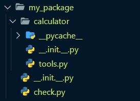

# 제어문 (Control Statement) & 함수(function)

---

## 목차

- [제어문](#제어문)
  - [조건문](#조건문)
  - [조건 표현식](#조건-표현식)
  - [반복문](#반복문)
  - [반복문 제어](#반복문-제어)
- [함수](#함수)
  - [Decompositon(분해)](#Decompositon분해)
  - [Abstraction(추상화)](#Abstraction추상화)
  - [함수의 기초](#함수의-기초)
    - 선언과 호출(`define` & `call`)
    - 입력(`Input`)
    - 문서화(`Docsting`)
    - 범위(`Scope`)
    - 결과값(`Output`)
  - [함수 응용](#함수-응용)
- [모듈과 패키지](#모듈과-패키지)

<br>

## 제어문

- ### 제어문이란?

  - 파이썬은 기본적으로 `위에서부터 아래로 차례대로 명령을 수행`

  - 특정 상황에 따라 코드를 선택적으로 실행(분기/조건) 하거나 계속하여 실행(반복)하는 제어가 필요함

- ### 조건문

  - 조건문은 `참/거짓`을 판단할 수 있는 `조건식`과 함께 사용

    - 기본형식

      - 조건이 `참인 경우` 이후 들여쓰기 되어있는 코드 블록을 실행

      - 이외의 경우 `else` 이후 들여쓰기 되어있는 코드 블록을 실행

      - `else`는 선택적으로 활용할 수 있음

        ``` python
        if 조건:
            # Run this Code block
        else:
            # Run this Code block
        ```

  - 복수 조건문

    ``` python 
    if 조건:
        # Run this Code block
    elif 조건:
        # Run this Code block
    elif 조건:
        # Run this Code block
    else:
        # Run this Code block
    ```

  - 중첩 조건문

    - 조건문은 다른 조건문에 중첩되어 사용될 수 있음

    - `들여쓰기에 유의`하여 작성할 것

      ``` python
      if 조건:
          # Run this Code block
          if 조건:
              # Run this Code block
      else:
          # Run this Code block
      ```

    - 중촉 조건문 실습 

      ``` python
      dust = 500
      if dust > 150:
          print('매우 나쁨')
          if dust > 300:
              print('실외 활동을 자제하세요.')
      elif dust > 80:
          print('나쁨')
      elif dust > 30:
          print('보통')
      elif dust > 0:
          print('좋음')
      else:
          print('값이 잘못 되었습니다')
          
      '''
      매우나쁨
      실외 활동을 자제하세요.
      '''
      ```


- ### 조건 표현식

  - 조건 표현식이란?

    - 조건 표현식을 일반적으로 조건에 따라 값을 정할 때 활용

    - `삼항 연산자`로 부르기도 함

    - 예시

      ` true인 경우 값 if 조건 else false인 경우 값`

      ``` python
      # 절대값을 저장하기 위한 코드
      value = num if num >= 0 else value = -num
      ```

  

- ### 반복문

  - 특정 조건을 만족할 때까지 같은 동작을 게속 반복하고 싶을 때 사용

  - 반복문의 종류

    - `while` 문 : 조건식이 참인 경우 반복적으로 코드를 실행

      - 조건이 참인 경우 들여쓰기 되어 있는 코드 블록이 실행됨

      - 코드 블록이 모두 실행되고, 다시 조건식을 검사하며 반복적으로 실행됨

      - `while`문은 무한 루프를 하지 않도록 `종료 조건이 반드시 필요`

        ``` python
        while 조건:
            # Code block
        ```

    - `for` 문 : 반복가능한 객체를 모두 순회하면 종료 (별도의 종료 조건이 필요 없음)

      - `for`문은 시퀀스(`string`, `tuple`, `list`, `range`)를 포함한 순회 가능한 객체(iterable_)의 요소륾 ㅗ두 순회
      - 처음부터 끝까지 모두 순회하므로 별도의 종료 조건이 필요하지 않음
      - Iterable

        - 순회할 수 있는 자료형(`string`, `list`, `dict`, `tuple`, `range`, `set` 등)
        - 순회형 함수(`range`, `enumerate`)

        - 사용 예시

          ``` python
          for fruit in ['apple', 'mango', 'banana']:
              print(fruit)
          print('끝')
          
          '''
          apple
          mango
          banana
          '''
          ```

        - for문을 이용한 문자열(`String`) 순회

          ``` python
          chars = input()
          # happy
          
          for idx in range(len(chars)):
              print(chars[idx])
              
          '''
          h
          a
          p
          p
          y
          '''
          ```

        - 딕셔너리(`Dictionary`) 순회

          - 딕셔너리는 기본적으로 `key`를 순회하며, `key`를 통해 값을 활용	

            ``` python
            grades = {'john': 80, 'eric': 90}
            for student, grade in grades.items():
                print(student, grade)
                
            '''
            john 80
            eruc 90
            '''
            ```

        - `enumerate` 순회

          - 인덱스와 객체를 쌍으로 담은 열거형(`enumerate`) 객체 반환

          - (`index`, `value`) 형태의 `tuple`로 구성된 열거 객체를 반환

            ``` python
            members = ['민수', '영희', '철수']
            
            for idx, number in enumerate(member):
                print(idx, number)
                
            '''
            0 민수
            1 영희
            2 철수
            '''
            ```

          - 파이썬 문서에서 확인하기

            ``` python
            members = ['민수', '영희', '철수']
            
            print(list(enumerate(members))) # 
            print(list(enumerate(members, start = 1))) # 
            ```

      - `List Comprehension` 

        - 표현식과 제어문을 통해 특정한 값을 가진 리스트를 간결하게 생성하는 방법

        - `[code for 변수 in iterable]`

        - `[code for 변수 in iterable if 조건식]`

          ``` python
          # 1~3의 세제곱 리스트 만들기
          cubic_list = []
          for number in range(1, 4):
              cubic_list.append(number ** 3)
          print(cubic_list)
          
          # [1, 8, 27]
          
          cubic_list = [number ** 3 for number in range(1, 4)]
          print(cubic_list)
          
          # [1, 8, 27]
          ```

      - `Dictionary Comprehension`

        - `{key: balue for 변수 in iterable}`

        - `{key: balue for 변수 in iterable if 조건식}`

          ``` python
          # 1~3의 세제곱 딕셔너리 만들기
          cubic_dict = {}
          for number in range(1, 4):
              cubic_dict[number] = number ** 3
          print(cubic_dict)
          
          # [1: 1, 2: 8, 3: 27]
          
          cubic_dict = {number ** 3 for number in range(1, 4)}
          print(cubic_dict)
          
          # [1: 1, 2: 8, 3: 27]
          ```


​        

- ### 반복문 제어

  - `break`

    - 반복문을 종료

      ``` python 
      n = 0
      while True:
          if n == 3:
              break
          print(n)
          n += 1
      '''
      0
      1
      2
      '''
      
      for i in range(10):
          if i > 1:
              print('0과 1만 필요해!')
              break
          print(i)
      '''
      0
      1
      0과 1만 필요해!
      '''
      ```

      

  - `continue`

    - continue 이후의 코드 블록은 수행하지 않고, 다음 반복을 수행

      ``` python
      for i in range(6):
          if i % 2 == 0:
              continue
          print(i)
      '''
      1
      3
      5
      '''
      ```

      

  - `pass`

    - 아무것도 하지 않음(문법적으로 필요하지만, 할 일이 없을 때 사용)

    - 반복문 아니어도 사용 가능

      ``` python
      # i가 2일 때 pass
      for i in range(4):
          if i == 2:
              pass
        	print(i)
      '''
      0
      1
      2
      3
      '''
      ```

      

  - `for-else`

    - 끝까지 반복문을 싱행한 이후에 `else`문 실행

      - `break`를 통해 중간에 종료되는 경우 `else`문은 실행되지 않음

        ``` python
        for char in 'apple':
            if char == 'b':
                print('b!')
                break
        else:
            print('b'가 없습니다.)   
        # b가 없습니다.
        
        for char in 'banana':
            if char == 'b':
                print('b!')
                break
        else:
            print('b'가 없습니다.)   
        # b!
        ```


<br>

## 함수

- ### 함수를 왜 사용할까요?

  - `Decompositon`(분해)
  - `Abstraction`(추상화)

- ### Decompositon(분해)

  - 기능을 분해하고, 재사용 가능하게 만들고

    ``` python
    # 함수를 사용하지 않을 때
    numbers = [1, 2, 3]
    count = 0
    for i in numbers:
        conut += 1
    print(count) # 3
    
    # 함수 사용
    print(len([numbers])) # 3
    ```

    ``` python
    # 내장 함수만 사용
    numbers = [1, 2, 3]
    print(sum(numbers) / len(numbers)) # 2.0
    
    
    # 사용자 정의 함수 사용
    numbers = [1, 2, 3]
    
    def average(numbers):
        return sum(numbers) / len(numbers)
    
    print(average(numbers)) # 2.0
    ```

  

- ### Abstraction(추상화)

  - 복잡한 내용을 모르더라도 사용할 수 있도록 재사용성과 가독성, 생산성

  - 사실 내부 구조를 변경할게 아니라면 몰라도 무방

    - 그것이 함수의 장점이자 프로그래밍의 매력
    - 복잡한 걸 숨기고 알고 싶은것만 드러내어 이해하기 쉬움

    

- ### 함수의 기초

  - 함수의 종류

    - 내장 함수 : 파이썬에 기본적으로 포함된 함수
    - 외장 함수 : `import`문을 통해 사용하며, 외부 라이브러리에서 제공하는 함수
    - 사용자 정의 함수 : 직접 사용자가 만드는 함수

  - 함수의 정의

    - 특정한 기능을 하는 코드의 조각(묶음)

    - 특정 코드를 매번 다시 작성하지 안혹, 필요시에만 호출하여 간편히 사용

      ``` python
      def function_name(parameter):
          return returning_value
      ```

      

  - 함수의 기본 구조

    - 선언과 호출(`define` & `call`)

      ``` python
      # 선언
      def foo():
          return True
      
      def add(x, y):
          return x + y
      
      # 호출
      foo()
      add(2, 3)
      ```

    - 입력(`Input`)

      - `Parameter`: 함수를 정의할 때 함수 내부에서 사용되는 변수

      - `Argument`: 함수를 호출 할 때, 넣어주는 값

        - 필수 `Argument`: 반드시 전달되어야 하는 argument

        - 선택 `Argument`: 값을 전달하지 않아도 되는 경우는 기본값이 전달

        - `Positional Arguments`
  
          - 기본적으로 함수 호출 시 `Argument`는 위치에 따라 함수 내에 전달됨
  
        - `Keyword Arguments`
  
          - 직접 변수의 이름으로 특정 `Argument`를 전달할 수 있음
          - `Keyword Argument` 다음에 `Positional Argument`를 활용할 수 `없음`
  
        - `Default Arguments Values`
  
          - 기본값을 지정하여 함수 호출 시 `argument`값을 설정하지 않도록 함
  
          - 정의된 것 보다 더 적은 개수의 `argument`들로 호출될 수 있다
  
            ``` python	
            def add(x, y=0):
                return x + y
            
            add(2)
            ```
  
        - 정해지지 않은 여러 개의 `Arguments` 처리
  
          - 애스터리스크(`Asterisk`) 혹은 언패킹 연산자라고 불리는 `*` 덕분
  
            ``` python
            def sum_all(*numbers):
                result = 0
                for number in numbers:
                    result += number
                return result
            
            print(sum_all(1, 2, 3)) # 6
            print(sum_all(1, 2, 3,4 ,5 ,6)) # 21
            ```
  
        - 패킹 / 언패킹
  
          - 가변 인자를 이해하기 위해서는 패킹, 언패킹을 이해해야 함
  
          - 패킹 : 여러 개의 데이터를 묶어서 변수에 할당하는 것
  
            ``` python
            numbers = (1, 2, 3, 4, 5) # 패킹
            ```
  
          - 언패킹 : 시퀀스 속의 요소들을 여러 개의 변수에 나누어 할당하는 것
  
            ``` python
            numbers = (1, 2, 3, 4, 5)
            a, b, c, d, e = numbers # 언패킹
            a, b, c, d, e, f = numbers # 갯수가 다르면 에러가 남
            ```
  
          - 가변 인자(`*args`) 사용으로 해결
  
            ``` python
            # 가변 인자를 사용하면 해결 가능!!
            a, b, *rest = numbers # 1, 2를 제외한 나머지를 rest에 대입
            print(a, b, rest) # 1 2 [3, 4, 5]
            
            a, *rest, e = numbers # 1, 5를 제외한 나머지를 rest에 대입
            print(rest) # [2, 3, 4]
            ```
  
        - 필수 인자, 가변 인자 혼용 함수
  
          ``` python
          def print_family_name(father, mother, *pets):
              print(f'아버지 : {father}')
              print(f'어머니 : {mother}')
              print('반려동물들..')
              for name in pets:
                  print(f'반려동물 : {name}')
                  
          print_family_name('아부지', '어무니', '멍멍이', '냥냥이')
          ```
  
        - 가변 키워드 인자(`**kwargs`)
  
          - 몇 개의 키워드 인자를 받을지 모르는 함수를 정의할 때 유용
  
          - `**kwargs`는 `딕셔너리로 묶여 처리`되며, `parameter`에 `**`를 붙여 표현
  
            ``` python
            def print_family_name(father, mother, **pets):
                print(f'아버지 : {father}')
                print(f'어머니 : {mother}')
                if pets:
               		print('반려동물들..')
                	for species, name in pets.items():
                    	print(f'{species} : {name}')
                    
            print_family_name('아부지', '어무니', dog= '멍멍이', cat= '냥냥이')
            ```
  
        - 가변 인자(`*args`)와 가변 키워드 인자(`**kwargs`) 동시 사용
  
          ``` python
          def print_family_name(*parents, **pets):
              print('아버지 :', parents[0])
              print('어머니 :', parents[1])
              if pets:
             		print('반려동물들..')
              	for title, name in pets.items():
                  	print(f'{title} : {name}')
                  
          print_family_name('아부지', '어무니', dog= '멍멍이', cat= '냥냥이')
          ```
  
          
  
    - 문서화(`Docsting`)
  
    - 범위(`Scope`)
  
      - `scope`
  
        - `global scope`: 코드 어디에서든 참조할 수 있는 공간
  
        - `local scope`: 함수가 만든 scope, 함수 내부에서만 참조 가능
  
          ``` python
          def func():
              a = 20
              print('local', a) # local 20
              
          func()
          print('global', a) # NameError: name 'a' is not defined
          ```
  
      - `variable`
  
        - `global variable`: global scope에 정의된 변수
        - `local variable`: local scope에 정의된 변수
  
      - 변수 수명주기(`lifecycle`)
  
        - `built-in scope`: 파이썬이 실행된 이후부터 영원히 유지
        - `global scope`: 모듈이 호출된 시점 이후 혹은 인터프리터가 끝날 때까지 유지
        - `local scope`: 함수가 호출될 때 생성되고, 함수가 종료될 때까지 유지
  
      - 이름 검색 규칙(`Name Resolution`)
  
        1. `Local scope`: 지역 범위
  
        2. `Enclosed scope`: 지역 범위 한 단계 위 범위
  
        3. `Global scope`: 최상단에 위치한 범위
  
        4. `Built-in scope`: 모든 것을 담고 있는 범위(정의하지 않고 사용할 수 있는 모든 것)
  
           - ex) `print()`
  
           **함수 내에서는 바깥 Scope의 값을 읽을 순 있지만 수정할 순 없음**
  
      - `global` 예시
  
        ``` python 
        # 함수 내부에서 글로벌 변수 변경하기
        a = 10
        def func1():
            global a # 글로벌을 외치기 전에는 func1에서 a 사용 불가능!!
            a = 3
            
        print(a) # 10
        func1()
        print(a) # 3
        ```
  
      - `nonlocal` : `가까운곳에서 가져옴!` `이름공간상에 존재하는 변수만 가능!`
  
        ``` python
        # nonlocal 예시
        x = 0
        def func1():
            x = 1
            def func2():
                nonlocal x
                x = 2
            func2()
            print(x) # 2
            
        func1()
        print(x) # 0
        ```
  
        
  
    - 결과값(`Output`)
  
      - `Void function` : 명시적인 `return`값이 없는 경우, `None`을 반환하고 종료
  
        ``` python
        # Void function 예시
        def void_product(x, y):
            print(f'{x} x {y} = {x * y}')
            
        void_product(4, 5) # 4 x 5 = 20
        ans = void_product(4, 5) # 4 x 5 = 20
        print(ans) # None
        ```
  
      - `Value returning function` : 함수 실행 후 `return`문을 통해 값 반환 후 함수 바로 종료
  
        ``` python
        # Value returning function 예시
        def value_returning_product(x, y):
            return x * y
            
        value_returning_product(4, 5)
        ans = value_returning_product(4, 5
        print(ans) # 20
        ```
  
      - 2개 이상의 값 반환(`tuple`)
  
        ``` python
        def minus_and_product(x, y):
            return x - y, x * y
        
        y = minus_and product(4, 5)
        print(y) # (-1, 20)
        print(type(y)) # <class 'tuple'>
        ```
  
      - 2개 이상의 값 반환(`list`)
  
        ``` python
        # 똑바로 읽어도 거꾸로 읽어도 같은 단어를 찾는 함수
        word_list = ['우영우', '기러기', '별똥별', '파이썬']
        def is_palindrome(word_list):
            palindrome_list = []
            for word in word_list:
                if word == word[::-1]:
                    palindrome_list.append(word)
            return palindrome_list
        print(is_palindrome(word_list))
        # ['우영우', '기러기', '별똥별']
        ```
  
        
  
  - 함수의 실행 순서 예시
  
    ``` python
    num = 0
    num = 1
    
    def func1(a, b):
        return a + b
    
    def func2(a, b):
        return a - b
    
    def func2(a, b):
        return func1(a, 5) + func2(5, b)
    
    reslut func3(num1, num2)
    print(result) # 9
    ```


- ### 함수 응용

  - `map`: 순회 가능한 데이터구조(iterable)의 모든 요소에 함수를 적용하고 결과를 `map object`로 반환

    ``` python
    n, m = map(int, input().split()) # 3, 5를 입력하면
    print(n, m)
    print(type(n), type(m)) # <class 'int'> <class 'int'>
    ```

    

  - `filter`: 결과가 `True`인 것들을 `filter object`로 반환

    ``` python
    def odd(n):
        return n % 2
    numbers = [1, 2, 3]
    result = filter(odd, numbers)
    print(result, type(result)) # <filter object at ~~~~> <class 'filter'>
    print(list(result)) # [1, 3]
    ```

    

  - `zip`: 복수의 iterable을 모아 튜플을 원소로 하는 `zip object`를 반환

    ``` python
    girls = ['jane', 'ashley']
    boys = ['justin', 'eric']
    pair = zip(girls, boys)
    print(pair, type(pair)) # <zip object at ~~~~> <class 'zip'>
    print(list(pair)) # [('jane', 'justin'), ('ashley', 'eric')]
    ```

    

  - `lambda` 함수

    - 표현식을 계산한 결과값을 반환하는 함수로, 이름이 없는 함수여서 익명함수라고도 불림

      ``` python
      # 삼각형의 넓이를 구하는 공식
      def triangle_area(b, h):
          return 0.5 * b * h
      print(triangle_area(5, 6)) # 15
      
      # 삼각형의 넓이를 구하는 공식 - 람다
      triangle_area = lambda b, h : 0.5 * b * h
      print(triangle_area(5, 6)) # 15
      ```

  - 재귀 함수

    - 자기 자신을 호출하는 함수

    - 무한한 호출을 목표로 하는 것이 아니며 알고리즘 설계 및 구현에서 에서 유용하게 사용

      ``` python
      # 팩토리얼을 재귀함수로 구현해본다면?
      def factorial(n):
          if n == 0 or n == 1:
              return 1
          else:
              return n * factorial(n-1)
      print(factorial(4)) # 24
      ```

    - 재귀 함수 주의 사항

      - 재귀 함수를 `base case`에 도달할 때까지 함수를 호출함

      - 메모리 스택이 넘치게 되면(`stack overflow`) 프로그램이 동작하지 않게 됨

      - 파이썬에서는 최대 재귀 깊이(`maximum recursion depth`)가 1,000번으로,

        호출 횟수가 이를 넘어가게 되면 `Recursion Error`가 발생

      

  - 반복문과 재귀 함수 비교

    - 알고리즘 자체가 재귀적인 표현이 자연스러운 경우 재귀함수를 사용함.
    - 재귀 호출은 변수 사용을 줄여줄 수 있음.
    - 재귀 호출은 입력 값이 커질 수록 연산 속도가 오래 걸림.


## 모듈과 패키지

- 정의

  - 모듈(`module`): 다양한 기능을 하나의 파일로 
    - 특정 기능을 하는 코드를 파이썬 파일(.py) 단위로 작성한 것
  - 패키지(`package`): 다양한 파일을 하나의 폴더로
    - 특정 기능과 관련된 여러 모듈의 집합
    - 패키지 안에는 또 다른 서브 패키지를 포함
  - 라이브러리(`library`): 다양한 패키지를 하나의 묶음으로

- 모듈과 패키지 불러오기

  - `import` module
  - `from` module `import` var, function, Class
  - `from` module `import` *
  - `from` package `import` module
  - `from` package.module `import` var, function, Class

- 표준 라이브러리

  - 파이썬에 기본적으로 설치된 모듈과 내장 함수 
  - [링크](https://docs.python.org/ko/3/library/index.html)

- 파이썬 패키지 관리자(`pip`)

  - PyPl에 저장된 외부 패키지들을 설치하도록 도와주는 패키지

    ``` python
    $ pip install SomePackage
    $ pip install SomePackage==1.0.5
    $ pip install 'SomePackage>=1.0.4'
    
    # 모두 bash, cmd 환경에서 사용되는 명령어
    ```

  - 파이썬 패키지 관리자(pip) 명령어

    - `$ pip install Somepackage`
    - `$ pip uninstall Somepackage`
    - `$ pip list`
    - `$ pip show SomePackage`
    - 패키지 관리하기
      - 아래의 명령어들을 통해 패키지 목록을 관리[1]하고 설치[2]할 수 있음
      - 일반적으로 패키지를 기록하는 파일의 이름은 `requirements.txt`로 정의함
      - `$ pip freeze > requirements.txt`
      - `$ pip install -r requirements.txt`

- 모듈/패키지 활용하기

  - 폴더 생성 구조

    

  - tools.py  작성

    ``` python
    def add(num1, num2):
        return num1 + num2
    
    def minus(num1, num2):
        return num1 - num2
    ```

  - check.py 작성

    ``` python
    from calculator import tools
    
    print(dir(tools))
    
    print(tools.add(1, 2)) # 3
    ```

    

- 가상환경

  - 정의
    - 파이썬 표준 라이브러리가 아닌 외부 패키지와 모듈을 사용하는 경우 모두 pip를 통해 설치를 해야함
    - 복수의 프로젝트를 하는 경우 버전이 상이할 수 있음
      - 과거 외주 프로젝트 - django 버전 2.x
      - 신규 회사 프로젝트 - django 버전 3.x
    - 이러한 경우 가상환경을 만들어 프로젝트별로 독립적인 패키지를 관리할 수 있음
  - 명령어 
    - `$ python -m venv venv`
    - `$ source venv/Scripts/activate` (윈도우 기준)
    - 가상환경 비활성화는 `$ deactivate`  명령어를 사용
