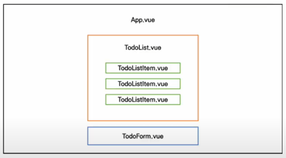

# Vue 02

<br>

## 목차

- [Vue CLI](#Vue-CLI)
- [SFC](#SFC)
- [Pass Props & Emit Events](#Pass-Props--Emit-Events)

<br><br>

## Vue CLI

- #### Vue CLI

  - Vue 개발을 위한 표준 도구
  - 프로젝트의 구성을 도와주는 역할
  - 확장 플러그인, GUI, Babel 등 다양한 tool 제공

<br>

- #### Vue CLI Quick Start

  - **설치**
    - `$ npm install -g @vue/cli`
  - **프로젝트 생성**
    1. vscode terminal 에서 진행
    2. `$ Vue create vue-cli`
    3. ``>> Default ([Vue 2] babel, eslint)` 선택
    4. `$ cd vue-cli` 폴더 이동
    5. `$ npm run serve` 서버 실행

<br>

- #### Vue CLI 프로젝트 구조

  - **public**
    - favicon.ico : 탭에 표시되는 img
    - index.html : Vue 앱의 뼈대가 되는 html 파일
  - **src**
    - assets : 정적 파일을 저장하는 디렉토리
    - components : 하위 컴포넌트들이 위치
    - App.vue : 최상의 컴포넌트
      - public/index.html 과 연결됨

<br><br>

## SFC

- #### Component

  - UI를 독립적이고 재사용 가능한 조각들로 나눈 것
  - 하나의 app을 구성할 때 중첩된 컴포넌트들의 tree로 구성하는 것이 보편적임
  - `new Vue()` 로 만든 인스턴스는 하나의 Component이다

<br>

- #### SFC (Single File Component)

  - 하나의 **.vue** 파일이 하나의 **Vue instance**이고, 하나의 **컴포넌트**이다.
  - HTML, CSS, JAvaScript 코드를 한번에 관리, 기능 단위로 작성하는 것이 핵심!
  - 컴포넌트 기반 개발의 핵심 기능

<br>

- #### Vue component 구조

  - **템플릿 (HTML)**
    - HTML의 **body** 부분
    - 눈으로 보여지는 요소 작성
    - 다른 컴포넌트를 HTML
  - **스크립트 (JavaScript)**
    - vue 인스턴스를 구성하는 대부분이 작성 됨, 문법이 조금 달라짐
  - **스타일 (CSS)**
    - CSS가 작성되며 컴포넌트의 스타일을 담당

<br>

- #### Vue component 구조 정리

  - root에 해당하는 최상단의 component가 **App.vue**
  - 이 App.vue를 index.html과 연결
  - 결국 index.html 파일 rendering
    - 이게 바로 SPA (Single Page Application)

<br>

- #### Vue component 실습

  - **하위 컴포넌트 생성 방법**
    1. src/components/ 안에 vue파일 생성
    2. script에 name 등록
    3. template 에 요소 추가
  - **상위 컴포넌트에 등록 방법**
    1. 불러오기 (import)
    2. 등록하기 (components에 name 등록)
    3. 보여주기 (template에 tag 작성)

<br>

- #### Vue component 스타일 가이드

  - 컴포넌트 이름은 **PascalCase** or **always kebab-case.**
  - 단독으로만 사용되는 컴포넌트에는 **The**를 붙인다
  - 강한 연관성을 가질 경우 **하위 컴포넌트가 상위 컴포넌트 이름을 포함하여 확장**

<br><br>

## Pass Props & Emit Events

- #### pass props & emit event

  - **pass props 방식**
    - 부모 :arrow_right: 자식으로의 데이터 흐름
  - **emit event 방식**
    - 자식 :arrow_right: 부모로의 데이터 흐름

<br>

- #### pass props

  - **props**
    - 요소의 속성(property)을 사용하여 데이터 전달
    - props 는 상위 컴포넌트의 정보를 전달하기 위한 **사용자 지정 특성**
    - 하위 컴포넌트는 **props 옵션을 사용**하여 수신하는 **props를 명시적으로 선언**해야함 (type?)
    - 정적인 데이터를 전달하는 경우 static props라고 함

  - **convention**
    - 상위 컴포넌트에서 데이터를 줄 때 **속성의 키 값은 kebab-case를 사용**
      - html 에서는 대문자를 구분하지 못한다
    - 하위 컴포넌트에서 데이터를 받을 때 **속성의 키 값은 camelCase 를 사용**
      - JavaScript 에서 받기 때문
  - **Dymamic props**
    - v-bind directive를 사용해 데이터를 동적으로 바인딩
      - 부모 컴포넌트의 **데이터가 업데이트 되면**<br>자식 컴포넌트로 전달되는 데이터 또한 업데이트 됨
    - **:warning:vue-cli 에서는 data를 함수의 return 객체로 선언해줘야 함**
  - **단방향 데이터 흐름**
    - 하위 컴포넌트가 실수로 상위 컴포넌트 상태를 변경하여 <br>앱의 데이터 흐름을 이해하게 힘들게 만드는 것을 방지
    - 하위 컴포넌트에서 prop를 변경하려고 시도해서는 안되며<br>그렇게하면 Vue는 콘솔에서 경고를 출력함

<br>

- #### Emit Event

  - **Emit Event**
    - 자식 컴포넌트에서 부모 컴포넌트로 데이터를 전달할 때는 이벤트를 발생 시킴
  - **$emit**
    - 자식 컴포넌트의 methods 안에 작성
    - this.$emit의 첫번째 인자 : 이벤트 이름(kebab-case)
    - this.$emit의 두번째~ 인자 : 부모에 전달할 데이터
  - **Emit Event 데이터 흐름 정리**
    1. 자식 컴포넌트의 tag에서 이벤트 발생
    2. 자식 컴포넌트의 연결된 핸들러 함수 호출
    3. 호출된 함수에서 $emit 을 통해 상위 컴포넌트에 이벤트 발생
    4. 상위 컴포넌트의 연결된 핸들러 함수 호출

<br>

- #### TodoList 실습하기

  

  - **App.vue**

    ```vue
    <template>
      <div id="app">
        <TodoList :todos="todos" @delete-todo="deleteTodo"/>
        <TodoForm @create-todo="createTodo"/>
      </div>
    </template>
    
    <script>
    import TodoForm from '@/components/TodoForm'
    import TodoList from '@/components/TodoList'
    
    export default {
      name: 'App',
      components: {
        TodoForm,
        TodoList,
      },
      data: function () {
        return {
          todos: [],
        }
      },
      methods: {
        createTodo: function(todoTitle) {
          const todo = {
            title: todoTitle,
          }
          this.todos.push(todo)
        },
        deleteTodo: function(todo) {
          const index = this.todos.indexOf(todo)
          this.todos.splice(index, 1)
        }
      }
    }
    </script>
    
    <style>
    
    </style>
    ```

    <br>

  - **TodoList.vue**

    ```vue
    <template>
      <div>
        <ul v-for="(todo, index) in todos" :key="index">
          <TodoListItem :todo="todo"
            @delete-todo="deleteTodo"
          />
        </ul>
      </div>
    </template>
    
    <script>
    import TodoListItem from '@/components/TodoListItem'
    
    export default {
      name: 'TodoList',
      components: {
        TodoListItem
      },
      props: {
        todos: Array,
      },
      methods: {
        deleteTodo: function(todo) {
          this.$emit('delete-todo', todo)
        }
      }
    }
    </script>
    
    <style>
    
    </style>
    ```

    <br>

  - **TodoListItem.vue**

    ```vue
    <template>
      <li>
        {{ todo.title }}
        <button @click="deleteTodo">X</button>
      </li>
    </template>
    
    <script>
    export default {
      name: 'TodoListItem',
      props: {
        todo: Object,
      },
      methods: {
        deleteTodo: function() {
          this.$emit('delete-todo', this.todo)
        }
      }
    }
    </script>
    
    <style>
    
    </style>
    ```

    <br>

  - **TodoForm.vue**

    ```vue
    <template>
      <div>
        <input 
          type="text" 
          v-model="todoTitle"
          @keyup.enter="createTodo"
        >
      </div>
    </template>
    
    <script>
    export default {
      name: 'TodoForm',
      data: function () {
        return {
          todoTitle: null,
        }
      },
      methods: {
        createTodo: function() {
          this.$emit('create-todo', this.todoTitle)
          this.todoTitle = null
        }
      }
    }
    </script>
    
    <style>
    
    </style>
    ```

    

