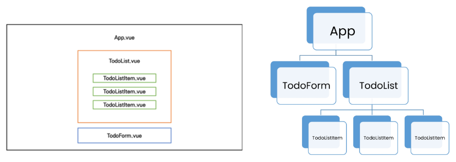

# Vue 03

<br>

## 목차

- Vuex
- Lifecycle Hooks
- Todo with Vuex

<br>

## Vuex

- #### State Management

  - Web Application에서의 상태는 현재 App이 가지고 있는 data로 표현할 수 있음!
  - 하지만, 여러 개의 componenet가 같은 상태(data)를 유지할 필요가 있음
    - 상태관리 필요!

<br>

- #### Centralized Store

  - 기존의 props, event 방식의 데이터 전달 방식은 비효율적!
  - **중앙 저장소(stor)에 데이터를 모아서 상태 관리**

<br>

- #### Vuex 시작하기

  1. `$ vue create vuex-app`
  2. `$ cd vuex-app`
  3. `$ vue add vuex`
     - commit 권장 질문 (y/n) :arrow_right: y

<br>

- #### Vuex의 핵심 컨셉 4가지

  1. **state**
     - vue 인스턴스의 data 에 해당
     - 중앙에서 관리하는 모든 상태 정보
     - **$store.state**로 state 데이터에 접근
  2. **mutations**
     - vue 인스턴스의 methods 에 해당
     - **실제로 state를 변경하는 유일한 방법**
     - 호출되는 핸들러 함수는 반드시 **동기적** 이어야 함
     - 첫번째 인자로 **state**를 받으며,<br>
       component 혹은 Actions에서 **commit()** 메서드로 호출됨
     - commit 의 첫번째 인자는 **mutation 메서드 이름**, 두번째 인자는 **추가데이터**
  3. **actions**
     - vue 인스턴스의 methods 에 해당
     - mutations와 비슷하지만 **비동기**작업을 포함할 수 있다는 차이를 가짐
     - **state를 직접 변경하지 않고 commit() 메서드로 mutations를 호출해서 state를 변경함**
     - **actions**는 모든 메서드에 접근할 수 있지만 **mutations의 영역은 침범하지 않게 하자!**
     - component에서 **dispatch()** 메서드에 의해 호출됨
     - 첫번째 인자는 **context**, 두번째 인자는 **payload**
  4. **getters**
     - vue 인스턴스의 computed 에 해당
     - **state를 활용하여 계산된 값을 얻고자 할 때 사용**
     - 첫번째 인자로 **state**, 두번째 인자로 **getter**를 받음

<br>

- #### 그럼 모든 데이터를 Vuex에서 관리해야 할까?

  - Vuex에서도 여전히 pass props, emit event를 사용하여 상태를 관리할 수 있음
  - 개발 환경에 따라 적절하게 사용하는 것이 필요함

<br>

- #### Vuex 실습

  - index.js

    ```js
    import Vue from 'vue'
    import Vuex from 'vuex'
    
    Vue.use(Vuex)
    
    export default new Vuex.Store({
      state: {
        message: 'message in store',
      },
      getters: {
        messageLength(state) {
          return state.message.length
        }
      },
      mutations: {
        CHANGE_MESSAGE(state, newMessage) {
          state.message = newMessage
        }
      },
      actions: {
        changeMessage(context, newMessage) {
          context.commit('CHANGE_MESSAGE', newMessage)
        }
      },
      modules: {
      }
    })
    ```
    
  - App.vue
  
    ```vue
    <template>
      <div id="app">
        <h1>{{ message }}</h1>
        <h2>문자의 길이는 {{ messageLength }} 입니다.</h2>
        <input 
          type="text"
          @keyup.enter="changeMessage"
          v-model="inputData"
        >
      </div>
    </template>
    
    <script>
    
    export default {
      name: 'App',
      data() {
        return {
          inputData: null,
        }
      },
      components: {
      },
      computed: {
        message() {
          return this.$store.state.message
        },
        messageLength() {
          return this.$store.getters.messageLength
        },
      },
      methods: {
        changeMessage() {
          const newMessage = this.inputData
          this.$store.dispatch('changeMessage', newMessage)
        }
      },
    }
    </script>
    
    <style>
    #app {
      font-family: Avenir, Helvetica, Arial, sans-serif;
      -webkit-font-smoothing: antialiased;
      -moz-osx-font-smoothing: grayscale;
      text-align: center;
      color: #2c3e50;
      margin-top: 60px;
    }
    </style>
    ```
    
  

<br><br>

## LIfecycle Hooks

- #### created

  - Vue instance가 생성된 후 호출됨
  - data, computed 등의 설정이 완료된 상태
  - 서버에서 받은 데이터를 vue instance의 data에 할당하는 로직을 구현학 ㅣ적합
  - 단, mount되지 않아 요소에 접근할 수 없음

<br>

- #### mounted

  - Vue instance가 요소에 mount된 후 호출됨
  - mount된 요소를 조작할 수 있음
  - DOM이 생성된 이후라 DOM을 조작할 수 있음!

<br>

- #### updated

  - 데이터가 변경되어 DOM에 변화를 줄 때 호출됨

<br>

- #### Lifecycle Hooks 특징

  - instance마다 각각의 Lifecycle을 가지고 있음
  - Lifecycle Hooks는 컴포넌트별로 정의할 수 있음

<br><br>

## Todo with Vuex

- #### 개요

  - Todo CRUD

  - Todo 개수 계산

    - 전체 Todo
    - 완료된 Todo
    - 미완료된 Todo

  - 컴포넌트 구성

    

<br>

- #### 코드

  - index.js

    ```js
    import Vue from 'vue'
    import Vuex from 'vuex'
    import createPersistedState from 'vuex-persistedstate'
    
    Vue.use(Vuex)
    
    export default new Vuex.Store({
      plugins: [
        createPersistedState(),
      ],
      state: {
        todos: [],
      },
      getters: {
        allTodosCount(state) {
          return state.todos.length
        },
        completedTodosCount(state) {
          const completedTodos = state.todos.filter((todo) => {
            return todo.isCompleted
          })
          return completedTodos.length
        },
        uncompletedTodosCount(state, getters) {
          return getters.allTodosCount - getters.completedTodosCount
        },
      },
      mutations: {
        CREATE_TODO(state, todoItem) {
          state.todos.push(todoItem)
        },
        DELETE_TODO(state, todoItem) {
          const index = state.todos.indexOf(todoItem)
          state.todos.splice(index, 1)
        },
        UPDATE_TODO_STATUS(state, todoItem) {
          const index = state.todos.indexOf(todoItem)
          state.todos[index].isCompleted = !state.todos[index].isCompleted
        },
        // LOAD_TODOS(state) {
        //   const localStorageTodos = localStorage.getItem('todos')
        //   const parsedTodos = JSON.parse(localStorageTodos)
        //   state.todos = parsedTodos
        // },
      },
      actions: {
        createTodo(context, todoTitle) {
          const todoItem = {
            title: todoTitle,
            isCompleted:false,
          }
          context.commit('CREATE_TODO', todoItem)
          // context.dispatch('saveTodosToLocalStorage')
        },
        deleteTodo(context, todoItem) {
          context.commit('DELETE_TODO', todoItem)
          // context.dispatch('saveTodosToLocalStorage')
        },
        updateTodoStatus(context, todoItem) {
          context.commit('UPDATE_TODO_STATUS', todoItem)
          // context.dispatch('saveTodosToLocalStorage')
        },
    
        // saveTodosToLocalStorage(context) {
        //   const jsonTodos = JSON.stringify(context.state.todos)
        //   localStorage.setItem('todos', jsonTodos)
        // },
    
        // loadTodos(context) {
        //   context.commit('LOAD_TODOS')
        // },
      },
      modules: {
      }
    })
    ```

    <br>

  - App.vue

    ```vue
    <template>
      <div id="app">
        <h1>Todo List</h1>
        <h2>모든 Todo 개수 : {{ allTodosCount }}</h2>
        <h2>완료된 Todo 개수 : {{ completedTodosCount }}</h2>
        <h2>미완료된 Todo 개수 : {{ uncompletedTodosCount }}</h2>
        <TodoList/>
        <TodoForm/>
        <!-- <button @click="loadTodos">Todo 불러오기</button> -->
      </div>
    </template>
    
    <script>
    import TodoList from '@/components/TodoList'
    import TodoForm from '@/components/TodoForm'
    
    
    export default {
      name: 'App',
      components: {
        TodoList,
        TodoForm,
      },
      computed: {
        allTodosCount() {
          return this.$store.getters.allTodosCount
        },
        completedTodosCount() {
          return this.$store.getters.completedTodosCount
        },
        uncompletedTodosCount() {
          return this.$store.getters.uncompletedTodosCount
        }
      },
      methods: {
        // loadTodos() {
        //   this.$store.dispatch('loadTodos')
        // },
      }
    }
    </script>
    
    <style>
    #app {
      font-family: Avenir, Helvetica, Arial, sans-serif;
      -webkit-font-smoothing: antialiased;
      -moz-osx-font-smoothing: grayscale;
      text-align: center;
      color: #2c3e50;
      margin-top: 60px;
    }
    </style>
    
    ```

    <br>

  - components / TodoList.vue

    ```vue
    <template>
      <div>
        Todo
        <TodoListItem
          v-for="(todo, index) in todos" :key="index"
          :todo="todo" 
        />
      </div>
    </template>
    
    <script>
    import TodoListItem from '@/components/TodoListItem'
    
    export default {
      name: 'TodoList',
      components: {
        TodoListItem,
      },
      computed: {
        todos() {
          return this.$store.state.todos
        }
      }
    }
    </script>
    
    <style>
    
    </style>
    ```

    <br>

  - components / TodoListItem.vue

    ```vue
    <template>
      <div>
        <span 
          @click="updateTodoStatus"
          :class="{ 'is-completed': todo.isCompleted}"
        >
          {{ todo.title }}
        </span>
        <button @click="deleteTodo">Delete</button>
      </div>
    </template>
    
    <script>
    export default {
      name: 'TodoListItem',
      props: {
        todo: Object,
      },
      methods: {
        deleteTodo() {
          this.$store.dispatch('deleteTodo', this.todo)
        },
        updateTodoStatus() {
          this.$store.dispatch('updateTodoStatus', this.todo)
        }
      }
    }
    </script>
    
    <style>
      .is-completed {
        text-decoration: line-through;
      }
    </style>
    ```

    <br>

  - components / TodoForm.vue

    ```vue
    <template>
      <div>Todo Form
        <input 
          type="text"
          v-model.trim="todoTitle"
          @keyup.enter="createTodo"
        >
      </div>
    </template>
    
    <script>
    export default {
      name: 'TodoForm',
      data() {
        return {
          todoTitle: null,
        }
      },
      methods: {
        createTodo() {
          if (this.todoTitle) {
            this.$store.dispatch('createTodo', this.todoTitle)
          }
          this.todoTitle = null
        }
      },  
    }
    </script>
    
    <style>
    
    </style>
    ```

<br><br>

## Local Storage

- #### Window.localStorage

  - 관련 메서드
    - setItem(key, value) - key, value 형태로 데이터 저장
    - getItem(key) - key에 해당하는 데이터 조회

<br>

- #### vuex-persistedstate

  - 설치

    - ```
      $ npm i vuex-persistedstate
      ```

  - Vuex state를 자동으로 브라우저의 Local Storage에 저장해주는 라이브러리 중 하나

  - 페이지가 새로고침 되어도 Vuex state를 유지시킴

  - Local Storage에 저장된 data를 자동으로 state로 불러옴