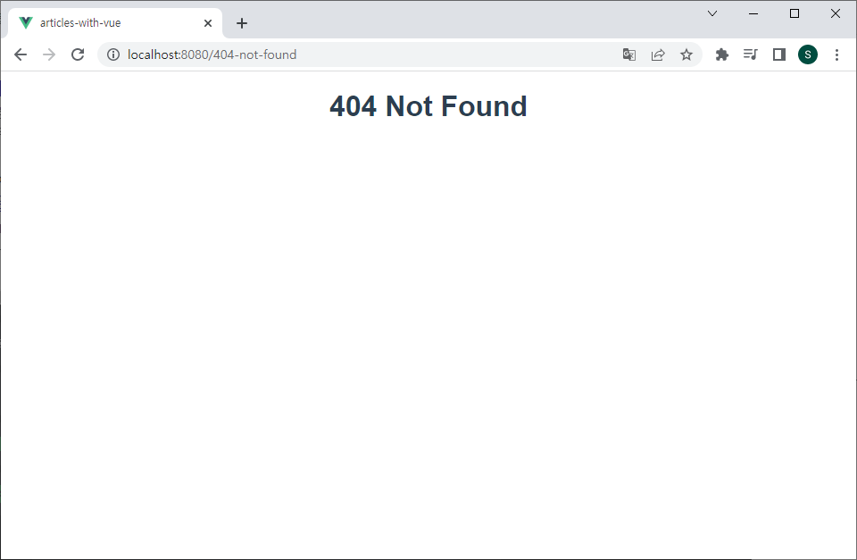

# Vue 04

<br>

## 목차

- [UX & UI](#UX--UI)
- [Vue Router](#Vue-Router)
- [Navigation Guard](#Navigation-Guard)
- [Articles app with Vue](#Articles-app-with-Vue)
- [vuetube](#vuetube)

<br>

## UX & UI

- #### UX (User Experience)

  - 유저와 가장 가까이에 있는 분야, 데이터를 기반으로 유저를 조사하고 분석해서 개발자, 디자이너가 이해할 수 있게 소통
  - 유저가 느끼는 느낌, 태도 그리고 행동을 디자인

<br>

- #### 좋은 UX를 설계하기 위해서는

  - 사람들의 마음과 생각을 이해하고 정리해서 우리 제품에 녹여내는 과정이 필요
  - 유저 리서치, 데이터 설계 및 정제, 유저 시나리오, 프로토타입 설계 등이 필요

<br>

- #### UI (User interface)

  - 유저에게 보여지는 화면을 디자인
  - UX를 고려한 디자인을 반영, 이 과정에서 기능 개선 혹은 추가가 필요한 경우 Front-end 개발자와 가장 많이 소통

<br>

- #### 좋은 UI를 설계하기 위해서는

  - 예쁜 디자인 즉 심미적인 부분만 중요하다기보다는 사용자가 보기 쉽고 편리하게 사용할 수 있도록 하는 부분까지 고려되어야 함
  - 통일된 디자인을 위한 디자인 시스템, 소통을 위한 중간 산출물, 프로토타입 등이 필요
  - UI 디자인에 있어 가장 중요한 것은 협업

<br>

- #### 디자이너와 기획자 그리고 개발자

  - 많은 회사에서 UX/UI 디자인을 함께하는 디자이너를 채용하거나<br>UX는 기획자, UI는 디자이너의 역할로 채용하기도 함
  - 개발자는 단순히 기능 개발만 하는 사람이 아니며 제품에 대해 고민하고 소통하는 능력이 반드시 필요
  - 즉 다양한 분야와의 협업이 필수적이기에 기본적인 UX/UI에 대한 이해가 있어야 함

<br>

- #### 생각하는 UX & UI 디자인

  - 점점 더 복잡해지는 기술과 반대로 점점 더 단순하고 대중화 되어야하는<br>유저에 대한 경험으로 인해 계속해서 연구되는 중요한 분야

  - 예술에 정답이 없듯, 디자인에도 정답이 정해져 있지 않음

  - 전세계의 많은 디자이너 또는 연구자들이 데이터에 기반해서 연구한 다양한 가이드가 존재

    ```
    UX/UI 그리고 HCI
     - GUI: 유저가 보는 일반적인 시각적인 디자인
     - UI: 유저가 보거나 듣는 등 비시각적인 부분까지 포함한 디자인
     - UX: 유저가 겪는 모든 경험(컴퓨터와 관련이 없는 부분까지도 포함)
     - HCI: 인간과 컴퓨터 사이의 상호작용에 대한 학문 (Human Computer Interaction)
    ```

<br>

- #### Prototyping

  - **Prototyping Tool 시장**
    - 이전까지는 Sketch라는 툴이 굉장히 많이 사용되었지만,<br>현재에는 **Figma**라는 툴이 약 70%의 시장 점유율을 보이고 있음
  - **Why Figma?**
    - 웹 기반 시스템을 가짐
      - 매우 가벼운 환경에서 실행가능, 모든 작업 내역이 웹에 저장됨
    - **실시간으로 팀원들이 협업**할 수 있는 기능을 제공
    - 직관적이고 다양한 디자인 툴을 제공
    - Figma 사용자들이 만든 다양한 플러그인이 존재 (VScode의 확장프로그램 등)
    - **대부분의 기능을 무료**로 사용할 수 있음
  - **프로젝트를 시작하기 전에**
    - 개발부터 시작하지 말고 반드시 충분한 기획을 거칠 것
    - 우리가 완성하고자 하는 대략적인 모습을 그려보는 과정이 필요
    - 이러한 과정을 통해서 기획에서 빠진 화면이나 API 등을 확인할 수 있음
    - 설계와 기획이 끝난 후 개발을 시작해야 체계적인 진행이 가능함

<br><br>

## Vue Router

- #### Routing

  - 네트워크에서 경로를 선택하는 프로세스
  - 웹 서비스에서의 라우팅
    - 유저가 방문한 URL에 대해 적절한 결과를 응답하는 것

<br>

- #### Routing in SSR

  - Server가 모든 라우팅을 통제
  - URL로 요청이 들어오면 응답으로 완성된 HTML 제공
    - Django로 보낸 요청의 응답 HTML은 완성본인 상태였음
  - 결론적으로, Routing(URL)에 대한 결정권을 서버가 가짐

<br>

- #### Routing in SPA / CSR

  - 서버는 하나의 HTML(index.html) 만을 제공
  - 이후의 모든 동작은 하나의 HTML 문서 위에서 JavaScript 코드를 활용
    - DOM을 그리는데 필요한 추가적인 데이터가 있다면 axios와 같은 AJAX 요청을 보낼 수 있는 도구를 사용하여 데이터를 가져오고 처리
  - 즉, 하나의 URL만 가질 수 있음

<br>

- #### Why routing?

  - Routing이 없다면
    - 유저가 URL을 통한 페이지의 변화를 감지할 수 없음
    - 페이지가 무엇을 렌더링 중인지에 대한 상태를 알 수 없음
      - 새로고침 시 처음 페이지로 돌아감
      - 링크를 공유할 시 처음 페이지만 공유 가능
    - 브라우저의 뒤로 가기 기능을 사용할 수 없음

<br>

- #### Vue Router

  - 라우트(routes)에 컴포넌트를 매핑한 후, 어떤 URL에서 렌더링 할 지 알려줌
    - 즉, SPA를 MPA(multiple, SSR방식)처럼 URL을 이동하면서 사용 가능
    - SPA의 단점 중 하나인 **"URL이 변경되지 않는다"** 를 해결

<br>

- #### Vue Router 시작하기

  1. 설치 및 반영

     - `$ vue create vue-router-app`

     - `$ cd vue-router-app`

     - `$ vue add router`

  2. history mode 사용여부 :arrow_right: Yes
  3. App.vue
     - router-link 요소 및 router-view가 추가됨
  4. router/index.js 생성, views 폴더 생성
  5. 서버 실행하기

<br>

- #### History mode

  - 브라우저의 History API를 활용한 방식
    - 새로고침 없이 URL 이동 기록을 남길 수 있음
  - 우리에게 익숙한 URL 구조로 사용 가능 ('/'을 통해 URL을 구분하는 방식)
  - History mode를 사용하지 않으면 Default 값인 **hash mode**로 설정됨('#'을 통해 URL을 구분하는 방식)

<br>

- #### router-link

  - a 태그와 비슷한 기능 :arrow_right: URL을 이동시킴
    - routes에 등록된 컴포넌트와 매핑됨
    - 히스토리 모드에서 router-link는 클릭 이벤트를 차단하여 페이지를 다시 로드 하지 않도록 함
  - 목표 경로는 **'to'** 속성으로 지정됨
  - 기능에 맞게 HTML에서 a 태그로 rendering 되지만, 필요에 따라 다른 태그로 바꿀 수 있음

<br>

- #### router-view

  - 주어진 URL에 대해 일치하는 컴포넌트를 렌더링 하는 컴포넌트
  - 실제 component가 DOM에 부착되어 보이는 자리를 의미
  - router-link를 클릭하면 rotues에 매핑된 컴포넌트를 렌더링
  - Django에서의 block tag와 비슷함
    - App.vue는 base.html의 역할
    - router-view는 block 태그로 감싼 부분

<br>

- #### src/router/index.js

  - 라우터에 관련된 정보 및 설정이 작성 되는 곳
  - Django에서의 urls.py에 해당
  - routes에 URL과 컴포넌트를 매핑

<br>

- #### src/Views

  - router-view에 들어갈 component 작성
  - 기존에 컴포넌트를 작성하던 곳은 components 폴더 뿐이었지만 이제 두 폴더로 나뉘어짐
  - 각 폴더 안의 .vue 파일들이 기능적으로 다른 것은 아님
  - views/
    - routes에 매핑되는 컴포넌트를 모아두는 폴더
    - 다른 컴포넌트와 구분하기 위해 View로 끝나도록 만드는 것을 권장
  - components/
    - routes에 매핑된 컴포넌트의 하위 컴포넌트를 모아두는 폴더

<br>

- #### 주소를 이동하는 2가지 방법

  1. 선언적 방식 네비게이션
  2. 프로그래밍 방식 네비게이션

<br>

- #### 선언적 방식 네비게이션

  - router-link의 'to' 속성으로 주소 전달

  - 이름을 가지는 routes

    ```html
    <router-link :to="{name: 'home'}">Home</router-link>
    ```

<br>

- #### 프로그래밍 방식 네비게이션

  - Vue 인스턴스 내부에서 라우터 인스턴스에 **$router** 로 접근할 수 있음
  - 다른 URL로 이동하려면 **this.$router.push({ name:  'home' })** 를 사용
  - 동작 원리는 선언적 방식과 같음

<br>

- #### Dynamic Route Matching

  - 동적 인자 전달

    - URL의 특정 값을 변수처럼 사용할 수 있음

  - HelloView.vue 작성 및 route 추가

    ```js
    import HelloView from '@/views/HelloView.vue'
    
    const routes = [
      ...,
      {
        path: '/hello/:userName',		// 동적 인자 명시
        name: 'hello',
        component: HelloView
      },
    ]
    ```

  - **$route.params**로 변수에 접근 가능

    ```vue
    <template>
      <div>
        <h1>hello, {{ userName }}</h1>
      </div>
    </template>
    
    <script>
    export default {
      name: 'HelloView',
      data() {
        return {
          userName: this.$route.params.userName
        }
      }
    }
    </script>
    ```
  
  - params를 이용하여 동적 인자 전달 가능

    ```html
    <router-link :to="{ name: 'hello', params: { userName: 'seungtae' } }"></router-link>
    ```
  
  - **실습 (입력값을 동적 인자로 URL 이동하기)**
  
    ```vue
    <template>
      <div class="about">
        <h1>This is an about page</h1>
        <input type="text" v-model="inputName" @keyup.enter="goToHello">
      </div>
    </template>
    
    <script>
    export default {
      data() {
        return {
          inputName: null,
        }
      },
      methods: {
        goToHello() {
          this.$router.push({ name: 'hello', params: { userName: this.inputName } })
        }
      }
    }
    </script>
    ```

<br>

- #### route에 컴포넌트를 등록하는 또다른 방법

  - lazy-loading

    - 미리 로드를 하지 않고 특정 라우트에 방문할 때 로딩함

    - 모든 파일을 한 번에 로드하지 않아도 되기 때문에 최초에 로드하는 시간이 빨라짐

    - 당장 사용하지 않을 컴포넌트는 먼저 로드하지 않는 것이 핵심

      ```js
      const routes = [
        {
          path: '/about',
          name: 'about',
          component: () => import('../views/AboutView.vue')
        },
      ]
      ```


<br><br>

## Navigation Guard

- #### 네비게이션 가드

  - 특정 URL에 접근할 때 **다른 url로 redirect** 를 하거나 **해당 URL로의 접근을 막는** 방법

<br>

- #### 전역 가드

  - 다른 url 주소로 이동할 때 항상 실행

  - router/index.js에 **router.beforeEach()** 를 사용하여 설정

  - 콜백 함수의 값으로 다음과 같이 3개의 인자를 받음

    - to : 이동할 URL 정보가 담긴 Route 객체
    - from : 현재 URL 정보가 담긴 Route 객체
    - next : 지정한 URL로 이동하기 위해 호출하는 함수

  - URL이 변경되어 화면이 전환되기 전 **router.beforeEach()** 가 호출됨

  - 변경된 URL로 라우팅하기 위해서는 **next()** 를 호출해줘야 함

    - **next()가 호출되기 전까지 화면이 전환되지 않음 (대기상태가 됨)**

    ```js
    // router/index.js
    
    //전역 가드
    router.beforeEach((to, from, next) => {
      // 로그인 여부 
      const isLoggedIn = true
    
      // 로그인이 필요한 페이지
      const authPages = ['hello']
    
      const isAuthRequired = authPages.includes(to.name)
    
      if (isAuthRequired && !isLoggedIn) {
        console.log('login으로 이동')
        next({ name: 'login' })
      } else {
        console.log('to로 이동')
        next()
      }
    })
    ```

    

<br>

- #### 라우터 가드

  - 전체 route가 아닌 특정 route에 대해서만 가드를 설정하고 싶을 때 사용

  - **beforeEnter()**

    - route에 진입했을 때 실행됨
    - 라우터를 등록한 위치에 추가
    - 단 매개변수, 쿼리, 해시 값이 변경될 때는 실행되지 않고 다른 경로에서 탐색할 때만 실행됨
    - 콜백 함수 인자로 to, from, next를 받음

    ```js
    // router/index.js
    
    const routes = [
        ...,
      {
        path: '/login',
        name: 'login',
        component: LoginView,
        // 라우터 가드
        beforeEnter(to, from, next) {
          if (isLoggedIn === true) {
            console.log('이미 로그인 되어 있음')
            next({ name: from.name })
          } else {
            next()
          }
        }
      },
    ]
    ```

    

<br>

- #### 컴포넌트 가드

  - 특정 컴포넌트 내에서 가드를 지정하고 싶을 때 사용

  - **beforeRouteUpdate()**

    - 해당 컴포넌트를 렌더링하는 경로가 변경될 때 실행

    ```html
    // views/HelloView.vue
    
    <script>
    export default {
      name: 'HelloView',
      data() {
        return {
          userName: this.$route.params.userName
        }
      },
      // 컴포넌트 가드
      beforeRouteUpdate(to, from, next) {
        this.userName = to.params.userName
        next()
      }
    }
    </script>
    ```

    

<br>

- #### 404 Not Found

  - 요청한 리소스가 존재하지 않는 경우
    - 애스터리스크 '*' 에서 404페이지로 redirect
  - 형식은 유효하지만 특정 리소스를 찾을 수 없는 경우
    - 해당 컴포넌트에서 axios.catch 구문에서 404페이지로 이동

<br><br>

## Articles app with Vue

- #### 개요

  - 지금까지 배운 내용들을 종합하여 Django 에서 만들었던 게시판 만들기

  - 구현기능

    - Index
    - Create
    - Detail
    - Delete
    - 404

  - 컴포넌트 구성

    

<br>

- #### 코드

  1. store/index.js

     ```js
     import Vue from 'vue'
     import Vuex from 'vuex'
     
     Vue.use(Vuex)
     
     export default new Vuex.Store({
       state: {
         article_id: 3,
         articles: [
           {
             id: 1,
             title: 'title',
             content: 'content',
             createAt: new Date().getTime(),
           },
           {
             id: 2,
             title: 'title2',
             content: 'content2',
             createAt: new Date().getTime(),
           },
         ]
       },
       getters: {
       },
       mutations: {
         CREATE_ARTICLE(state, article) {
           state.articles.push(article)
           state.article_id = state.article_id + 1
         },
         DELETE_ARTICLE(state, article_id) {
           state.articles = state.articles.filter((article) => {
             return !(article.id === article_id)
           })
         }
       },
       actions: {
         createArticle(context, payload) {
           const article = {
             id: context.state.article_id,
             title: payload.title,
             content: payload.content,
             createAt: new Date().getTime()
           }
           context.commit('CREATE_ARTICLE', article)
         }
       },
       modules: {
       }
     })
     ```

     <br>

  2. router/index.js

     ```js
     import Vue from 'vue'
     import VueRouter from 'vue-router'
     import IndexView from '../views/IndexView.vue'
     import CreateView from '../views/CreateView.vue'
     import DetailView from '../views/DetailView.vue'
     import NotFound404 from '../views/NotFound404.vue'
     
     Vue.use(VueRouter)
     
     const routes = [
       {
         path: '/',
         name: 'index',
         component: IndexView
       },
       {
         path: '/create',
         name: 'create',
         component: CreateView
       },
       {
         path: '/404-not-found',
         name: 'NotFound404',
         component: NotFound404
       },
       {
         path: '/:id',
         name: 'detail',
         component: DetailView
       },
       {
         path: '*',
         redirect: { name: 'NotFound404' }
       },
     ]
     
     const router = new VueRouter({
       mode: 'history',
       base: process.env.BASE_URL,
       routes
     })
     
     export default router
     
     ```

     <br>

  3. views/IndexView.vue

     ```vue
     <template>
       <div>
         <h1>Articles</h1>
         <router-link :to="{ name: 'create' }">게시글 작성</router-link>
         <ArticleItem
           v-for="article in articles" :key="article.id"
           :article=article
         />
       </div>
     </template>
     
     <script>
     import ArticleItem from '@/components/ArticleItem'
     
     export default {
       name: 'IndexView',
       components: {
         ArticleItem,
       },
       computed: {
         articles() {
           return this.$store.state.articles
         }
       }
     }
     </script>
     
     <style>
     
     </style>
     ```

     <br>

  4. components/ArticleItem.vue

     ```vue
     <template>
       <div @click="goDetail(article.id)">
         <p>글 번호 : {{ article.id }}</p>
         <p>글 제목 : {{ article.content }}</p>
         <hr>
       </div>
     </template>
     
     <script>
     export default {
       name: 'ArticleItem',
       props: {
         article: Object,
       },
       methods: {
         goDetail(id) {
           this.$router.push({ name: 'detail', params: { id } })
         }
       }
     }
     </script>
     
     <style>
     
     </style>
     ```

     <br>

  5. views/CreateView.vue

     ```vue
     <template>
       <div>
         <h1>게시글 작성</h1>
         <form @submit.prevent="createArticle">
           <input type="text" v-model.trim="title"><br>
           <textarea v-model="content"></textarea><br>
           <input type="submit">
         </form>
         <router-link :to="{ name: 'index' }">Home</router-link>
       </div>
     </template>
     
     <script>
     export default {
       name: 'CreateView',
       data() {
         return {
           title: null,
           content: null,
         }
       },
       methods: {
         createArticle() {
           const title = this.title
           const content = this.content
           const payload = {
             title,
             content,
           }
           this.$store.dispatch('createArticle', payload)
           this.$router.push({ name: 'index'})
         }
       }
     }
     </script>
     
     <style>
     
     </style>
     ```

     <br>

  6. views/DetailView.vue

     ```vue
     <template>
       <div>
         <h1>Detail</h1>
         <p>글 번호 : {{ article?.id }}</p>
         <p>글 제목 : {{ article?.title }}</p>
         <p>글 내용 : {{ article?.content }}</p>
         <p>글 작성시간 : {{ articleCreateAt }}</p>
         <button @click="deleteArticle">삭제</button><br>
         <router-link :to="{ name: 'index' }">Home</router-link>
       </div>
     </template>
     
     <script>
     export default {
       name: 'DetailView',
       data() {
         return {
           article: null,
         }
       },
       computed: {
         articles() {
           return this.$store.state.articles
         },
         articleCreateAt() {
           const article = this.article
           const createAt = new Date(article?.createAt).toLocaleString()
           return createAt
         }
       },
       methods: {
         getArticleById(id) {
           // const id = this.$route.params.id
           for (const article of this.articles) {
             if (article.id === Number(id)) {
               this.article = article
               break
             }
           }
           if(this.article === null) {
             this.$router.push({ name: 'NotFound404' })
           }
         },
         deleteArticle() {
           this.$store.commit('DELETE_ARTICLE', this.article.id)
           this.$router.push({ name: 'index' })
         },
       },
       created() {
         this.getArticleById(this.$route.params.id)
       }
     }
     </script>
     
     <style>
     
     </style>
     ```

     <br>

  7. views/NotFount404.vue

     ```vue
     <template>
       <div>
         <h1>404 Not Found</h1>
       </div>
     </template>
     
     <script>
     export default {
       name: 'NotFound404',
     }
     </script>
     
     <style>
     
     </style>
     ```

<br><br>

- #### 결과화면

  

  <br>

  

  <br>

  


# vuetube

- #### 개요


<br>


<br>

- #### 코드 

1. App.vue

   ```vue
   <template>
     <div id="app">
       <br><br>
       <p>My First Youtube Project</p>
       <TheSearchBar
         @get-search-data="getSearchData"
       />
       <br>
       <div id="main-div">
         <VideoDetail
           :selectedVideo="selectedVideo"
         />
         <VideoList
           :videoList="videoList"
           @choice-video="choiceVideo"
         />
       </div>
     </div>
   </template>
   
   <script>
   import VideoList from '@/components/VideoList'
   import TheSearchBar from '@/components/TheSearchBar'
   import VideoDetail from '@/components/VideoDetail'
   import axios from 'axios'
   
   export default {
     name: 'App',
     components: {
       VideoList,
       TheSearchBar,
       VideoDetail,
     },
     data() {
       return {
         videoList: null,
         selectedVideo: null,
       }
     },
     methods: {
       getSearchData(searchWord) {
         const key = process.env.VUE_APP_YOUTUBE_API_KEY
         const part = 'snippet'
         const type = 'video'
         const maxResults = '50'
         const url = `https://www.googleapis.com/youtube/v3/search?key=${key}&part=${part}&type=${type}&q=${searchWord}&maxResults=${maxResults}`
         axios({
           method: 'get',
           url: url
         })
           .then((response) => {
             this.videoList = response.data.items
             this.selectedVideo = this.videoList[0]
           })
           .catch((error) => {
             console.log(error)
           })
       },
       choiceVideo(selectedVideo) {
         this.selectedVideo = selectedVideo
       }
     }
   }
   </script>
   
   <style>
   #app {
     font-family: Avenir, Helvetica, Arial, sans-serif;
     -webkit-font-smoothing: antialiased;
     -moz-osx-font-smoothing: grayscale;
     text-align: center;
     color: #2c3e50;
     margin-top: 60px;
     margin: auto;
     width: 1400px;
   }
   
   #main-div {
     display: flex;
     flex-direction: row;
   }
   </style>
   ```

   <br>

2. components / TheSearchBar.vue

   ```vue
   <template>
     <div id="search-bar-div">
       <b-form-input
           id="input-formatter"
           placeholder="검색어를 입력하세요"
           v-model="searchWord" @keyup.enter="getSearchData"
         ></b-form-input>
     </div>
   </template>
   
   <script>
   export default {
     name: 'TheSearchBar',
     data() {
       return {
         searchWord: null,
       }
     },
     methods: {
       getSearchData() {
         this.$emit('get-search-data', this.searchWord)
         this.searchWord = ''
       }
     }
   }
   </script>
   
   <style>
   #search-bar-div {
     padding: 10px;
   }
   </style>
   ```

   <br>

3. components / VideoDetail.vue

   ```vue
   <template>
     <div id="detail-div" v-if="selectedVideo">
       <iframe
         :src="videoURL" 
         width=800 height=480 
         frameborder=0 
         allowfullscreen>
       </iframe>
       <div id="description-div">
         <h2>{{ title }}</h2>
         <hr>
         <p>{{ selectedVideo?.snippet.description }}</p>
       </div>
     </div>
   </template>
   
   <script>
   import _ from 'lodash'
   
   export default {
     name: 'VideoDetail',
     props: {
       selectedVideo: Object,
     },
     computed: {
       title() {
         return _.unescape(this.selectedVideo?.snippet.title)
       },
       videoURL() {
         return `https://www.youtube.com/embed/${this.selectedVideo?.id.videoId}`
       }
     }
   }
   </script>
   
   <style>
   #detail-div {
     margin-left: 10px;
     margin-right: 10px;
     width: 800px;
   }
   
   #description-div {
     padding: 10px;
     box-shadow : rgba(50, 50, 93, 0.25) 0px 6px 12px -2px, rgba(0, 0, 0, 0.3) 0px 3px 7px -3px;
     border-radius: 10px;
     width: 800px;
     height: 200px;
   }
   
   #description-div h2 {
     font-size: 32px;
     height: 77px;
     text-overflow: ellipsis;
     overflow: hidden;
     word-break: break-word;
     
     display: -webkit-box;
     -webkit-line-clamp: 2;
     -webkit-box-orient: vertical
   }
   
   #description-div p {
     height: 48px;
     overflow: hidden;
   }
   
   
   </style>
   ```

   <br>

4. components / VideoList.vue

   ```vue
   <template>
     <div id="video-list-div" v-if="videoList">
       <VideoListItem
         v-for="(video, index) in videoList" :key="index"
         :video="video"
         @choice-video="choiceVideo"
       />
     </div>
   </template>
   
   <script>
   import VideoListItem from '@/components/VideoListItem'
   
   export default {
     name: 'VideoList',
     components: {
       VideoListItem,
     },
     props: {
       videoList: Array,
     },
     methods: {
       choiceVideo(selectedVideo) {
         this.$emit('choice-video', selectedVideo)
       }
     }
   }
   </script>
   
   <style>
   #video-list-div {
     /* width: 1200px; */
     height: 700px;
     overflow-y: scroll;
   }
   </style>
   ```

   <br>

5. components / VideoListItem.vue

   ```vue
   <template>
     <div id="item-div" @click="choiceVideo">
       
       <p>{{ videoTitle }}</p>
     </div>
   </template>
   
   <script>
   import _ from 'lodash'
   
   export default {
     name: 'VideoListItem',
     props: {
       video: Object,
     },
     computed: {
       videoTitle() {
         return _.unescape(this.video.snippet.title)
       },
       videoThumbnail() {
         return this.video.snippet.thumbnails.default.url
       }
     },
     methods: {
       choiceVideo() {
         this.$emit('choice-video', this.video)
       }
     }
   }
   </script>
   
   <style>
   #item-div {
     width: 540px;
     /* height: 110px; */
     display: flex;
     flex-direction: row;
     margin-left: 10px;
     margin-right: 10px;
     margin-bottom: 10px;
     padding: 10px;
     box-shadow : rgba(50, 50, 93, 0.25) 0px 6px 12px -2px, rgba(0, 0, 0, 0.3) 0px 3px 7px -3px;
     border-radius: 10px;
   }
   
   #item-div p{
     margin: 0px;
     padding: 10px;
     width: 400px;
     text-overflow: ellipsis;
     overflow: hidden;
     word-break: break-word;
     
     display: -webkit-box;
     -webkit-line-clamp: 3;
     -webkit-box-orient: vertical
   }
   </style>
   ```

<br>

- #### 결과 화면


