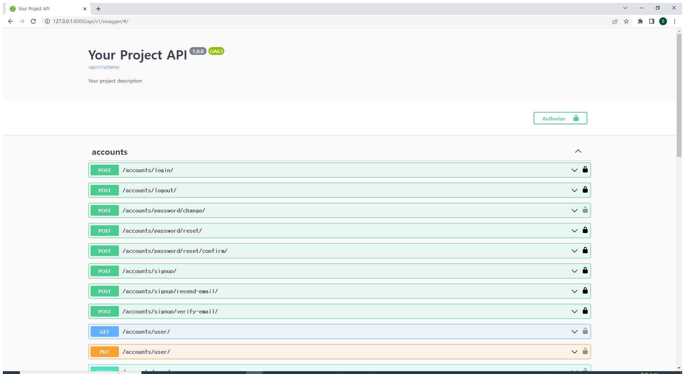

# Vue 05

<br>

## 목차

- [Vue with DRF](#Vue-with-DRF)
- [CORS](#CORS)
- [DRF Auth System](#DRF-Auth-System)
- [DRF Auth with Vue](#DRF-Auth-with-Vue)
- [drf-spectacular](#drf-spectacular)

<br><br>

## Vue with DRF

- #### Server & Client

  - Server
    - DB와 통신하며 데이터를 생성, 조회, 수정, 삭제를 담당
    - 요청을 보낸 Client에게 정상적인 요청이었다면 처리한 결과를 응답
  - Client
    - Server가 정의한 방식대로 정보(데이터)를 요청
    - 응답 받은 정보를 가공하여 화면에 표현

<br><br>

## CORS

- #### Cross-Origin Resource Sharing

  - **What Happened?**
    - 서버는 제대로 응답을 주었지만 브라우저가 막은 것
    - 보안상의 이유로 브라우저는 **동일 출처 정책(SOP)** 에 의해 다른 출처의 리소스와 상호작용 하는 것을 제한함
  - **CORS - 교차 출처 리소스 공유**
    - 추가 **HTTP Header** 를 사용하여, 특정 출처에서 실행 중인 웹 어플리케이션이<br>**다른 출처의 자원에 접근할 수 있는 권한** 을 부여하도록 브라우저에 알려주는 체제

<br>

- #### How to set CORS

  1. 라이브러리 설치 [공식문서](https://github.com/adamchainz/django-cors-headers)

     - `$ pip install django-cors-headers`
     - `$ pip freeze > requirements.txt`

  2. App 추가 및 MIDDLEWARE 추가 주석 해제

     - :warning: 주의) CorsMiddleware 는 가능한 CommonMiddleware 보다 먼저 정의되어야 함

     - ```python
       #settings.py 
       
       INSTALLED_APPS = [
       	...
       	# CORS policy
       	'corsheaders',
       	...
       ]
       ```
       
     - ```python
       #settings.py 
       
       MIDDLEWARE = [
           ...    
           "corsheaders.middleware.CorsMiddleware",
           'django.middleware.common.CommonMiddleware',
       	...    
       ]
       ```
  
  3. **CORS_ALLOWED_ORIGINS** 에 교차 출처 자원 공유를 허용할 Domain 등록
  
     - ```python
       #settings.py 
       
       CORS_ALLOWED_ORIGINS = [
           'http://localhost:8080',
       ]
       ```
       
     - ```python
       CORS_ALLOWED_ALL_ORIGINS = True # 모든 Origin을 허용하고 싶으면
       ```

<br><br>

## DRF Auth System

- #### How to authentication determined

  - **TokenAuthentication 사용 방법**

    1. App 등록

       - ```python
         #settings.py 
         
         INSTALLED_APPS = [
             # Auth
             'rest_framework.authtoken',
         ]
         ```

    2. 각 User 마다 고유 Token 생성

    3. 생성한 Token을 각 User에게 발급

<br>

- #### dj-rest-auth

  1. 패키지 설치 [공식문서](https://github.com/iMerica/dj-rest-auth)

     - `$ pip install dj-rest-auth`

  2. App 등록

     - ```python
       #settings.py 
       
       INSTALLED_APPS = [
       	...,
           'rest_framework',
           'rest_framework.authtoken',
           ...,
           'dj_rest_auth',
       ]
       ```

  3. url 설정

     - ```python
       # my_api/urls.py
       
       urlpatterns = [
       	...,
           path('accounts/', include('dj_rest_auth.urls')),
       ]
       ```

  4. auth.User 변경

     - ```python
       AUTH_USER_MODEL = 'accounts.User'
       ```

  5. makemigrations & migrate

<br>

- #### Registration

  1. django-allauth 설치

     - `$ pip install 'dj-rest-auth[with_social]'`

  2. App 등록 및 SITE_ID 설정

     - ```python
       #settings.py 
       
       INSTALLED_APPS = [
           # registration
           'django.contrib.sites',
           'allauth',
           'allauth.account',
           'allauth.socialaccount',
           'dj_rest_auth.registration',
       ]
       
       SITE_ID = 1
       ```

  3. url 설정

     - ```python
       # my_api/urls.py
       
       urlpatterns = [
           path('accounts/signup/', include('dj_rest_auth.registration.urls'))
       ]
       ```

  4. migrate

     - ```bash
       $ python manage.py migrate
       ```

<br>

- #### Sign up & Login

  - 회원 가입 요청에 대한 응답으로 **Token 발급**
  - 로그인 시에도 동일한 토큰 발급
    - 예시) b475f9e0ea61829bc0d1a3ff75b3b940803d0587

<br>

- #### Password change

  1. `/accounts/password/change/` 기능 확인

  2. Postman으로 양식에 맞춰 POST 요청

     - body/form-data에 값 입력

  3. **headers에 Token 입력**

     - `Authorization: Token { your token } ` 형식에 맞춰 입력

  4. 인증 방법 입증

     - ```python
       # settings.py
       
       REST_FRAMEWORK = {
           # Authentication
           'DEFAULT_AUTHENTICATION_CLASSES': [
               'rest_framework.authentication.TokenAuthentication',
           ],
       }
       ```

  5. 요청 완료

<br>

- #### Permission setting

  - 권한 설정 방법 확인

    - DRF 공식 문서 > API Guide > Permissions 확인 [공식문서](https://www.django-rest-framework.org/api-guide/permissions/)

  - 권한 세부 설정

    1. 모든 요청에 대해 인증을 요구하는 설정
    2. 모든 요청에 대해 인증이 없어도 허용하는 설정

  - 설정 위치 == 인증 방법을 설정한 곳과 동일

    - ```python
      #settings.py 
      
      REST_FRAMEWORK = {
      	...,
          # permission
          'DEFAULT_PERMISSION_CLASSES': [
              # 'rest_framework.permissions.IsAuthenticated',
              'rest_framework.permissions.AllowAny',
          ],
      }
      ```

<br>

- #### Article List Read

  - 게시글 조회 및 생성 요청 시 인증된 경우만 허용하도록 권한 부여

    - urls.py decorator를 활용

    - ```python
      # articles/views.py
      
      from rest_framework.decorators import permission_classes
      from rest_framework.permissions import IsAuthenticated
      
      @api_view(['GET', 'POST'])
      @permission_classes([IsAuthenticated])		# 이 부분
      def article_list(request):
          if request.method == 'GET':
              # articles = Article.objects.all()
              articles = get_list_or_404(Article)
              serializer = ArticleListSerializer(articles, many=True)
              return Response(serializer.data)
      
          elif request.method == 'POST':
              serializer = ArticleSerializer(data=request.data)
              if serializer.is_valid(raise_exception=True):
                  # serializer.save()
                  serializer.save(user=request.user)
                  return Response(serializer.data, status=status.HTTP_201_CREATED)
      ```

- #### Article Create

  - 게시글 생성 시 로그인 필요

    - axios 요청에 header를 포함하여 요청 보내기

    - ```javascript
      axios({
          method: 'get',
          url: `${API_URL}/api/v1/articles/`,
          headers: {
              Authorization: `Token ${context.state.token}`
          }
      })
      ```

<br><br>

## DRF Auth with Vue

- #### SignUp & Login Request

  - token을 state에 저장

<br>

- #### 토근 관리

  - **vuex-persistedstate** 활용 (localstorage)

    - `$ npm install vuex-persistedstate`

    - ```js
      import createPersistedState from 'vuex-persistedstate'
      
      export default new Vuex.Store({
        plugins: [
          createPersistedState
        ]
      })
      ```

<br>

- #### IsAuthenticated in Vue

  - 회원가입, 로그인 요청에 대한 처리 후 state에 저장된 Token을 직접 확인하기 전까지 인증 여부 확인 불가

  - getters를 통해  isLogin을 구현

    - ```js
      getters: {
        isLogin(state) {
          return state.token ? true : false
        }
      }
      ```

  - isLogin 정보를 토대로 axios 요청을 보낼 지, LogInView로 이동시킬 것인지 결정

<br><br>

## drf-spectacular

- #### swagger란?

  - 스웨거는 개발자가 REST 웹 서비스를 설계, 빌드, 문서화, 소비하는 일일 도와주는 오픈소스 소프트웨어 프레임워크

<br>

- #### 사용하기

  1. 설치
     - `$ pip install drf-spectacular`

  2. 등록

     - ```python
       INSTALLED_APPS = [
           # OpenAPI 3.0
           'drf_spectacular',
       ]
       
       REST_FRAMEWORK = {
           # spectacular Settings
           'DEFAULT_SCHEMA_CLASS': 'drf_spectacular.openapi.AutoSchema',
       }
       
       SPECTACULAR_SETTINGS = {
           'TITLE': 'Your Project API',
           'DESCRIPTION': 'Your project description',
           'VERSION': '1.0.0',
           'SERVE_INCLUDE_SCHEMA': False,
           # OTHER SETTINGS
       }
       ```

  3. url 설정

     - ```python
       urlpatterns = [
           # 필수 작성
           path('schema/', SpectacularAPIView.as_view(), name='schema'),
           # optional UI
           path('swagger/', SpectacularSwaggerView.as_view(url_name='schema'), name='swagger-ui'),
       ]
       ```

  4. 결과화면

     
