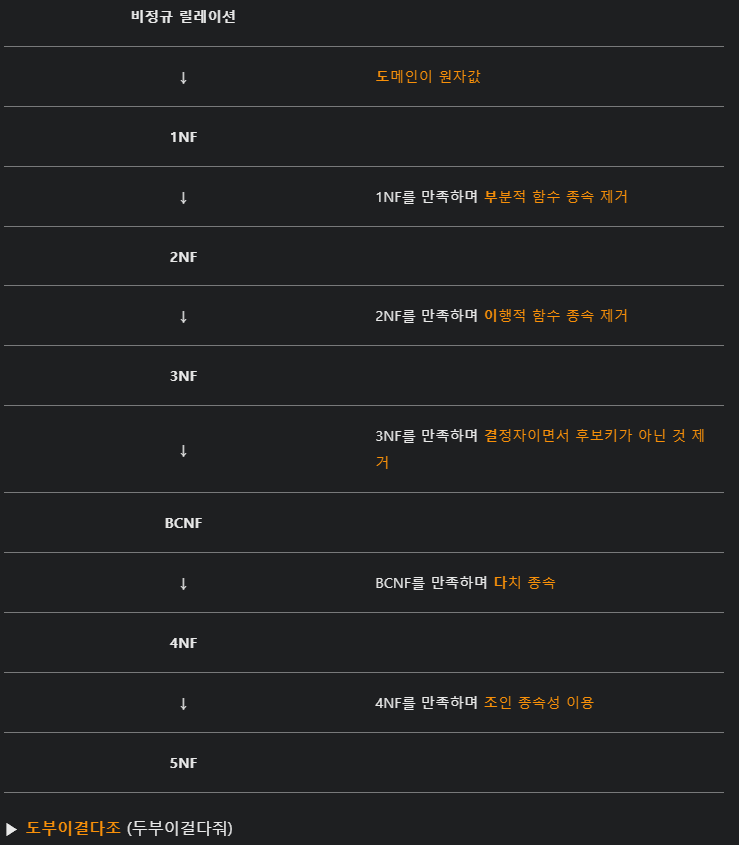

# 정보처리기사 실기 기출문제

## 목차

- [2020년 1회](#2020년-1회)
- [2020년 2회](#2020년-2회)
- [2020년 3회](#2020년-3회)
- [2020년 4회](#2020년-4회)
- [2021년 1회](#2021년-1회)
- [2021년 2회](#2021년-2회)
- [2021년 3회](#2021년-3회)
- [2022년 1회](#2022년-1회)

<br>
<br>

## 2020년 1회

##### 1. 다음 ( ) 안에 들어갈 단어를 쓰시오.

```
(         )은(는) 웹브라우저 간 HTML 문법이 호환되지 않는 문제와 SGML의 복잡함을 해결하기 위하여 개발된 다목적 마크업 언어이다
```

##### ans : XML

#### 해설 :

**XML : eXtensible Markup Language**

- 웹상에서 구조화된 문서를 전송 가능하도록 설계된 웹 표준
- 웹 브라우저 간 HTML 문법이 호환되지 않는 문제와 SGML의 복잡함을 해결하기 위하여 개발된 다목적 마크업 언어

**XML 기반 기술**

- **UDDI** : 웹 서비스에 대한 정보를 게시하고 검색하고 목록을 제공할 수 있도록 하는 **XML 기반의 구조화된 레즈스트리**이고 플랫폼, 개발 언어 등에 종속되지 않는 독립성을 지닌 XML 기반 표준 기술
- **RDF** : 웹리소스의 정보(Metadata)를 **Machine-readable**하게 표현하기 위한 프레임워크
- **SOAP** : HTTP 등의 프로토콜을 이용해 **XML 기반의 메시지**를 교환하는 프로토콜

<br>

##### 2. 다음 ( ) 안에 들어갈 단어를 쓰시오.

```
(        )은 속성-값 쌍(attribute-value pairs)으로 이루어진 데이터 오브젝트를 전달하기 위해 사용하는 개방형 표준 포맷이다. AJAX에서 많이 사용되고 XML을 대체하는 주요 데이터 포맷이다. 언어 독립형 데이터 포맷으로 다양한 프로그래밍 언어에서 사용되고 있다.
```

##### ans : JSON

JSON(JavaScript Object Notation)
자바스크립트 언어의 구문 형식을 가진, 데이터 교환용 표현법

- JS에서 객체를 만들 때 사용하는 경량 데이터 교환 방식
- 사람과 기계 모두 이해하기 쉽고, 용량이 적음
- 계층 표현 가능, 배열 표현 가능
- 거의 모든 언어, 모든 플랫폼에서 읽을 수 있는 텍스트 기반 비독점 포맷

##### <br>3. 다음은 릴리즈 노트의 구성 항목에 관한 설명이다. 설명하는 항목은 무엇인가?

```
릴리즈 노트 이름, 소프트웨어 이름, 릴리즈 버전, 릴리즈 날짜, 릴리즈 노트 날짜, 릴리즈 노트 버전 등의 기존정보가 포함된다.
```

##### ans : 릴리즈 노트 - 헤더(머릿말)

#### 해설 :

- 머릿말: 문서 이름(예: 릴리스 노트), 제품 이름, 릴리스 번호, 출시일, 노트 날짜, 노트 버전 등
- 개요: 다른 공식 문서가 없을 때 제품과 변경사항에 대한 간략한 개요
- 목적: 버그 픽스와 새로운 기능을 포함한 이 릴리스의 새로운 사항의 나열과 더불어 릴리스 노트의 목적에 대한 간략한 개요
- 문제 요약: 릴리스의 버그나 개선사항에 대한 짧은 설명
- 재현 단계: 버그 발생을 재현하기 위한 절차
- 해결책: 버그 수정을 위한 수정/개선사항의 짧은 설명
- 최종 사용자 영향: 응용 프로그램의 최종 사용자에게 필요한 조치
- 지원 영향: 소프트웨어 관리의 일일 프로세스에 필요한 변경사항0
  -참고: 소프트웨어나 하드웨어의 설치, 업그레이드, 제품 문서화에 관한 참고사항. (문서화 업데이트 포함)
- 면책: 회사와 표준 제품 관련 메시지 (예: 프리웨어, 불법 복제 금지 등)
- 연락처: 지원 연락처 정보

<br>

##### 4. 애플리케이션 테스트의 기본 원리 중 살충제 패러독스(Pesticide Paradox)의 의미를 설명하시오.

##### ans : 동일한 테스트 전략을 적용할 경우 결함을 발견하지 못한다는 의미

#### 해설 :

**요르돈 법칙(눈덩이 법칙, Snowball Effect)** : 소프트웨어 개발 초기 체계적인 분석 및 설계가 수행되지 못하면 그 결과로 프로젝트 후반에 미치는 영향으로 비용이 커지는 법칙


<br>

##### 5. 데이터 마이닝이란 무엇인지 설명하시오.

##### ans : 데이터를 탐색하고 분석하여 의미 있는 패턴이나 규칙을 추출하는 과정

#### 해설 :

**데이터 마이닝 (Data Mining)**
많은 데이터 가운데에서 숨겨져 있는 유용한 상괸관계를 발견하여, 미래에 실행 가능한 정보를 추출해 내고 의사 결정에 이용하는 과정

<br>

##### 6. 프로토콜을 구성하는 대표적인 세가지 요소를 적으시오.

##### ans : **구문(syntax), 의미(semantic), 타이밍(timing)**

<br>

##### 7. 다음에서 설명하는 해시 함수는?

```
128비트 암호화 해시 함수로 RFC 1321로 지정되어 있으며, 주로 프로그램이나 파일이 원본 그대로인지를 확인하는 무결성 검사 등에 사용된다. 1991년에 로널드 라이베스트(Ronald Rivest)가 예전에 쓰이던 MD4를 대체하기 위해 고안하였다.
```

##### ans : MD5

#### 해설 :

- MD4(Message Digest) : Rivest가 1991년에 만든 일방향 해시 함수로, 128비트의 해시 값을 가진다
- SHA(Secure Hash Algorithm) : NIST에서 만든 160비트의 해시 값을 갖는 일방향 해시 함수

<br>

##### 8. 비선점형 스케줄링 HRN의 우선순위 계산식을 작성하시오.

##### ans : (대기시간 + 서비스시간) / 서비스시간

<br>

##### 9. 아래는 데이터베이스 트랜잭션의 4가지 속성이다. (가) , (나)에 들어가 단어를 적으시오.

| 속성  | 설명                                                  |
|:---:|:---------------------------------------------------:|
| (가) | 트랜잭션은 연산들을 전부 실행하든지 전혀 실행하지 않아야 한다. 일부만 실행해서는 안 된다. |
| 일관성 | 트랜잭션이 성공적으로 실행되면 데이터베이스 상태는 모순되지 않고 일관된 상태가 된다.     |
| (나) | 트랜잭션 실행 도중의 연산 결과는 다른 트랜잭션에서 접근할 수 없다.              |
| 지속성 | 트랜잭션이 성공했을 경우 영구적으로 반영되어야 한다.                       |

##### ans : (가) 원자성 (나) 독립성

#### 해설 :

**트랜잭션의 특징**

- 원자성(Atomiciry) : 트랜잭션으 반영되거나 안되거나 등
- 일관성(Consistency) : 트랜잭션이 안전하게 실행이 완료되면 DB를 일관성 있는 DB 상태로 유지하는 것을 의미
- 독립성(Isloation) : 트랜잭셔 수행시 다른 트랜잭션은 연산에 들어오지 못함
- 지속성(Durability) : 성공적으로 수행된 트랜잭션은 영원히 반영된다함을 의미

<br>

##### 10. 다음에서 설명하는 서비스 거부 공격은?

```
패킷의 출발지 주소(Address)나 포트(port)를 임의로 변경하여 출발지와 목적지 주소(또는 포트)를 동일하게 함으로써, 공격 대상 컴퓨터의 실행 속도를 느리게 하거나 동작을 마비시켜 서비스 거부 상태에 빠지도록 하는 공격
```

##### ans : 랜드 어택

#### 해설 :

출발지와 목적지가 같은 패킷을 만들어 고통 대상이 자기 자신에게 응답하도록 과부하를 발생 시킨것

<br>

##### 11. OSI 7계층 중 다음에서 설명하는 계층은?

```
전송에 필요한 두 장치 간의 실제 접속과 절단 등 기계적, 전기적, 기능적, 절차적 특성에 대한 규칙을 정의한다. 단위(PDU)는 '비트'를 사용한다.
```

##### ans : 물리 계층

##### [참고]

##### **물데네전세표응**

| 명칭                                      | 특징                                                         | 단위(PDU)                         | 프로토콜                                                 | 주요 장비                                                    |
| ----------------------------------------- | ------------------------------------------------------------ | --------------------------------- | -------------------------------------------------------- | ------------------------------------------------------------ |
| Layer1: 물리 계층(Physical Layer)         | 물리적인 장치의 전기적, 전자적 연결에대한 명세로 디지털 데이터를 아날로적인 전기적 신호로 변환하여 물리적 전송을 가능케 함, 주소 개념이 없으므로 물리적 연결로 신호를 주고 받음 | 비트(Bit)                         | x.21, RS-232                                             | 허브(Hub), 리피터(Repeater), 네트워크 카드(NIC : Network Interface Card) |
| Layer2: 데이터 링크 계층(Data Link Layer) | 네트워크 카드의 MAC(Media Access Control) 주소를 통해 목적지를 찾아간다, 신뢰성 있는 전송을 위해 흐름제어(Flow Control), 오류제어(Error Control), 회전제어(Line Control)을 수행한다. | 프레임(Frame)                     | HDLC, X.25, Ethernet, TokenRing, DFFI, FrameRelay        | 브리지(Bridge), L2 Switch                                    |
| Layer3: 네트워크 계층(Network Layer)      | 종단간 전송을 위한 경로 설정을 담당하며 호스트로 도달하기 위한 최적의 경로를 라우팅 알고리즘을 통해 선택하고 제어한다, 종단간 전송을 위한 주소로 IP주소를 사용 | 패킷(Packet)                      | IP, ARP, ICMP, IGMP, RIP, RIP v2, OSPF, IGRP, EIGRP, BGP | 라우터(Router), L3 Switch                                    |
| Layer4: 전송 계층(Transport Layer)        | 종단간 신뢰성 있는 데이터 전송을 담당하며, 종단(Host)의 구체적인 목적지(Process)까지 데이터가 도달할 수 있도록 한다, Process를 특정하기 위한 주소로 Port Number를 이용, 신뢰성 있는 데이터 전송을 위해 분할과 재조합, 연결제어, 흐름제어, 오류제어, 혼합제어를 수행한다. | 세그먼트(Segment)                 | TCP, UDP                                                 | L4 Switch                                                    |
| Layer5: 세션 계층(Session Layer)          | 응용 프로그램 간의 논리적 연결(세션) 및 제어를 담당한다.     | 데이터(Data) 또는 메세지(Message) | 없음                                                     | 없음                                                         |
| Layer6: 표현 계층(Presentation Layer)     | 데이터 표현방식, 상이한 부호체계 간의 변화에 대해 규정, 인코딩/디코딩, 압축/해제, 암복호화 등의 역할을 수행함 | 데이터(Data)                      | 없음                                                     | 업음                                                         |
| Layer7: 응용 계층(Application Layer)      | 우리가 사용하는 UI를 제공하는 프로그램을 칭함                | 데이터(Data)                      | TELNET, FTP, SMTP, HTTP                                  | 없음                                                         |

<br>

##### 12. LoC 기법으로 개발을 해야 하는 프로젝트의 총 라인이 30000 라인이고, 개발자가 5명, 그리고 인당 월평균 300라인의 개발이 가능할 때, 개발하는데 소요될 것으로 예상되는 시간의 계산식과 그 결과를 작성하시오.

##### ans : 30000/(300*5) = 20(개월)

<br>

##### 13. 아래는 애플리케이션 성능을 측정하기 위한 요소들이다. (가), (나),(다)에 들어갈 단어를 적으시오.

| 속성     | 설명                                                    |
|:------:|:-----------------------------------------------------:|
| (가)    | 일정 시간 내에 애플리케이션이 처리하는 일의 양                            |
| (나)    | 애플리케이션에 요청을 전달한 시간부터 응답이 도착할 때까지 걸린 시간                |
| (다)    | 애플리케이션에 작업을 의뢰한 시간부터 처리가 완료될 때까지 걸린 시간                |
| 자원 사용률 | 애플리케이션이 의뢰한 작업을 처리하는 동안의 CPU 사용량, 메모리 사용량, 네트워크 사용량 등 |

##### ans : (가) 처리량 (나) 응답시간 (다) 경과시간 or 처리시간

#### 해설 :

성능 테스트(Performance Test)
시스템에서 수용 가능한 처리량을 판별하기 위한 테스트

성능 지표

- 전체 사용자 (Named User) : 대상 소프트웨어를 사용하는 모든 사람
- 동시 사용자 (Concurrent User) : 특정 시점에 대상 시스템에 접속하여 서비스를 사용하고 있는 사용자
- 부하(Load) : 사용자가 대상 시스템에 요청하는 처리량
- 응답시간(Response Time) : 사용자가 서버에 서비스를 요청한 후 그에 대한 응답을 받을 때 까지 걸리는 시간
- 처리량(Throughput) : 단위 시간당 대상 시스템에 의해서 처리되는 요청 건수
- 경과시간(Turnarround Time) : 서비스에 작업을 의뢰한 시간부터 처리가 완료될때 까지 걸린 시간

<br>

##### 14. 다음은 소프트웨어 모듈화에 관한 설명이다. (가), (나)에 들어갈 단어를 각각 적으시오.

```
모듈의 기능적 독립성은 소프트웨어를 구성하는 각 모듈의 기능이 서로 독립됨을 의미하는 것으로, 모듈이 하나의 기능만을 수행하고 다른 모듈과의 과도한 상호작용을 배제함으로써 이루어진다. 모듈의 독립성을 높이기 위해서는 ( 가 )는 약하게, ( 나 )는 강하게 만들어야 한다.
```

##### ans : (가) 결합도 (나) 응집도

#### 해설 :

- 결합도(Coupling)와 함께 모듈의 독립성을 판단하는 지표
- 응집도는 모듈 내부의 기능적인 응집 정도를 나타낸다
- 결합도는 모듈과 모듈간의 긴으적인 응집 정도를 나타낸다.
- 응집도는 높을수록 좋고 결합도는 낮을 수록 좋다.

**결합도, Coupling**
자료 결합도 < 스탬프 결합도 < 제어 결합도 < 외부 결합도 < 공통 결합도 < 내용 결합도
**자 -> 스 -> 제 -> 외 -> 공 -> 내**

- 자료 결합도(Data Coupling)

  \- 모듈간의 인터페이스 전달되는 파라미터를 통해서만 모듈간의 상호 작용이 일어나는 경우

  - 깔끔한 Call by value

- **스탬프 결합도(Stamp Coupling)**
  \- 모듈간의 인터페이스로 배열이나 오브젝트, 스트럭쳐등이 전달되는 경우

- **제어 결합도(Control Coupling)**
  \- 단순히 처리를 해야할 대상인 값만 전달되는 게 아닌 어떻게 처리해야 한다는 제어 요소(DCD, Falg 등)이 전달되는 경우

- **외부 결합도(External Coupling)**
  \- 어떤 모듈에서 반환한 값을 다른 모듈에서 참조해서 사용하는 경우

- **공통 결합도(Common Coupling)**
  \- 파라미터가 아닌 모듈 밖에서 선언되어 있는 전역 변수를 참조하고 전역변수를 갱신하는 식으로 상호작용하는 경우

- **내용 결합도(Content Coupling)**
  \- 다른 모듈 내부에 있는 변수나 기능을 다른 모듈에서 사용하는 경우

**응집도, Cohension**

우연적 응집도 < 논리적 응집도 < 시간적 응집도 < 절차적 응집도 < 교환적 응집도 < 순차적 응집도 < 기능적 응집도
=> **우논 시절 교순도** == 우는 시절 교수도

응집도 오름차순

- **우연적 응집도 (Coincidental Cohesion)**
  \- 모듈 내부의 각 구성요소들이 연관이 없는 경우
- **논리적 응집도 (Logical Cohesion)**
  \- 실제와 달리 논리적으로만 같은 그룹으로 분류되는 처리 요소들이 한 모듈에서 처리되는 경우
- **시간적 응집도 (Temporal Cohesion)**
  \- 연관된 기능이라기 보단 특정 시간에 처리되어야하는 활동들이 한 모듈에서 처리하는 경우
- **절차적 응집도 (Procedural Cohesion)**
  \- 모듈 안의 구성요소들이 서로 다른 기능을 하지만 그 기능을 순차적으로 수행할 경우
- **교환적 응집도 (Communication Cohesion)**
  \- 서로 다른 기능을 수행하지만 동일한 입력과 출력을 사용하는 활동들이 모여있을 경우
- **순차적 응집도 (Sequential Cohesion)**
  \- 모듈 내의 한 활동으로부터 나온 출력값을 모듈 내의 다른 활동이 사용될 경우
- **기능적 응집도 (Functional Cohesion)**
  \- 모듈 내부의 모든 기능이 단일한 목적을 위해 수행되는 경우

<br>

##### 15. 데이터베이스 성능 개선과 관련하여 '데이터베이스 반정규화'란 무엇인지 설명하시오.

##### ans : 데이터베이스 성능 향상 등을 위해 정규화된 데이터를 의도적으로 정규형을 위배한 데이터 구조로 만드는 행위

<br>

##### 16. 다음의 시스템 구조도에서 팬인(Fan-in)이 2 이상인 것은?


##### ans : F, J

<br>

##### 17. 다음은 C언어로 작성된 코드이다. 코드의 실행 결과를 쓰시오. (단, 출력문의 출력 서식을 준수하시오.)

```
#include 
void align(int a[ ]) {
int temp;
for (int i = 0; i < 4; i++) {
  for (int j=0; j < 4 - i; j++)  {
    if (a[j]> a[j+1]) {
      temp = a[j];
      a[j] = a[j+1];
      a[j+1] = temp;
    }
  }
}

main( ) {
    int a[ ] = { 85, 75, 50, 100, 95 };
    align(a);
     for (int i = 0; i < 5; i++) printf("%d ", a[i]);
}
```

##### ans : 50 75 85 95 100

<br>

##### 18. 다음은 C언어로 작성된 코드이다. 코드의 실행 결과를 쓰시오. (단, 출력문의 출력 서식을 준수하시오.)

```
#include 
main( ) {
   int c = 1;
   switch (3) {
      case 1: c += 3;
      case 2: c++;
      case 3: c = 0;
      case 4: c += 3;
      case 5: c -= 10;
      default: c--;
   }
   printf("%d", c);
}
```

##### ans : -8 (switch case문에서 break가 없으면 밑으로 쭉 다 실행함)

<br>

##### 19. 다음은 Java언어로 작성된 코드이다. 코드의 실행 결과를 쓰시오. (단, 출력문의 출력 서식을 준수하시오.)

```
public class Test {
   static int[ ] arr( ) {
     int a[ ] = new int[4];
     int b = a.length;
     for(int i = 0; i < b; i++)
        a[i] = i;
     return a;
  }

  public static void main(String[ ] args) {
     int a[ ] = arr( );
     for(int i = 0; i < a.length; i++)
        System.out.print(a[i] + " ");
  }
}
```

##### ans : 0 1 2 3

<br>

##### 20. 학생 테이블에 전기과 학생이 50명, 전산과 학생이 100명, 전자과 학생이 50명 있다고 할 때, 다음 SQL문 ①, ②, ③의 실행 결과로 표시되는 튜플의 수를 쓰시오. (단, DEPT 필드는 학과를 의미)

```
1) SELECT DEPT FROM EMPLOYEE;
2) SELECT DISTINCT DEPT FROM EPLOYEE;
3) SELECT COUNT(DISTINCT DEPT) FROM EMPLOYEE WHERE DEPT='전산과';
```

##### ans : 1) 200    2) 3    3) 1

<br>

<br>

## 2020년 2회

##### 1. 다음 보기는 네트워크 인프라 서비스 관리 실무와 관련된 사례이다. 괄호안에 들어갈 가장 적합한 용어를 한글 또는 영문으로 쓰시오.

```
귀하는 IT회사의 보안관제실에서 근무하고 있다. 정보시스템 운영 중 자연재해나 시스템 장애 등의 이유로 대고객 서비스가 불가능한 경우가 종종 발생한다. 이를 대비하여 백업 및 복구 솔루션을 도입하고자 한다.
백업 및 복구 솔루션은 (            )와 복구 목표 시점(RPO) 기준을 충족할 수 있는 제품으로 선정해야 한다. (           )는 “비상사태 또는 업무중단 시점으로부터 업무가 복구되어 다시 정상가동 될 때까지의 시간” 을 의미하고 복구 목표 시점(RPO)는 "업무 중단 시 각 업무에 필요한 데이터를 여러 백업 수단을 이용하여 복구할 수 있는 기준점"을 의미한다.
```

##### ans : 복구시간목표 (RTO)

#### 해설 :

**RTO (복구시간목표, Recovery Time Object)**

- 시스템이 얼마나 빨리 복구되는가?
- 서비스가 재개될 때 까지 걸리는 시간 목표

**RPO (복구시점목표, Recovery Point Object)**

- 데이터 손실을 얼마나 감당할 수 있는가?
- 감내할 수 있는 데이터 손실의 양(시간)
- 현재로부터 가장 가까운 복원지점(백업시점)까지의 시간 목표

<br>

##### 2. 다음 파이썬(Python) 스크립트의 실행 결과를 적으시오.

```
>>> asia={"한국", "중국", "일본"}
>>> asia.add("베트남")
>>> asia.add("중국")
>>> asia.remove("일본")
>>> asia.update(["홍콩", "한국", "태국"])
>>> print(asia)
```

##### ans : {"한국", "중국", "베트남", "홍콩", "태국"}

##### <br>3. 다음에서 설명하는 기술을 영문 약어로 쓰시오.

```
'비동기식 자바스크립트 XML'을 의미하는 용어로, 클라이언트와 웹서버 간에 XML 데이트를 내부적으로 통신하는 대화식 웹 애플리케이션의 제작을 위해 사용된다. 클라이언트의 요청에 의해 웹서버에서 로딩된 데이터를 웹 브라우저의 페이지에 보여주기 위해 웹 페이지 전체를 '새로고침'할 필요 없이 즉, 현재 페이지에서 필요한 일부만 로딩되도록 하는 웹 개발 기법을 의미한다.
```

##### ans : AJAX

<br>

##### 4. 다음에서 설명하는 개발방법론은 무엇인지 적으시오.

```
고객의 요구사항 변화에 유연하게 대응하기 위해 일정한 주기를 반복하면서 개발하며 고객에게 시제품을 지속적으로 제공하며 고객의 요구사항이 정확하게 반영되고 있는지 점검한다. 폭포수 모형에 대비되는 유연한 방법론으로 비교적 소규모 개발 프로젝트에서 각광받고 있는 개발 방법론이다.
```

##### ans : 애자일 방법론

#### 해설 :

시제품이라는 단어 때문에 프로토타입 같으나, 고객의 요구사항 변화에 초점을 둔다는 내용을 통해

애자일(Agile) : 절차나 문서보다 사람과 업무 자체를 중요시하고 유연하고 신속한 개발을 추구하는 방법론에 적합하다.

<br>

##### 5. 다음에 제시된 자바(Java) 프로그램이 [처리 결과]와 같은 결과를 출력할 때, 자바 프로그램의 ( ? )에 들어갈 표현을 대소문자를 구별하여 쓰시오.

[처리결과]  Child

```
class Parent {
    void show() {
        System.out.println("Parent");
    }
}
class Child extends Parent {
    void show() {
        System.out.println("Child");
    }
}
public class Exam {
    public static void main(String[] args) {
        Parent pa = (  ?  ) Child();
        pa.show();
    }
}
```

##### ans : new

#### 해설 : Java의 객체 선언은 클래스명 변수명 = new 클래스명()이다.

<br>

##### 6. 다음과 같은 "학생"테이블을 대상으로, 3학년과 4학년의 학번과 이름을 출력하는 SQL문을 작성하시오. (단, in 구문을 반드시 사용할 것)

| 학번   | 이름  | 학년  |
|:----:|:---:|:---:|
| 1111 | 홍길동 | 1   |
| 2222 | 임꺽정 | 2   |
| 3333 | 유관순 | 3   |
| 4444 | 안중근 | 3   |
| 5555 | 홍범도 | 4   |

##### ans

##### SELECT 학번, 이름

##### FROM 학생

##### WHERE 학년 IN (3,4);

<br>

##### 7. SQL 제어어(DCL)에는 COMMIT, ROLLBACK, GRANT, REVOKE 가 있다. 그 중 ROLLBACK에 대해 약술하시오.

##### ans : 트랜잭션의 실패로 작업이 취소되면 트랜잭션 이전 상태로 되돌리는 데이터 제어어

#### 해설 :

- COMMIT : 트랜잭션 작업이 정상적으로 처리되어 적용시키는 명렁어
- ROLLBACK : 트랜잭션의 실패로 작업이 취소되면 트랜잭션 이전 상태로 되돌리는 명령어
- GRANT : 특정 사용자에게 특정 작업을 수행할 권한을 부여하는 명령어
- REVOKE : 특정 사용자에게 부여한 권한을 회수하는 명령어

<br>

##### 8. 네트워크 계층(network layer, 3계층)인 인터넷 프로토콜(IP)에서 '암호화', '인증', '키 관리'를 통해 보안성을 제공해 주는 표준화된 기술

##### ans : IPsec (아이피씨큐어)

#### 해설 :

IPsec

- 보안에 취약한 구조를 가진 IP의 보안을 위하여 국제 인터넷 기술 의원회(IEFT)에서 설계한 표준
- IPv4에서 보안이 필요한 경우에만 선택적으로 사용하였지만 IPv6부턴 기본 스펙에 포함
- 인터넷 프로토콜(IP)에서 암호화, 인증, 키 관리를 통해 보안성을 제공

IP adress와 IP는 별개

<br>

##### 9. 애플리케이션을 실행하지 않고, 소스 코드에 대한 코딩 표준, 코딩 스타일, 코드 복잡도 및 남은 결함을 발견하기 위하여 사용하는 테스트 자동화 도구 유형은?

##### ans : 코드 인스펙션

#### 해설 :

**소프트웨어 테스트**

**정적 테스트(Static Test) : 소프트웨어를 실행하지 않고 코드나 문서로 리뷰하는 형식**

- 코드 인스펙션(Code Inspection) : 프로그램을 수행하지 않고 산추물을 대상으로 공식적 검토, 결함을 발견하는 과정
- 동료 검토(Peer Review) : 프로그램 수행과제에서 각 단계 별 산출물, 제품에 대한 동료들의 상호교차하여 검토 수행 활동
- 워크스루(WalkThrough) : 프로그램 개발 초기 팀 내에서 수행하는 비공식 검토 과정

| **정적 분석 도구** **(Static Analysis Tools)**   | - 프로그램을 실행하지 않고 분석하는 도구로, 소스 코드에 대한 코딩 표준, 코딩 스타일, 코드 복잡도 및 남은 결함 등을 발견하기 위해 사용된다 <br />- 테스트를 수행하는 사람이 작성된 소스 코드를 이해하고 있어야만 분석이 가능하다                                                                                                                                                                                                                                                               |
| ------------------------------------------ | --------------------------------------------------------------------------------------------------------------------------------------------------------------------------------------------------------------------------------------------------------------------------------------------------------------------------------------------------------------------------------------------------- |
| **테스트 실행 도구** **(Test Execution Tools)**   | - 스크립트 언어를 사용하여 테스트를 실행하는 방법으로, 테스트 데이터와 테스트 수행 방법 등이 포함된 스크립트를 작성한 후 실행한다<br /><br />- 데이터 주도 접근 방식:<br />    스프레드시트에 테스트 데이터를 저장하고, 이를 읽어 실행하는 방식이다<br />    다양한 테스트 데이터를 동일한 테스트 케이스로 반복하여 실행할 수 있다<br />    스크립트에 익숙하지 않은 사용자도 미리 작성된 스크립트에 테스트 데이터만 추가하여 테스트할 수 있다<br /><br />- 키워드 주도 접근 방식:<br />    스프레드시트에 테스트를 수행할 동작을 나타내는 키워드와 테스트 데이터를 저장하여 실행하는 방식이다<br />    키워드를 이용하여 테스트를 정의할 수 있다 |
| **성능 테스트 도구** **(Performance Test Tools)** | 애플리케이션의 처리량, 응답 시간, 경과 시간, 자원 사용률 등을 인위적으로 적용한 가상의 사용자를 만들어 테스트를 수행함으로써 성능의 목표 달성 여부를 확인한다                                                                                                                                                                                                                                                                                                          |
| **테스트 통제 도구** **(Test Control Tools)**     | 테스트 계획 및 관리, 테스트 수행, 결함 관리 등을 수행하는 도구로, 종류에는 형상 관리 도구, 결함 추적/관리 도구 등이 있다                                                                                                                                                                                                                                                                                                                            |
| **테스트 하네스 도구** **(Test Harness Tools)**    | - 테스트 하네스는 애플리케이션의 컴포넌트 및 모듈을 테스트하는 환경의 일부분으로, 테스트를 지원하기 위해 생성된 코드와 데이터를 의미한다<br />- 테스트 하네스 도구는 테스트가 실행될 환경을 시뮬레이션 하여 컴포넌트 및 모듈이 정상적으로 테스트되도록 한다                                                                                                                                                                                                                                                   |

<br>

##### 10. 다음에서 설명하는 소프트웨어 디자인 패턴을 영문으로 쓰시오.

```
한 객체의 상태가 바뀌면 그 객체에 의존하는 다른 객체들한테 연락이 가고 자동으로 내용이 갱신되는 방식으로 일 대 다(one-to-many) 의존성을 가지는 디자인 패턴. 
서로 상호작용을 하는 객체 사이에서는 가능하면 느슨하게 결합(Loose coupling)하는 디자인을 사용해야 한다.
```

##### ans : Observer

#### 해설 :

**Gof(Gang of Four Design Pattern) 디자인 패턴** : 객체 지향 프로그래밍 설계를 할 때 자주 발생하는 문제들을 피하기 위해 사용되는 패턴


**생성 패턴(Creational Pattern)**

- 객체를 생성하는데 관련된 패턴들
- 객체가 생성되는 과정의 유연성을 높이고 코드의 유지를 쉽게 함

| 명칭                       | 특징                                                     |
| ------------------------ | ------------------------------------------------------ |
| 팩토리 메소드(Factory Method)  | 객체를 생성하기 위한 인터페이스를 정의하여 어떤 클래스가 인스턴스화 될 것인지는 서브클래스가 결정 |
| 추상 팩토리(Abstract Factory) | 서로 연관, 의존하는 객체들의 그룹을 생성하여 추상적으로 표현                     |
| 빌더(Builder)              | 분리된 인스턴스(객체)를 건축하듯 조합하여 새 객체를 생성                       |
| 프로토타입(Prototype)         | 원본 객체를 복제하는 방법으로 객체를 생성하는 패턴                           |
| 싱글톤(Singleton)           | 여러 프로세스가 하나의 객체를 참조하는 방식                               |

**구조 패턴(Structual Pattern)**

- 프로그램 구조에 관련된 패턴들
- 프로그램 내의 자료구조나 인터페이스 구조 등 프로그램의 구조를 설계하는데 활용할 수 있는 패턴들

| 명칭                    | 특징                                                         |
| ----------------------- | ------------------------------------------------------------ |
| 어댑터(Adaptor)         | 클래스들의 호환성이 맞도록 변환해주는 패턴                   |
| 브리지(Bridge)          | 서로가 독립적으로 확장할 수 있도록 한 패턴, 기능과 구현을 별도의 클래스에서 구현(다리 놓듯이) |
| 컴포지드(Composite)     | 단일 객체와 복합 객체를 구분 없이 합성물처럼 다루고자 할 때 사용 |
| 데코레이터(Decorator)   | 객체간의 결합으로 기능을 확장하는 것으로 부가적인 기능 추가를 위해 다른 객체들을 덧붙이는 방식 |
| 퍼싸드(Facade)          | 커다란 코드 부분에 대한 간략화된 인터페이스를 제공함으로써 간단하게 복잡한 명령을 수행 가능 |
| 플라이웨이트(Flyweight) | 인스턴스를 가능한 한 공유해서 사용해서 메모리 절약           |
| 프록시(Proxy)           | 접근이 어려운 객체와 여기 접근하려는 객체 사이의 인터페이스 역할 |

**행위 패턴(Behavioral Pattern)**

- 반복적으로 사용되는 객체들의 상호작용을 패턴화 해놓은 것들

| 명칭                               | 특징                                                         |
| ---------------------------------- | ------------------------------------------------------------ |
| 책임 연쇄(Chain of Responsibility) | 요청을 한 객체가 처리 못하면 다음 객체로 책임이 넘어가는 패턴 |
| 커맨드(Command)                    | 요청을 캡슐화하여 재이용하거나 취소할 수 있도록 로그로 남겨두면서 명령어를 하나로 합쳐둔 것 |
| 인터프리터(Interpreter)            | 언어 번역하는 것으로 언어에 문법표현을 정의함, SQL이나 통신 프로토콜에 이용 |
| 반복자(Iterator)                   | 같은 명령의 반복이고 접근이 잦은 객체에 대해 동일한 인터페이스를 사용하도록 함 |
| 중재자(Mediator)                   | 객체들 간의 복잡한 상호작용을 캡슐화하여 객체로 정의하므로써 객체 사이의 결합도를 줄임 |
| 메멘토(Memento)                    | 객체를 특정 시점의 상태로 되돌리는 기능으로 내가 사랑하는 CTRL + Z 기능 개발시 사용 |
| 옵저버(Observer)                   | 한 객체의 상태 변화시 상속되어있는 다른 객체들에게 알림, 시스템간에 이벤트를 생성하고 수신시 사용 |
| 상태(State)                        | 객체의 상태에 따라 동일한 동작을 다르게 처리할 때 사용       |
| 전략(Staregy)                      | 동일한 계열의 알고리즘을 캡슐화하여 상호 교환할 수 있게 함으로써 클라이언트에 영향 없이 알고리즘 변경 가능 |
| 탬플릿 메소드(Template Method)     | 상위 클래스에서 골격 정의, 하위 클래스에서 세부 처리를 구체화함으로써 유지보수를 용이하게 함 |
| 방문자(Visitor)                    | 각 클래스들의 데이터 구조에서 처리 기능을 별도의 클래스로 구성하여 각 클래스에서 방문해서 수행가능하게 함 |


<br>

##### 11. 리눅스 커널을 기반으로 동작하며 자바의 코틀린 언어로 개발된, 모바일 기기에 주로 사용되는 오픈소스 플랫폼인 운영체제는 무엇인지 쓰시오.

##### ans : Android (안드로이드)

#### 해설 :

안드로이드 : 코틀린, 자바
IOS : 오브젝트-C, 스위프트

<br>

##### 12. 다음 주어진 student 테이블의 name 속성에 idx_name를 인덱스 명으로 하는 인덱스를 생성하는 SQL문을 작성하시오.

| id   | name | grade |
|:----:|:----:|:-----:|
| 1111 | 홍길동  | 1     |
| 2222 | 임꺽정  | 2     |
| 3333 | 유관순  | 3     |
| 4444 | 안중근  | 3     |
| 5555 | 홍범도  | 4     |

##### ans : CREATE INDEX idx_name ON student(name);

<br>

##### 13. 다음 괄호안에 들어갈 프로토콜의 이름을 적으시오.

```
(              )은(는) HTTP 등의 프로토콜을 이용하여 XML 기반의 메시지를 교환하는 프로토콜로, Envelope-Header-Body 주요 3요소로 구성된다. (              )은(는) 유사한 기능을 하는 RESTful로 대체될 수 있다.
```

##### ans : SOAP

#### 해설 :

- **WSDL(Web Services Description Language)** : 웹 서비스가 제공하는 서비스에 대한 정보를 기술하기 위한 **XML 기반의 마크업 언어**
- **UDDI(Universal Description, Discovery and Integration)** : 웹 서비스에 대한 정보를 게시하고 검색하고 목록을 제공할 수 있도록 하는 **XML 기반의 구조화된 레지스트리**
- **SOAP(Simple Object Access Protocol)** : HTTP 등의 프로토콜을 이용해 **XML 기반의 메시지를 교환하는 프로토콜**

<br>

##### 14. 소프트웨어 보안 취약점 중 하나인 SQL Injection에 대해 간략히 설명하시오.

##### ans : 웹 페이즈의 입력값을 통해서 SQL 명령어를 주입하여 오작동을 일으키는 해킹방법

<br>

##### 15. 다음은 사용자 인터페이스 설계 원칙에 대한 설명이다. 괄호안에 들어갈 설계 원칙을 적으시오.

```
ㅇ 직관성: 누구나 쉽게 이해하고 사용할 수 있어야 한다. 
ㅇ (        ): 사용자의 목적을 정확하게 달성하여야 한다. 
ㅇ 학습성: 누구나 쉽게 배우고 익힐 수 있어야 한다. 
ㅇ 유연성: 사용자의 요구사항을 최대한 수용하며, 오류를 최소화하여야 한다.
```

##### ans : 유효성

#### 해설 :

**UI의 기본원칙**

- 직관성 : 누구나 쉽게 이해하고 사용할 수 있어야 한다.
- 유효성 : 사용자의 목적을 정확하게 달성하여야 한다.
- 학습성 : 누구나 쉽게 배우고 익힐 수 있어야 한다.
- 유연성 : 사용자의 요구사항을 최대한 수용하며, 오류를 최소화하여야 한다.

**UI 설계 도구**
와이어 프레임

- 기획 초기 단계에서 제작하는 것으로 페이지에 대한 대략적인 레이아웃이나 UI 요소 등에 대한 뼈대를 설계

목업

- 와이어프레임보다 좀 더 실제 화면과 유사하게 만든 정적인 형태의 모형

스토리보드

- 와이어프레임 콘텐츠에 대한 설명이나 페이지 간 흐름 등을 추가한 문서
- 디자이너와 개밸자가 최종적으로 참고하는 작업 지침서

프로토타입

- 와이어프레임이나 스토리보드 등에서 인터렉셔을 적용해 실제 구현한 것처럼 테스트가 가능한 동적인 형태의 모형
- 작성 방법에 따라 페이터/디지털 프로토타입으로 나뉨

유스케이스

- 사용지 측명에서의 요구사항으로 사용자가 원하는 목표를 달성하기 위해 수행할 내용을 기술하는표준 방법
- 관련 도구 : UML 다이어그램

**UX와의 차이**

- UI의 주요 평가항목 : 사용성/접근성/편의성
- UX의 주요 평가항목 : 몰입도/만족도/재접근률
  => 주로 UI/UX로 묶임

<br>

##### 16. 리눅스 운영체제에서 현재 디렉터리에 위치한 "a.txt"에 아래의 조건대로 권한을 부여하고자 한다. 실행해야 하는 명령어를 적으시오.

```
ㅇ 사용자에게 읽기,쓰기 실행 권한 부여
ㅇ 그룹에게 읽기, 실행 권한 부여
ㅇ 그 외에게 실행 권한 부여
ㅇ 한 줄의 명령어로 작성하며, 아라비안 숫자를 사용하여 8진수 권한으로 부여
```

##### ans : chmod 751 a.txt

##### [참고]

##### changeMode rwx  r-x   --x a.txt → chmod 751 a.txt

##### r(읽기) - w(쓰기) - x(실행)

##### u(파일소유자) - g(그룹) - o(그외사용자)

<br>

##### 17. 다음에서 설명하는 용어를 영문 완전 이름(Full-name)으로 적으시오.

```
ㅇ 전세계 오픈된 정보를 하나로 묶는 방식
ㅇ Linked data와 Open data의 합성어
ㅇ URI(Uniform Resource Identifier)를 사용
ㅇ RESTful 방식으로 볼 수 있으며, 링크 기능이 강조된 시멘틱 웹에 속하는 기술
```

##### ans : LOD (Linked Open Data)

<br>

##### 18. 다음은 데이터베이스 설계(모델링) 과정을 간략히 표현한 것이다. 괄호 안에 들어갈 내용을 순서대로 나열하시오.

```
요구사항 분석 -> (    ) -> (     ) -> (       ) -> 구현
```

##### ans : 개념 모델링, 논리 모델링, 물리 모델링

##### [참고]

##### 데이터모델링 단계

##### - 요개논물구

<br>

##### 19. 다음 자바(Java) 프로그램을 실행한 출력 결과를 쓰시오.

```
class A {
    int a;
    public A(int n) {
        a = n;
    }
    public void println("a="+a);
}
class B extends A {
    public B(int n) {
        super(n);
        super.println();
    }
}
public class Exam {
    public static void main(String[] args) {
        B obj = new B(10);
    }
}
```

##### ans : a= 10

<br>

##### 20. 다음 보기에서 설명하는 것으로 가장 적절한 것은?

```
소프트웨어 개발 과정에서 산출물 등의 변경에 대비하기 위해 반드시 필요하다. 소프트웨어 리사이클 기간 동안 개발되는 제품의 무결성을 유지하고 소프트웨어의 식별, 편성 및 수정을 통제하는 프로세스를 제공한다. 실수를 최소화하고 생산성의 최대화가 궁극적인 목적이다. 관련 도구로는 CVS, SVN, Clear Case 등이 있다.
```

##### ans : 형상 관리

<br>

<br>

## 2020년 3회

##### 1. 리팩토링의 목적에 대한 설명을 작성하시오.

##### ans

- 소프트웨어를 보다 이해하기 쉽고, 수정하기 쉽도록 개선함
- 결과의 변경없이 코드의 구조를 재조정하는 것으로 가독성을 높이고, 유지보수를 쉽게하기 위한 목적
- 코드의 외부 행위는 바꾸지 않고 내부 구조를 개선시켜 소프트웨어를 보다 이해하기 쉽고, 수정하기 쉽도록 만드는 것

<br>

##### 2. 다음의 출력 결과를 쓰시오.

```
#include <stdio.h>
void main() {
    int c=0;
    int i=0;
        while(i<10) {
        i++;
        c *= i;
    }
    printf("%d", c);
}
```

##### ans : 0

##### <br>3. 다음 학생 테이블에서 이름이 민수인 튜플을 삭제하도록 결과를 작성하시오.

```
- 테이블명: 학생
- 필드명: 이름
```

##### ans : DELETE FORM 학생 WHERE 이름 =  '민수';

<br>

##### 4. TCP/IP에서 신뢰성없는 IP를 대신하여 송신측으로 네트워크의 IP 상태 및 에러 메시지를 전달해주는 프로토콜을 ( )이라 한다.

##### ans : ICMP

#### 해설 :

ICMP는 인터넷 프로토콜의 비신뢰적인 특성을 보완하기 위한 프로토콜로 IP 패킷 전송 중 에러 발생 원인을 알려주거나 네트워크 상태를 진단해주는 기능을 제공한다.
즉 신뢰성 없는 IP를 대신하여 송신측으로 네트워크의 Ip 상태 및 에러 메세지를 전달해주는 프로토콜

IGMP(Internet Group Message Protocol)
인터넷에 연결한 컴퓨터가 멀티캐스트 그룹을 주위의 라우터에 알릴 수 있는 수단을 제공하는 프로토콜

<br>

##### 5. 다음의 출력 결과를 쓰시오.

```
public class Test{
    public static void main(String []args){
        int i=0;
        int sum=0;
        while (i<10){
            i++;
            if(i%2==1)
              continue;
        sum += i;
        }
    System.out.print(sum);
    }
}
```

##### ans : 30

<br>

##### 6. 심리학자 톰 마릴은 컴퓨터가 메시지를 전달하고 메시지가 제대로 도착했는지 확인하며 도착하지 않았을 경우 메시지를 재전송하는 일련의 방법을 '기술적 은어'를 뜻하는 ( )이라는 용어로 정의하였다. ( )안에 들어갈 용어는?

##### ans : 프로토콜

#### 해설 :

프로토콜이란 컴퓨터나 원거리 통신 장비 사이에서 메시지를 주고 받는 양식과 규칙의 체계로 위의 정의와 같이 메세지가 잘 전달되었는지를 확인하는 통신 규악 및 약속이다.

<br>

##### 7. 다음 아래 제어 흐름 그래프가 분기 커버리지를 만족하기 위한 테스팅 순서를 쓰시오.


##### ans : 1234561, 124567

<br>

##### 8. 다음 조건을 만족하면서, 과목별 점수의 평균이 90이 상인 과목이름, 최소점수, 최대점수를 구하는 SQL문을 작성하시오.

```
- 대소문자를 구분하지 않는다.
- WHERE 구분을 사용하지 않는다.
- GROUP BY, HAVING구문을 반드시 사용한다.
- 세미콜론(;)은 생략 가능하다.
- 별칭(AS)을 사용해야 한다.
```

[성적]

| 과목코드 | 과목이름  | 학점  | 점수  |
|:----:|:-----:|:---:|:---:|
| 1000 | 컴퓨터과학 | A+  | 95  |
| 2000 | 운영체제  | B+  | 85  |
| 1000 | 컴퓨터과학 | B+  | 85  |
| 2000 | 운영체제  | B   | 80  |

[결과]

| 과목코드 | 과목이름  | 학점  | 점수  |
|:----:|:-----:|:---:|:---:|
| 1000 | 컴퓨터과학 | A+  | 95  |
| 2000 | 운영체제  | B+  | 85  |
| 1000 | 컴퓨터과학 | B+  | 85  |
| 2000 | 운영체제  | B   | 80  |

##### ans

##### SELECT 과목이름, MIN(점수) AS 최소점수, MAX(점수) AS 최대점수

##### FROM 성적

##### GROUP BY 과목이름 HAVING AVG(점수) >= 90;

#### 해설 :

과목 이름으로 GROUP BY 했으므로 MIN, MAX, AVG 같은 함수들은 같은 과목에서만 실행됨

<br>

##### 9. 학생 테이블에서 이름이 민수인 튜플을 삭제하는 SQL문을 작성하시오

| 학번   | 이름  | 점수  | 과목이름   |
|:----:|:---:|:---:|:------:|
| 1000 | 김정미 | 90  | 알고리즘   |
| 2000 | 강은미 | 95  | 데이터베이스 |
| 3000 | 홍길동 | 90  | 전산수학   |
| 4000 | 민수  | 95  | 운영체제   |

##### ans : DELETE FROM 학생 WHERE 이름 = '민수';

<br>

##### 10. 릴레이션 A, B가 있을 때 릴레이션 B 조건에 맞는 것들만 릴레이션 A에서 튜플을 꺼내 프로젝션하는 관계대수의 기호는 무엇인가?

##### ans : ÷

#### 해설 :

관계대수

- 릴레이션 조작을 위한 연산의 집합으로 피연산자와 결과가 모두 릴레이션이다.
- 일반 집한 연산과 순수 연산으로 구분
- 질의에 대한 해를 구하기 위해 수행해야할 연산의 순서를 명시
- 원하는 정보와 그 정보를 어떻게 유도하는가를 기술하는 절차적 특징을 가지고 있음
- 기본적으로 관계해석과 관계대수는 관계 데이터베이스를 처리하는 기능과 능력 면에서 동일하다


<br>

##### 11. 다음 중 헝가리안 표기법(Hungarian Notation)에 대해서 서술하시오.

##### ans : 식별자 표기 시 접두어에 자료형을 붙이는 표기법

#### 해설 :

- 헝가리안 표기법(Hungarian Notation) : 변수명 작성시 변수명에 자료형을 구분지을 수 있는 접두어를 달아 표기하는 방법
- 카멜 표기법(Camel Notation) : 맨앞의 단어는 전체 소문자로, 그 뒤에 따라오는 단어들은 앞 한글자만 대문자로 표기 나머지는 소문자로 표기하는 방법(helloWorld)
- 파스칼 표기법(Pascal Notation) : 모든 단어들의 앞 한글자를 대문자로 표기하고 나머지는 소문자로 표시한다.

<br>

##### 12. 테스트의 종류 중, 동치 분할 테스트, 경계값 분석 테스트 등의 종류가 있는 테스트 기법을 쓰시오.

##### ans : 블랙박스 테스트 (명세 기반 테스트)

#### 해설 :

블랙 박스 테스트의 종류로는

- 동치 분할 테스트 : 프로그램의 입력 데이터를 여러 분류로 나누어 검사
- 경계값 분석 : 입력값의 경계값을 중심으로 예외 발생 검사
- 원인-결과 그래프 기법 : 입력데이터 간의 관계, 출력에 미치는 영향에 대한 분석 그래프 이용
- 오류 예측 기법 : 테스터의 감각이나 경험, 지식을 통해 에러케이스를 예측
- 비교 검사 : 테스트 대상과 비교 대상 프로그램에 같은 입력값을 넣어 데이터를 비교

<br>

##### 13. 다음은 C언어 소스 코드이다. 출력 결과를 쓰시오.

```
#include <studio.h>
int r1(){
    return 4;
}
int r10(){
    return (30+r1());
}
int r100(){
    return (200+r10());
}
int main(){
    printf("%dn", r100());
    return 0;
}
```

##### ans : 234

<br>

##### 14. 데이터베이스에서 스키마(Schema)에 대해 간략히 설명하시오.

##### ans : 데이터베이스의 전체적인 구조와 제약조건에 대한 명세로, 내부 스키마와 개념 스키마, 외부 스키마로 나뉜다.

#### 해설 :

**스키마(Schema)**
데이터베이스의 전체적인 구조와 제약조건에 대한 명세

내부 스키마(Internal Schema)

- 물리적 저장 장치 관점에서 본 DB의 물리적인 구조

개념 스키마(Conceptual Schema)

- 논리적 관점에서 본 전체적인 데이터 구조
- 사용자들이 필요로하는 통합 조직의 데이터베이스 구조
- View(뷰)라고도 불림

외부 스키마(External Schema)

- 사용지 관점에서 논리적인 구조
- 서브 스키마, 사용자 뷰라고도 한다.

<br>

##### 15. 다음은 자바(Java) 코드이다. 출력 결과를 쓰시오.

```
abstract class vehicle{
    private String name;
    abstract public String getName(String val);
    public String getName(){
        return "vehicle name:" + name;
    }
    public void setName(String val){
        name = val;
    }
}

class Car extends Vehicle{
    public Car(String val){
        setName(val);
   }
public String getName(String val){
    return "Car name : " + val;
   }
public String getName(byte val[]){
    return "Car name : " + val;
   }
}

public class good {
    public Static void main(String[] args){
    Vehicle obj = new Car("Spark");
    System.out.print(obj.getName());
    }
}
```

##### ans : vehicle name:Spark

<br>

##### 16. UI 설계 원칙 중 직관성에 대해 설명하시오.

##### ans : 누구나 쉽게 이해하고, 쉽게 사용할 수 있어야 한다는 원칙

#### 해설 :

UI(User Interface)

종류

- CLI(Command Line Interface) : 명령과 출력이 텍스트 형태로 이루어지는 인터페이스
- GUI(Graphic User Interface) : 아이콘이나 메뉴를 마우스로 선택하여 작업을 수행하는 인터페이스
- NUI(Natual User Interface) : 말이나 행동으로 조작하는 인터페이스

기본 원칙

- 직관성 : 누구나 쉽게 이해하고 사용할 수 있어야 한다.
- 유효성 : 사용자의 목적을 정확하게 달성하어야 한다.
- 학습성 : 누구나 쉽게 익힐 수 있어야한다.
- 유연성 : 사용자의 요구사항을 최대한 수용하고, 오류를 최소화하여야 한다.

<br>

##### 17. 다음은 자바(Java) 코드이다. 출력 결과를 쓰시오.

```
public class Test{
    public static void main(String []args){
        int i=0;
        int sum=0;
        while (i＜10){
            i++;
            if(i%2==1)
              continue;
        sum += i;
        }
    System.out.print(sum);
    }
}
```

##### ans : 30

<br>

##### 18. EAI 유형에는 메세지 버스(Message bus) 유형, 하이브리드(Hybrid) 유형, ( A ) 유형, ( B ) 유형이 있다. 괄호안에 들어갈 말을 적으시오.

##### ans

##### A. 포인트 투 포인트(Point-to-point)

##### B. 허브 앤 스포크(Hub & Spoke)

#### 해설 :

**EAI (기업 애플리케이션 통합, Enterprise Application Intergration)**
엔터프라이즈의 미들웨어를 인프라로 하여 다양한 이질적 기업환경(애플리케이션, 데이터, 플랫폼 및 네트워크 등)을 통합하여 하나의 시스템으로 관리 운영할 수 있는 유기적 시스템

**EAI 통합 방식**
Peer to Peer (Point-to-Point, 포인트 투 포인트)

- 중간 미들웨어 없이 애플리케이션 간 별도의 통신으로 연계

Hub & Spoke (허브 앤 스포크)

- 단일 접점으로 주변과 연계하는 일종의 중앙집중 방식

Messaging Bus

- 메세지 전송로(버스)를 통해 데이터가 전달되도록 하는 방식

Hybird

- Hub & Spoke 방식과 Message Bus 방식의 혼합
- 그룹 내에서는 Hub & Spoke, 그룹 간에는 Messaging Bus를 활용

<br>

##### 19. C++에서 생성자란 무엇인지 쓰시오.

##### ans : 해당 클래스의 객체가 생성될 때 자동으로 호출되는 특수한 종류의 메서드

<br>

##### 20. 학생 테이블에 주소 속성을 추가하는 SQL문을 작성하려고 한다. 빈 칸을 채우시오.

```
(    A    ) TABLE 학생   (   B   ) 주소 VARCHAR(20);
```

##### ans

##### A. ALTER

##### B. ADD

<br>

<br>

## 2020년 4회

##### 1. 현재 IPv4의 확장형으로 IPv4가 가지고 있는 주소 고갈, 보안성, 이동성 지원 등의 문제점을 해결하기 위해서 개발된 128비트 주소체계를 갖는 차세대 인터넷 프로콜은 무엇인가?

##### ans : IPv6

#### 해설 :

IPv6는 128비트 IPv4는 32비트이며 IPv6는 IPv4와의 호환성을 위해 주소 공간을 Class로 구분하여 IPv4와 같은 방법을 이용

<br>

##### 2. 목적에 따른 디자인 패턴의 유형에는 생성(Creational) 패턴, 구조(Structural) 패턴, ( 괄호 ) 패턴이 있다. 괄호에 들어갈 알맞은 패턴 유형을 쓰시오.

##### ans : 행위

#### 해설 :

디자인 패턴, Gof 디자인 패턴은 객체 지향 프로그래밍 설계를 할 때 자주 발생하는 문제들을 피하기 위해 사용되는 패턴

**생성 패턴(Creational Pattern)**

- 객체를 생성하는데 관련된 패턴들
- 객체가 생성되는 과정의 유연성을 높이고 코드의 유지를 쉽게함

**구조 패턴(Structual Pattern)**

- 프로그램 구조에 관련된 패턴들
- 프로그램 내의 자료구조나 인터페이스 구조 등 프로그램의 구조를 설계 하는데 활용할 수 있는 패턴들

**행위패턴(Behavioral Pattern)**

- 반복적으로 사용되는 객체들의 상호작용을 패턴화 해놓은 것들

##### <br>3. 다음은 어떤 UML 다이어그램에 관한 예시이다. 어떤 종류의 다이어그램인가?


##### ans : 패키지 다이어그램

<br>

##### 4. 데이터베이스의 회복(Recovery) 기법 중 Rollback 시 Redo, Undo가 모두 실행되는 트랜잭션 처리법으로 트랜잭션 수행 중 갱신 결과를 바로 DB에 반영하는 기법은 무엇인가?

##### ans : 즉시갱신 회복 기법(Immediate Update)

#### 해설 :

**Database Recovery**
트랜잭션들을 수행하는 도중 장애로 인한 손상된 DB를 손상되기 이전의 정상적인 상태로 복구하는 작업

**장애의 유형**

- 트래잭션 장애 : 트랜잭션의 실행시 논리적인 오류로 발생할 수 있는 에러
- 시스템 장애 : H/W 시스템 자체에 발생할 수 잇는 에러 상황
- 미디어 장애 : 디스크 자체의 손상으로 발생할 수 있는 에러 상황

**Undo와 Redo**

- Undo : 트랜잭션 로그를 이용하여 오류와 관련된 모든 변경을 취소하여 복구 수행, 로그 파일에 트랜잭션의 시작은 있고 종료가 없으면 수행
- Redo : 트랜잭션 로그를 이용하여 오류가 발생한 트랜잭션을 재실행하여 복구 수행, 로그 파일에 시작와 종료가 있는 경우 수행

**회복 기법**
**로그 기반 회복 기법**
지연갱신 회복 기법(Deferred Update)

- 트랜잭션의 부분 완료 상태에선 변경 내용을 로그 파일에만 저장
- 커밋이 발생하기 전까지는 DB에 기록하지 않음
- 중간에 장애가 발생하더라도 DB에 기록하지 않았으므로 Undo가 필요없음(미실행된 로그는 폐기)

즉기갱신 회복 기법(Immediate Update)

- 트랜잭션 수행 도중에도 변경 내용을 즉시 데이터베이스에 기록
- 커밋 발생 이전의 갱신은 원자성이 보장되지 않는 미완료 갱신이므로 장애 발생시 Undo 필요

<br>

##### 5. 다음은 n이 10일 때, 10을 2진수로 변환하는 자바 소스 코드이다. A, B 괄호 안에 알맞은 값을 적으시오.

```
class good {
    public static void main (String[] args) {
        int[]a = new int[8];
        int i=0; int n=10;
        while (   괄호 A    ) {
          a[i++] = (    괄호 B    );
          n /= 2;
       }
      for(i=7; i>=0; i--){
          System.out.print(a[i]);
      }
   }
}
```

##### ans

(a) n > 0

(b) n % 2

<br>

##### 6. 다음은 자바 소스 코드이다. 출력 결과를 보고 괄호 A, B에 알맞은 값을 적으시오.

```
public class good {
    public static void main(String[] args) {
    int[][]a = new int[( 괄호A )][( 괄호B )];
    for(int i = 0; i < 3; i++){
        for(int j=0; j < 5; j++){
        a[i][j] = j*3+(i+1);
        System.out.print(a[i][j]+"");
      }
      System.out.println();
      }
   }
} 

[출력 결과]  
1 4 7 10 13 
2 5 8 11 14 
3 6 9 12 15
```

##### ans

##### A = 3

##### B = 5

<br>

##### 7. 해킹 공격의 종류 중 하나인 스니핑(Sniffing)에 대하여 설명하시오.

##### ans : 네트워크상에 흘러다니는 트래픽을 훔쳐보는 행위. 주로 자신에게 와야할 정보가 아닌 정보를 자신이 받도록 조작하는 행위

#### 해설 :

스푸핑(spoofing) : 승인받은 사용자인 것처럼 속이는 행위 (MAC 주소 속이기 : ARP Spoof, IP 주소 속이기 : IP Spoof)
스니핑(sniffing) : 네트워크 중간에서 남의 패킷 교환을 훔쳐보는 행위
스누핑(snooping) : 네트워크 상에서 떠도는 중요 정보를 몰래 획득하는 행위

<br>

##### 8. IP 패킷에서 외부의 공인 IP주소와 포트 주소에 해당하는 내부 IP주소를 재기록하여 라우터를 통해 네트워크 트래픽을 주고받는 기술을 무엇이라고 하는가?

##### ans : NAT(Network Address Translation)

#### 해설 :

**NAT(Network Address Translation)
사설 IP주소를 공인 IP 주소와 변환시켜(재기록하여) 라우터를 통해 네트워크 트래픽을 주고 받는방식**
보유하고 있는 IP주소가 부족할 경우 사설 IP 주소를 사용하여 IP 주소를 확장하기 위한 방법으로 활용할 수 있으며 내부 네트워크 주소를 드러내지 않아 보안성이 노릴 수 있음

<br>

##### 9. 다음은 파이썬 소스 코드이다. 출력 결과를 쓰시오.

```
lol = [[1,2,3],[4,5],[6,7,8,9]]
print(lol[0])
print(lol[2][1])
for sub in lol:
    for item in sub:
        print(item, end = '')
    print()
```

##### ans

```
[1,2,3]
7
123
45
6789
```

<br>

##### 10. 분산 컴퓨팅 기술 기반의 데이터 위변조 방지 기술로 P2P방식을 기반으로 하여 소규모 데이터들이 연결되어 형성된 '블록'이라는 분산 데이터 저장 환경에 관리 대상 데이터를 저장함으로써 누구도 임의로 수정할 수 없고 누구나 변경의 결과를 열람할 수 있게끔 만드는 기술은 무엇인가?

##### ans : 블록체인

#### 해설 :

**블록체인**
분산 컴퓨팅 기술 기반의 데이터 위변조 방지 기술로 P2P방식을 기반으로 하여 소규모 데이터들이 연결되어 형성된 '블록'이라는 분산 데이터 저장 환경에 관리 대상 데이터를 저장함으로써 누구도 임의로 수정할 수 없고 누구나 변경의 결과를 열람할 수 있게끔 만드는 기술

<br>

##### 11. 오픈 소스 기반으로 한 분산 컴퓨팅 플랫폼으로, 일반 PC급 컴퓨터들로 가상화된 대형 스토리지를 형성하고 그 안에 보관된 거대한 데이터 세트를 병렬로 처리할 수 있도록 개발된 자바 소프트웨어 프레임워크로 구글, 야후 등에 적용한 기술은 무엇인가?

##### ans : 하둡(Hadoop)

#### 해설 :

**빅데이터(Big Data)**
기존의 관리 방법이나 분석 체계로는 처리하기 어려운 막대한 양의 정형 또는 비정형 데이터 집합, 스마트 단말의 빠른 확산, 소셜 네트워크 서비스의 활성화, 사물 네트워크의 확대로 데이터 폭발이 더욱 가속화 됨

**브로드 데이터(Borad Data)**
다양한 채널에서 소비자와 상호작용(SNS, 블로그 등)을 통해 생성되는 기업 마케팅에 있어 효율적인 데이터 이전에 사용하지 않았거나 알지 못했던 새로운 데이터나, 기존 데이터에 새로운 가치를 더한 데이터

**메타 데이터(Meta Data)**
일련의 데이터를 정의하고 설명해주는 데이터, 컴퓨터에서는 데이터 사전의 내용, 스키마의 등을 의미, HTML 문서에서는 메타 태그 내의 내용이 메타 데이터

- 여러 용도로 사용되나 주로 빠르게 검색하거나 내용을 간략하고 체계적으로 하기 위해 사용

**디지털 아카이빙(Digital Archiving)**
디지털 아카이빙은 디지털 정보 자원을 장기적으로 보관하기 위한 작업
아날로그를 디지털로 변환하여 압축 저장하고 디지털 콘테츠도 체계적으로 분류하고 메타 데이터를 만들어 DB화하는 작업

**하둡(Hadoop)**
오픈 소스 반으로한 분산 컴퓨팅 플랫폼으로 일반 PC 컴퓨터들로 가상화된 대형 스토리지를 형성하고 그 안에 보관된 거대한 데이터 세트를 병렬로 처리할 수 있도록 개발된 자바 소프트웨어 프레임워크로 구글 야후 등에 적용된 기술

<br>

##### 12. 데이터베이스 이상 현상(Anomaly)의 종류 3가지를 쓰시오.

##### ans : 삽입 이상, 삭제 이상, 갱신 이상

#### 해설 :

**데이터베이스 이상(Database Anomaly)**

- 정규화를 거치지 않은 데이터베이스에서 발생할 수 있는 문제
- 데이터들이 불필요하게 중복되어 릴레이션 조직에서 예기치 못한 문제 발생
- 애트리뷰트들의 종속관계를 하나의 릴레이션에 표현하기 때문에 발생

**이상 종류**

- 삽입 이상(Insertion Anomaly) : 데이터 삽입 시 의도와 다른 값들도 삽입됨
- 삭제 이상(Delete Anomaly) : 데이터 삭제 시 의도와 다른 값들도 연쇄 삭제
- 갱신 이상(Update Anomaly) : 속성값 갱신 시 일부 튜플만 갱신되어 모순 발생

<br>

##### 13. 다음은 프로세스 상태 전이도이다. A, B, C에 알맞은 상태를 쓰시오.


##### ans

A. 준비(Ready)
B. 실행(Run)
C. 대기(Wait)

#### 해설 :


<br>

##### 14. 테스트 오라클 중 특정한 몇 개의 입력값에 대해서만 기대하는 결과를 제공해주는 오라클은 무엇인가?

##### ans : 샘플링 오라클

#### 해설 :

**테스트 오라클(Test Oracle)**
테스트를 수행한 결과가 참인지 거짓인지 판단하기 위해서 미리 정의된 참 값을 대입하여 비교하는 소프트웨어 테스트 기법, 활동
=> 테스트 대상 Sw의 실제 결과와 비교할 목적으로 예상결과를 결정하는 시스템

**테스트 오라클 특징**
제한된 검증 : 모든 테스트 항목 적용 불가
수학적 기법 : 테스트 수행시 수학적 기법을 이용, 오라클 값을 구할 수 있음
자동화 가능 : 테스트 대상 프로그램의 실행, 결과 비교, 커버리지 측정 등

**테스트 오라클 유형**

참 오라클(True Oracle)

- 모든 테스트 케이스 입력값의 기대한 결과값에 대한 확인
- 전수 테스트 가능

샘플링 오라클(Sampling Oracle)

- 특정 몇몇 입력 값들에 대해서만 원하는 결과를 제공해주는 오라클
- 전수 테스트 불가능

휴리스틱 오라클(Heuristic Oracle)

- 샘플링 오라클에서 나머지 값들에 대해서는 추정(직관에 의한 예상 값)으로 처리

일관된 오라콜(Consistent Oracle)

- 이전수행결과와 현재수행결과가 동일한지 검증
- 회귀테스트시 수정 전후의 프로그램 실행 결과 확인 또는 비교시 사용

회귀테스트 : 이전에 잘 돌아가던 SW에서 문제가 발생시 이전에 고친 오류들이 재현되는지 검사하는 테스트

<br>

##### 15. 점수에 따른 성적 부여가 잘 되었는지 테스트하고자 한다. 아래에 알맞는 테스트 기법은 무엇인가?

| 점수       | 성적  |
|:--------:|:---:|
| 0 ~ 59   | 가   |
| 60 ~ 69  | 양   |
| 70 ~ 79  | 미   |
| 80 ~ 89  | 우   |
| 90 ~ 100 | 수   |

```
[테스트 값] : -10점 / 30점 / 65점 / 75점 / 85점 / 95점 / 110점
```

##### ans : 동치 분할 테스트

#### 해설 :

**소프트웨어 테스트 기법**

**화이트박스 테스트(White Box Test)**
모듈의 원시 코드를 오픈시킨 상태에서 코드의 논리적 모든 경로를 테스트하는 방법

**종류**
**기초 경로 검사**

- 대표적인 화이트 박스 테스트 기법
- 테스트 케이스 설계자가 절차적 설계의 논리적 복잡성을 측정할 수 있게 해주는 테스트 기법

**제어 구조 검사**

- 조건 검사 : 프로그램 모듈 내에 있는 논리적 조건을 테스트하는 테스트 케이스 설계 기법
- 루프 검사 : 프로그램 반복 구조에 초점을 맞춰 실시하는 테스트 케이스 설계 기법
- 데이터 흐름 검사 : 프로그램에서 변수의 정의와 변수의 사용 위치에 초점을 맞춰 실시하느 테스트 케이스 설계 기법

**검증 기준**

- 문장 검증 기준 : 소스 코드의 모든 구문이 한번 이상 수행되도록 테스트 케이스 설계
- 분기 검증 기준 : 소스 코드의 모든 조건문이 한번 이상 수행되도록 테스트 케이스 설계
- 조건 검증 기준 : 소스 코드의 모든 조건문에 대해 조건이 True인 경우, False인 경우 모두 한 번 이상 수행되도록 테스트 케이스 설계
- 분기/조건 기준 : 소스 코드의 모든 조건문과 각 조건문에 포함된 개별 조건식의 결과가 True인 경우, False인 경우가 한 번 이상 수행되도록 테스트 케이스 설계

**검증 기준의 종류**

- 기능 기반 커버리지 : 실제 데이터가 수행된 기능의 수 / 전체 기능의 수
- 라인 커버리지 : 테스트 시나리오가 수행한 소스 코드의 라인 수 / 전체 소스 코드의 라인 수
- 코드 커버리지 : 소스 코드의 구문, 분기, 조건 등의 구조 코드 자체가 얼마나 테스트 되었는지를 측정하는 방법

**블랙박스 테스트(Black Box Test)**

- SW가 수행할 특정 기능을 알기 위해서 각 기능이 완전히 동작하는 것을 입증하는 테스트로 기능 테스트라고도 한다
- 사용자의 요구사항 명세를 보면서 테스트하는 것으로 구현된 기능을 테스트 한다.
- SW 인터페이스에서 실시되는 테스트이다.
- 부정확하거나 누락된 기능, 인터페이스 오류, 자료 구조나 외부 데이터베이스 접근에 따른 오류, 행위나 성능 오류, 초기화와 종료 오류 등을 발견하기 위해 사용되며 테스트 과정의 후반부에 적용

**종류**

- 동치 분할 검사 : 입력 조건에 타당한 입력자료와 타당하지 않은 입력 조건의 개수를 균등하게 하여 테스트 케이스를 정하고 해당 입력 자료에 맞는 결과가 출력되는 지를 확인하는 기법
- 경계값 분석 : 입력 조건의 중간값보다 경계값에서 오류가 발생될 확률이 높다는 점을 이용하여 입력 조건의 경계값을 테스트 케이스로 선정하여 검사하는 기법
- 원인-효과 그래프 검사 : 입력 데이터 간의 관계와 출력에 영향을 미치는 상황을 체계적으로 분석한 다음 효용성이 높은 테스트 케이스를 선정하여 검사하는 방법
- 오류 예측 검사 : 과거의 경험이나 확인자의 감각으로 테스트하는 검사, 다른 블랙 박스 테스트로 찾아낼 수 없는 오류를 찾아내는 일련의 보충력 검사 기법, 데이터 확인 검사라고도 함
- 비교 검사 : 여러 버전의 프로그램에 동일한 테스트 자료를 제공하여 동일한 결과가 출력되는지 테스트 하는 기법

<br>

##### 16. 다음 조건을 만족하면서 학과별로 튜플 수가 얼마인지 구하는 SQL문을 작성하시오.

```
- WHERE 구문을 사용하지 않는다.
- GROUP BY 를 사용한다.
- 별칭(AS)을 사용한다.
- 집계 함수를 사용한다.
```

[학생]

| 학과  | 학생  |
|:---:|:---:|
| 전기  | 이순신 |
| 컴퓨터 | 안중근 |
| 컴퓨터 | 윤봉길 |
| 전자  | 이봉창 |
| 전자  | 강우규 |

[결과]

| 학과  | 학과별튜플수 |
|:---:|:------:|
| 전기  | 1      |
| 컴퓨터 | 2      |
| 전자  | 2      |

##### ans

##### SELECT 학과, COUNT(학과) AS 학과별튜플수

##### FROM 학생

##### GROUP BY 학과;

#### 해설 :

COUNT를 한 컬럼이 있을 경우 다른 컬럼은 GROUP BY를 해야한다.

<br>

##### 17. 데니스 리치와 켄톰슨 등이 함께 벨 연구소를 통해 만든 운영체제이며, 90% 이상 C언어로 구현되어 있고, 시스템 프로그램이 모듈화되어 있어서 다른 하드웨어 기종으로 쉽게 이식 가능하며 계층적 트리 구조를 가짐으로써 통합적인 파일 관리가 용이한 운영체제는 무엇인가?

##### ans : 유닉스(UNIX)

#### 해설 :

윈도우(Windows)

- Ms사의 OS
- GUI 기반 OS
- 트리 디렉터리 구조를 지님
- 선점형 멀티테스킹 방식을 사용

유닉스(Unix)

- 시분할 시스템을 위해 설계된 대화식 OS
- Open 소스
- C 언어로 작성되었음으로 이식성이 높음

리눅스(Linux)

- 유닉스로부터 파생된 OS
- Open 소스

<br>

##### 18. 다음은 C언어 소스 코드이다. 출력 값을 쓰시오.

```
#include <stdio.h>
void main(){
  char *p = "KOREA"
  printf("%sn" , p);
  printf("%sn" , p+3);
  printf("%cn" , *p);
  printf("%cn" , *(p+3));
  printf("%cn" , p+2);
}
```

##### ans

```
KOREA
EA
K
E
M
```

#### 해설 :

%s는 문자열
%c는 문자
마지막에 %c, p+2는
아스키로 2를 더해서 k가 m이됨

<br>

##### 19. 다음은 자바(Java) 소스 코드이다. 출력 결과를 쓰시오.

```
class Parent {
  public int compute(int num){
    if(num <=1) return num;
    return compute(num-1) + compute(num-2);
  }
}

class Child extends Parent {
  public int compute(int num){
    if(num<=1) return num;
    return compute(num-1) + compute(num-3);
  }
}

class Good {
  public static void main (String[] args){
    parent obj = new Child();
    System.out.print(obj.compute(4));
  }
}
```

##### ans : 1

<br>

##### 20. 정보 보안의 3요소 중 가용성(Availability)에 대하여 설명하시오.

##### ans : 인가된 사용자는 원할 때 정보에 접근이 가능해야 함

#### 해설 :

정보보안의 3대요소

- 기밀성(Confidentiality) : 인가된 사용자만 정보 자산에 접근할 수 있도록 하는 것으로, 방화벽 암호, 패스워드 등이 대표적이다.
- 무결성(Integrity) : 적절한 권한을 가진 사용자가 인가한 방법으로만 정보를 변경할 수 있도록 하여 접근 통제하는 것을 의미한다
- 가용성(Availability) : 필요한 시점에 정보 자산에 접근이 가능하도록 하는 것인데 대표적으로 백업이 있다

<br>

<br>

## 2021년 1회

##### 1. 물리 네트워크(MAC) 주소에 해당하는 IP 주소를 알려주는 프로토콜로 역순 주소 결정 프로토콜을 무엇이라고 하는지 쓰시오.

##### ans : RARP (Reverse Address Resolution Protocol)

#### 해설 :

물리 네트워크인 MAC을 IP로 만드는 프로토콜은 **RARP(Reverse Address Resolution Protocol)**
물리 네트워크를 이횽하여 논리 주소로 변환시켜주는 ARR의 반대 프로토콜이다.
**ARP(Address Resolution Protocol)**은 IP 주소를 물리적 주소로 대응시키기 위한 프로토콜 이다.

ARP : IP -> MAC
RARP : MAC -> IP

<br>

##### 2. 다음은 DB 설계 절차에 관한 설명이다. 다음 빈칸에 들어갈 알맞은 용어를 쓰시오.

```
(   A   )은/는 특정 DBMS의 특성 및 성능을 고려하여 데이터베이스 저장 구조로 변환하는 과정으로 결과로 나오는 명세서는 테이블 정의서 등이 있다.

(   B   )은/는 현실 세계에 대한 인식을 추상적, 개념적으로 표현하여 개념적 구조를 도출하는 과정으로 주요 산출물에는 E-R 다이어그램이 있다.

(    C   )은/는 목표 DBMS에 맞는 스키마 설계, 트랜잭션 인터페이스를 설계하는 정규화 과정을 수행한다.

[보기] : 구현 / 개념적 설계 / 논리적 설계 / 요구사항 분석 / 물리적 설계
```

##### ans :

(A) 물리적 설계

(B) 개념적 설계

(C) 논리적 설계

#### 해설 :

**DB의 설계 순서**
**1. 요구조건 분석 -> 2. 개념적 설계 -> 3. 논리적 설계 -> 4. 물리적 설계 -> 5. 구현**
**(개논물)**

**1. 요구조건의 분석**

- DB를 사용할 사람들의 필요한 용도를 파악
- 데이터의 종류, 용도, 형태 등을 수집
- 수집된 정보를 바탕으로 요구 조건 명세를 작성

**2. 개념적 설계**

- 개념 스키마 모델링과 트랜잭션 모델링을 수행
- 개념 스키마를 설계
- 요구분석 단계에서 나온 요구 조건 명세를 E-R 다이어그램으로 작성

**3. 논리적 설계**

- DBMS가 지원하는 논리적 자료구조로 변환시키는 과정
- 개념 스키마 평가 및 정제
- 논리적 스키마를 설계
- 트랜잭션의 인터페이스 설계
- 관계형 데이터베이스라면 테이블을 설계하는 단계

**4. 물리적 설계**

- 논리적 구조로 표현된 데이터를 물리적 구조의 데이터로 변환하는 과정

**5. 데이터베이스 구현**

- 논리적 설계, 물리적 설계 단계에서 도출된 스키마를 파일로 생성하는 과정
- 특정 DBMS DDL를 이용해 데이터베이스 스키마를 기술, 컴파일하여 빈 데이터베이스 파일을 생성
- 파일에 데이터 입력
- 응용 프로그램을 위한 트랜잭션 생성

##### <br>3. 다음은 요구사항의 분류에 대한 설명이다. 괄호 ( ) 안에 들어갈 요구사항의 유형에 대해서 쓰시오.

```
(   A   ) 요구사항은 시스템이 제공하는 기능, 서비스에 대한 요구사항이다.
(   B   ) 요구사항은 시스템이 수행하는 기능 이외의 사항, 시스템 구축에 대한 제약사항에 관한 요구사항이다.
```

##### ans : (A) 기능적 (B) 비기능적

<br>

##### 4. 웹 서비스명, 제공 위치, 메세지 포맷, 프로토콜 정보 등 웹 서비스에 대한 상세 정보가 기술된 XML 형식으로 구성된 언어를 무엇이라고 하는지 쓰시오.

##### ans : WSDL (Web Service Description Language)

#### 해설 :

- SOAP : HTTP, HTTPS, SMTP 프로토콜을 사용하여 XML 기반의 메시지를 교환하는 프로토콜
- WSDL : 웹 서비스가 제공하는 서비스에 대한 정보를 기술하기 위한 XML 기반 마크업 언어
- UDDI : WSDL을 등록하고 검색하기 위한 저장소
- XML : HTML 문법이 호환되지 않는 문제와 SGML의 복잡함을 해결하기 위해 고안된 마크업 언어
- JSON : 비동기 브라우저 서버 통신을 위해 속성, 값의 쌍으로 이루어진 개방형 표준 포맷
- AJAX ; javascript을 이용한 비동기 통신으로 클라이언트와 서버 간 XML 데이터를 주고 받는 기술
- REST : URL을 통해 자원을 명시하고 HTTP 메서드를 통해 해당 자원을 조작할 수 있는 기법
- 테스트 케이스 : 명세 기반의 산출물로 입력값, 실행조건, 기대 결과로 구성된 테스트 항목

<br>

##### 5. 다음은 파이썬 코드이다. 출력 결과를 쓰시오.

```
class good :
    li = ["seoul", "kyeonggi","inchon","daejeon","daegu","pusan"]

g = good()
str01 = ''
for i in g.li:
    str01 = str01 + i[0]

print(str01)
```

##### ans : skiddp

<br>

##### 6. 다음 SQL 실행 결과를 숫자만 쓰시오.

```
SELECT COUNT(*) FROM 급여
WHERE EMPNO > 100 AND SAL >= 3000 OR EMPNO = 200;
```

| EMPNO | SAL  |
|:-----:|:----:|
| 100   | 1000 |
| 200   | 3000 |
| 300   | 1500 |

##### ans : 1

<br>

##### 7. 다음 Java 프로그램 결과를 쓰시오.

```
public class QfranTest{
     public static void main(String []args){
        int a[][] = {{45, 50, 75}, {89}};
        System.out.println(a[0].length);
        System.out.println(a[1].length);
        System.out.println(a[0][0]);
        System.out.println(a[0][1]);
        System.out.println(a[1][0]);
     }
}
```

##### ans

```
3
1
45
50
89
```

<br>

##### 8. 정규화된 엔티티, 속성, 관계에 대해 성능 향상과 개발 운영의 단순화를 위해 중복, 통합, 분리 등을 수행하는 데이터 모델링의 기법을 무엇이라고 하는지 쓰시오.

##### ans : 반정규화

#### 해설 :

데이터베이스 반정규화(Denormalization)
데이터베이스 성능 향상 등을 위해 정규화된 데이터를 의도적으로 정규형을 위배한 데이터 구조로 만드는 데이터 모델링 기법
주요 기법

- 테이블 합병
- 중복 칼럼 추가
- 계산된 컬럼 추가
- 코드 명칭 추가 (성별을 F,M이 아니라 남자, 여자 같은 식으로)

<br>

##### 9. 다음은 블랙박스 기법에 대한 예제이다. 블랙박스 기법 두 가지를 쓰시오.

```
1. 0 ≤ x ≤ 10이면 -1, 0, 10, 11 검사
2. 입력 데이터의 영역을 유사한 도메인별로 유효값과 무효값을 그룹핑하여 나누어서 검사
```

##### ans

A: 경계값 분석
B: 동치 분할 테스트

#### 해설 :

블랙 박스 테스트 (Black-box Text)

- 동치 분할 테스트 : 프로그램의 입력 데이터를 여러 분류로 나누어 검사(그룹핑하여 검사)
- 경계값 분석 : 입력값의 경계값을 중심으로 예외 발생 검사
- 원인-결과 그래프 기법 : 입력데이터 간의, 출력에 미치는 영향의 분석 그래프를 이용
- 오류 예측 검사 : 테스터의 감각이나 경험, 지식을 통해 여러 케이스를 예측
- 비교 검사 : 테스트 대상과 비교 대상 프로그램에 같은 입력값을 넣어 데이터를 비교

<br>

##### 10. 다음은 테스트 종류에 대한 설명이다. 빈칸에 들어갈 알맞은 용어를 보기에서 찾아 쓰시오.

```
(   A   ) 은/는 개별 모듈, 서브루틴이 정상적으로 실행되는지 확인
(   B   ) 은/는 인터페이스 간 시스템이 정상적으로 실행되는지 확인

[보기] : 시스템 테스트 / 인수 테스트 / 알파 테스트 / 단위 테스트 / 통합 테스트 / 회귀 테스트
```

##### ans :

(A) 단위 테스트

(B) 통합 테스트

#### 해설 :

단통시인설
단위 테스트 -> 통합 테스트 -> 시스템 테스트 -> 인수 테스트 -> 설치 테스트

<br>

##### 11. 다음 빈칸에 들어갈 알맞은 용어를 쓰시오.

```
IPv6는 (   A   )  비트 길이를 가진다.
IPv4는 길이 32bit이며, (   B   ) 비트씩 네 부분으로 나눈다.
```

##### ans :

(A) 128

(B) 8

<br>

##### 12. 공유메모리, 소켓, 세마포어, 메세지 큐 등 프로세스 간 통신하는 기술을 무엇이라고 하는지 쓰시오.

##### ans : 프로세스 간 통신(IPC, Inter Process Communication)

<br>

##### 13. 시스템 통합에 사용되는 솔루션으로 구축 유형에는 Point to Point, Hub & Spoke, Message Bus가 있다. 기업에서 운영되는 서로 다른 플랫폼 및 애플리케이션 간의 정보를 전달, 연계 , 통합이 가능하도록 해주는 솔루션을 무엇이라고 하는지 쓰시오.

##### ans : EAI (Enterprise Application integration)

#### 해설 :

EAI (Enterprise Application Intergration)

- 개념 : 기업에서 운영하는 서로 다른 플랫폼, APP 간의 정보 전달 및 연계, 통합을 위한 솔루션

ESB (Enterprise Service Bus)

- 개념 : APP 통합 측면에서는 EAI와 비슷하지만 App 보다는 Service 중심으로 통합하는 것을 지향하는 아키텍처 혹은 기술로 Message Bus 유형으로써 Bus를 중심으로 각각 프로토콜이 호환되게끔 변환이 가능하고 서비스 중심으로 메시지 이동을 라우팅 할 수 있다.

<br>

##### 14. 주어진 테이블의 Cardinality / Degree를 구하시오.

| 학번       | 이름   | 학년  | 학과   |
|:--------:|:----:|:---:|:----:|
| 20210000 | 홍길동  | 2   | 전자과  |
| 20210001 | 임꺽정  | 3   | 전기과  |
| 20210002 | 유관순  | 1   | 화학과  |
| 20210003 | 신사임당 | 4   | 기계과  |
| 20210004 | 장길산  | 2   | 컴퓨터과 |

##### ans

Cardinality : 5
Degree : 4

#### 해설 :

**릴레이션의 표현**
릴레이션의 데이터를 표(table)형태로 표현

튜플(Tuple, row)

- 릴레이션을 구성하는 각 행을 의미
- 속성 값의 모임으로 구성
- 파일 구조에서 레코드
- **튜플의 수 = 카디널리티(Cardinality)**

속성(Attribute)

- 릴레이션을 구성하는 각 열
- 데이터베이스를 구성하는 가장 작은 논리적 단위
- 파일 구조의 데이터 필드
- **속성의 수 = 디그리(Degree)**

도메인(Domain)

- 속성을 취할 수 있는 원자값들의 집합
- 속성이 성별일 경우 도메인은 F 또는 M

인스턴스(Instance)

- 속성들에 값이 부여되어 튜플을 이룬 형태

<br>

##### 15. 다음은 C언어 프로그램이다. 실행 결과를 쓰시오.

```
#include 

struct good {
    char name[10];
    int age;
 };

 void main(){
     struct good s[] = {"Kim",28,"Lee",38,"Seo",50,"Park",35};

    struct good *p;
    p = s;
    p++;
    printf("%s\n", p-> name);
    printf("%s\n", p-> age);
}
```

##### ans

```
LEE 
38
```

<br>

##### 16. 데이터 모델 구성요소 3가지를 쓰시오.

```
개체 데이터 모델에서는 (  A  ) 을/를 이용하여 실제 데이터를 처리하는 작업에 대한 명세를 나타내는데 논리 데이터 모델에서는 (  B  ) 을/를 어떻게 나타낼 것인지 표현한다. 
(  C  ) 은/는 데이터 무결성 유지를 위한 데이터베이스의 보편적 방법으로 릴레이션의 특정 칼럼에 설정하는 제약을 의미하며, 개체무결성과 참조 무결성 등이 있다.
```

##### ans

(A) 연산

(B) 구조

(C) 제약조건

#### 해설 :

개체 데이터 모델에서는 **연산**을 이용하여 실제 데이터를 처리하는 작업에 대한 명세를 나타내는데 논리 데이터 모델에서는 **구조**를 어떻게 나타낼 것인지 표현한다.
**제약조건**은 데이터 무결성을 위한 데이터베이스의 보편적 방법으로 릴레이션의 특정 컬럼에 설정하는 제약을 의미하여, 개체 무결성과 참조 무결성 등이 있다.

<br>

##### 17. 다음은 Java 프로그램이다. 실행 결과를 쓰시오.

```
public class good {
  public static void main(String[] args){
    int i, j;
    for(j=0, i=0; i<=5; i++){
    j+=i;
    System.out.print(i);
    if(i==5){
    System.out.print("=");
    System.out.print(j);
   }else{
       System.out.print("+");
    }
   }
  }
 }
```

##### ans

```
0+1+2+3+4+5=15
```

<br>

##### 18. 시스템 객체의 접근을 개인 또는 그룹의 식별자에 기반을 둔 방법, 어떤 종류의 접근 권한을 가진 사용자가 다른 사용자에 자신의 판단에 따라 권한을 허용하는 접근제어 방식은 ?

##### ans : 임의적 접근 통제(DAC, Discretionary Access Control)

#### 해설 :

접근통제 정책(Access Control Policy)

임의적 접근통제, DAC, Discretionary Access Control

- **사람들끼리 임의로 통제를 설정**
- 개인 기반 정책과 그룹기반 정책을 포함한다.
- 객체에 접근하고자 하는 주체(또는 주체가 속한 그룹)의 접근 권한에 따라 접근 통제를 적용
- 특정 접근 허가를 가진 주체는 임의의 다른 주체에게 자신의 접근 권한을 접길 수 있음

DAC 예시

- ACL(Access Control List)가 있다
- 방화벽 정책이나 TCP Wrapper 등 리눅스의 네트워크 서비스의 접근 제어가 대부분 DAC를 따름
- 이 자원은 누구누구나 접근 가능하다 또는 누구누구는 이 자원에 접근이 가능하다는 식의 정의

강제적 접근 통제(MAC, Mandatory Access Control)

- **등급에 따라 강제된 통제가 설정됨**
- 보안 등급, 규칙 기반, 관리 기반의 접근 통제 방식이다.
- 모든 주체 및 객체에 대하여 일정하며 어느 하나의 주체나 객체 단위로 접근을 설정할 수 없다.
- 주체의 레이블과 주체가 접근하고자 하는 객체의 보안 레이블을 비교하여 보안 정책에 합당한 접근 통제 규칙에 의한 통제 방법이다.

MAC 예시

- 보안 등급에 따른 일차원적인 접근권한 차등화가 대표적인 MAC의 구현 예이다
- 예를 들어 다음/네이버 카페에서는 등급에 따라 접근 가능한 게시판이 정해진게 예이다.
- 그누보드나 제로보드의 레벨 제도 또한 MAC 해당

역할기반 접근 통제(PBAC, Role Based Access Control)

- DAC, MAC의 단점을 보안한 방식
- 권한을 사용자가 아닌 그룹에 부여하고, 그룹이 수행하여야 할 역할을 정의
- 초기 관리의 오버헤드를 줄이고, 직무를 기반으로 하는 접근 통제 모델이다.
- 각 주체에 허용된 접근 수준(Clearance과 객체 부여된 허용등급(Classification)에 근거 하여 접근 통제를 운영한다.
- 접근 수준과 등급에 대한 정의는 관리자에 의해 설정 및 변경이 가능하다.
- 비 임의적 접근통제 모델(Non-Discretionary) 또는 임무 기반(Task-Based) 접근 통제 모델로 불리기도 하다.

PBAC 예시

- 최근 업무 시스템들은 대부분 PBAC이다, 인사담당자, 총무담당자 등과 같이 궈한 그룹을 통해 접근을 제어한다.
- 리눅스의 그룹 퍼미션 또한 PBAC라고 할 수 있다.

<br>

##### 19. 다음은 결합도에 대한 설명이다. 빈칸에 들어갈 알맞은 용어를 보기에서 찾아 쓰시오.

```
(  A  ) 은/는 다른 모듈 내부에 있는 변수나 기능을 다른 모듈에서 사용하는 경우의 결합도
(  B  ) 은/는 모듈 간의 인터페이스로 배열이나 객체, 구조 등이 전달되는 경우의 결합도
(  C  ) 은/는 파라미터가 아닌 모듈 밖에 선언된 전역 변수를 참조하고 전역 변수를 갱신하는 식으로 상호작용하는 경우의 결합도

[보기] : 자료 결합도 / 스탬프 결합도 / 제어 결합도 / 공통 결합도 / 내용 결합도 / 외부 결합도
```

##### ans

(A) 내용 결합도

(B) 스탬프 결합도

(C) 공통 결합도

#### 해설 :

Coupling은 응집도(Cohension, 모듈 내부의 기능 응집)와 함께 모듈의 독립성을 판단하는 지표로 모듈과 모듈간의 상호 결합 정도를 나타냅니다.

**결합도는 낮을 수록 응집도는 높을 수록 좋은 모듈이다.**

**결합도의 크기 순**
자료 결합도 < 스탬프 결합도 < 제어 결합도 < 외부 결합도 < 공통 결합도 < 내용 결합도
자 -> 스 -> 제 -> 외 -> 공 -> 내

**자료 결합도(Data Coupling)**

- 모듈간의 인터페이스에 전달되는 파라미터를 통해서만 모듈간의 상호 작용이 일어나는 경우
- 깔금한 Call By Back

**스탬프 결합도(Stamp Coupling)**

- 모듈간의 인터페이스에 배열이나 오브젝트, 스트럭쳐 등이 전달되는 경우

**제어 결합도(Control Coupling)**

- 단순히 처리를 해야할 대상인 값만 전달되는게 아니라 어떻게 처리를 해야 한다는 제어 요소(DCD, Flag 등)이 전달되는 경우

**외부 결합도(External Coupling)**

- 어떤 모듈에서 반환한 값을 다른 모듈에서 참조해서 사용하는 경우

**공통 결합도(Common Coupling)**

- 파라미터가 아닌 모듈 밖에서 선언되어있는 전역 변수를 참조하고 전역변수를 갱신하는 식으로 상호작용하는 경우

**내용 결합도(Content Coupling)**

- 모듈 내부에 있는 변수나 기능을 다른 모듈에서 사용하는 경우

<br>

##### 20. 괄호 안에 공통으로 들어갈 공격 기법을 적으시오.

```
(      ) 은/는 세션 관리 취약점을 이용한 공격 기법으로, '세션을 가로채다' 라는 의미이다. 이 공격은 정상적 연결을 RST 패킷을 통해 종료시킨 후 재연결 시 희생자가 아닌 공격자에게 연결한다.
```

##### ans : 세션 하이재킹

#### 해설 :

**세션 하이재킹(Session Hijacking)**
시스템에 접근할 적법한 사용자 아이디와 패스워드를 모를 때 공격 대상이 이미 시스템에 접속되어있는 상태를 가로채는 공격

- 아이디와 패스워드를 몰라도 시스템에 접근하여 자원이나 데이터를 사용 가능
- 인증 작업이 완료된 세션을 공격하기 때문에 OTP, Challenge/Response 기법을 사용하는 사용자 인증을 무력화

<br>

<br>

## 2021년 2회

##### 1. 네트워크 장치를 필요로하지 않고 네트워크 토폴로지가 동적으로 변화되는 특징이 있으며 응용 분야로는 긴급 구조, 긴급 회의, 전쟁터에서의 군사 네트워크에 활용되는 네트워크는?

##### ans : 애드혹 네트워크(Ad-hoc Network)

#### 해설 :

무선 또는 모바일 환경 통신지원을 위해 별도 고정된 유선망 없이 Mobile Host만으로 구성된 N/W로 기지국 같은 인프라가 필요 없음, 대신 멀리갈려면 여러 단말기를 거쳐야함

<br>

##### 2. 다음에서 설명하는 개념을 쓰시오.

```
(1) 사람의 감정이나 경험을 나타내는 개념
(2) 사용자 인터페이스. 예로는 CLI이 있다.
```

##### ans

(1) UX (User Experience)

(2) UI (User Interface)

#### 해설 :

UX : 사용자의 경험을 의미하며, 사용자가 특정 제품을 직접적이든 간접적이든 사용하면서 느낀 반응과 행동들을 같은 경험이다.
UI : 사용자가 제품을 어떤 방식으로 만나는 것을 의미한다.

##### <br>3. 트랜잭션의 특징 중, 원자성(Atomicity)에 대해 약술하시오.

##### ans : 모두 반영되거나 아니면 전혀 반영되지 않아야 하는 특성

#### 해설 :

ACID(데이터의 유효성을 보장하기 위한 특징들의 약어를 모은 것)
Atomicity(원자성) : 모든 트랜잭션은 반영되거나 반영되지 않아야 함.
Consistency(일관성) : 미리 정해진 규칙하에서만 수정이 가능하다.
Isolation(고립성) : 트랜잭션이 2개가 있을 때 서로의 존재를 모르며 영향을 줄 수 없다.
Durability(영구성) : 한번 적용된 트랜잭션은 영원히 적용된다.

<br>

##### 4. 다음은 제 ( ) 정규형으로 부분 함수적 종속성 제거하여 완전 함수적 종속을 만족하는 정규형이다. 괄호안에 들어갈 답안을 쓰시오.

[수강강의 테이블]

| 학생번호 | 강좌이름   | 강의실     | 성적  |
|:----:|:------:|:-------:|:---:|
| 501  | 데이터베이스 | 공학관 110 | 3.5 |
| 401  | 데이터베이스 | 공학관 110 | 4.0 |
| 402  | 스포츠경영학 | 체육관 103 | 3.5 |
| 502  | 자료구조   | 공학관 111 | 4.0 |
| 501  | 자료구조   | 공학관 111 | 3.5 |

[수강 테이블]

| 학생번호 | 강좌이름   | 성적  |
|:----:|:------:|:---:|
| 501  | 데이터베이스 | 3.5 |
| 401  | 데이터베이스 | 4.0 |
| 402  | 스포츠경영학 | 3.5 |
| 502  | 자료구조   | 4.0 |
| 501  | 자료구조   | 3.5 |

[강의 테이블]

| 강좌이름   | 강의실     |
|:------:|:-------:|
| 데이터베이스 | 공학관 110 |
| 스포츠경영학 | 체육관 103 |
| 자료구조   | 공학관 111 |

##### ans : 제 2 정규화



<br>

##### 5. 테이블의 튜플을 수정하고자 한다. 올바른 SQL을 작성하기 위해 빈칸을 채우시오.

```
(    A   ) 테이블명  (     B    )  컬럼 = 값 WHRE 점수 >= 90;
```

##### ans

(A) UPDATE

(B) SET

<br>

##### 6. 다음은 Inner Join을 하기 위한 SQL이다. 빈칸에 들어갈 문구를 적으시오.

```
SELECT .... FROM 학생정보 a JOIN 학과정보 b (   A   ) a.학과 = b.(   B   )
```

##### ans

(A) ON

(B) 학과

#### 해설 :

A는 Join 문법상 ON으로 Join의 조건이 와야하고 학과가 같은 것을 Join하는 문맥으로 B는 학과이다.

<br>

##### 7. 다음 파이썬 코드의 결과를 적으시오.

```
a = 100
result = 0
for i in range(1,3);
   result = a >> i
   result = result + 1
pirnt(result)
```

##### ans : 26

<br>

##### 8. 미국 국립 표준 기술연구소 (NIST), DES를 대체하며, 128 비트 블록 크기와 128,192,256비트 키 크기의 대칭 키 암호화 방식은?

##### ans : AES (Advanced Encryption Standard)

#### 해설 :

**블록 암호 (Block Cipher)**

- 평문을 일정한 크기의 블록으로 잘라낸 후 각 블록을 암호화하는 방식
- 일반적으로 블록의 크기는 8비트 또는 16비트의 배수
- 메시지 길이가 N비트보다 작다면 N비트 블록을 만들기 위해 패딩(Padding)을 추가

**블록 암호의 종류**

- **AES(Advanced Encryption Standard)** : DES를 대체하는 미국 표준 대칭키 알고리즘
- **DES(Data Encryption Standard)** : 블록 암호의 일종으로, IBM에서 개발하고, 미국 NBS(현재 NIST)에서 국가 표준으로 정한 암호화 알고리즘이나 취약점이 발견되어 현재 사용 안함
- **IDEA(International Data Encryption Algorithm)** : DES를 대체하기 위해 스위스에서 개발됨
- **SEED** : 한국인터넷진흥원(KISA)에서 민간부분의 암호 활용을 위하여 국내 순수 기술로 개발하여 보급한 블록 대칭키 암호화 알고리즘
- **HEIGHT(HIGH security and light weigHT**) : 국내에서 개발하여 국제 표준으로 등록된 초경량, 저전력 블록 암호 알고리즘
- **LEA** : 국내 국가보안연구소가 개발하여 국제 표준(ISO/IEC 29192)로 인정받은 경량 암호 알고리즘
- **RC5** : 다양한 크기의 키, 블록,라운드를 가질 수 있는 블록 알고리즘

<br>

##### 9. 다음은 화이트 박스 테스트 검증 기준에 대한 설명이다. 다음에서 설명하는 알맞은 용어를 보기에서 찾아 쓰시오.

```
(1) 최소 한 번은 모든 문장을 수행한다.
(2) 결정(Decision) 검증 기준이라고도 하며 조건 별로 True/False일 때 수행한다.
(3) (2)와 달리 전체 조건식에 상관없이 개별 조건식의 True/False에 대해 수행한다.

[보기] 다중 조건 커버리지, 변형 조건 / 결정 커버리지, 조건 커버리지, 결정 커버리지, 구조 커버리지, 구문 커버리지
```

##### ans

(1) 구문 커버리지
(2) 결정 커버리지
(3) 조건 커버리지

#### 해설 :

- 구문 커버리지(Statement Coverage) : 전체 코드를 최소 한 번은 모든 문장을 수행
- 결정 커버리지(Decision Coverage) : 결정 검증 기준이라고도 하며 개별 조건식의 True/False에 강제로 결정을 함으로써 수행
- 조건 커버리지(Condition Coverage) : 개별 조건식의 값이 True/False가 나오게 조합해줌으로써 수행
- 조건/결정 커버리지(Condition/Decision Coverage) : 결정 커버리지와 조건 커버리지를 포함한 커버리지
- 변경 조건/ 결정 커러비지(Modify Condition/Decision Coverage) : 각 개별 조건식이 조건식의 결과에 독립적으로 영향을 주도록 함
- 다중 조건 커버리지(Multiple Codition Coverage) : 결정 포인트 내에 모든 개별 조건식의 모든 가능한 논리적 조합을 고려하여 100% 커버리지를 보장

<br>

##### 10. 다음은 '이'씨 성을 가진 사람의 이름을 내림차순으로 출력하기 위한 SQL문이다. 괄호안에 들어갈 알맞은 답안을 작성하시오.

```
SELECT ... FROM ... WHERE 이름 LIKE (    A    ) ORDER  BY (    B     )
```

##### ans

(A) : '이%'
(B) : DESC

<br>

##### 11. 다음 각 번호에 해당하는 응집도를 보기에서 찾아 쓰시오.

```
(1) 입출력 간 연관성은 없으나, 순서에 따라 수행할 필요가 있다.
(2) 동일한 입출력을 사용한다.
(3) 하나의 기능에 모두 기여하고 밀접하게 관련되어 있다. 

[보기] 기능적(functional), 시간적(temporal), 교환적(communication), 절차적(procedural), 순차적(sequential), 우연적(coincidental), 논리적(logical)
```

##### ans

(1) 절차적 응집도(Procedural Cohesion)
(2) 교환적 응집도(Communication Cohesion)
(3) 기능적 응집도(Functional Cohesion)

#### 해설 :

**Cohension**

- 결합도(Coupling)와 함께 모듈의 독립성을 판단하는 지표
- 응집도는 모듈 내부의 기능적인 응집 정도를 나타낸다
- 결합도는 모듈과 모듈간의 긴으적인 응집 정도를 나타낸다.
- 응집도는 높을수록 좋고 결합도는 낮을 수록 좋다.

우연적 응집도 < 논리적 응집도 < 시간적 응집도 < 절차적 응집도 < 교환적 응집도 < 순차적 응집도 < 기능적 응집도
=> **우논 시절 교순도** == 우는 시절 교수도

응집도 오름차순

- 우연적 응집도 (Coincidental Cohesion)
  \- 모듈 내부의 각 구성요소들이 연관이 없는 경우
- 논리적 응집도 (Logical Cohesion)
  \- 실제와 달리 논리적으로만 같은 그룹으로 분류되는 처리 요소들이 한 모듈에서 처리되는 경우
- 시간적 응집도 (Temporal Cohesion)
  \- 연관된 기능이라기 보단 특정 시간에 처리되어야하는 활동들이 한 모듈에서 처리하는 경우
- 절차적 응집도 (Procedural Cohesion)
  \- 모듈 안의 구성요소들이 서로 다른 기능을 하지만 그 기능을 순차적으로 수행할 경우
- 교환적 응집도 (Communication Cohesion)
  \- 서로 다른 기능을 수행하지만 동일한 입력과 출력을 사용하는 활동들이 모여있을 경우
- 순차적 응집도 (Sequential Cohesion)
  \- 모듈 내의 한 활동으로부터 나온 출력값을 모듈 내의 다른 활동이 사용될 경우
- 기능적 응집도 (Functional Cohesion)
  \- 모듈 내부의 모든 기능이 단일한 목적을 위해 수행되는 경우

<br>

##### 12. 다음에서 설명하는 패킷 교환 방식을 작성하시오.

```
(1) 목적지 호스트와 미리 연결한 후, 통신하는 연결형 교환 방식
(2) 헤더에 붙어서 개별적으로 전달하는 비연결형 교환 방식
```

##### ans

(1) 가상 회선 방식
(2) 데이터그램 방식

#### 해설 :

**패킷 교환 방식**
패킷 교환은 송신 측에서 모든 메시지를 일정한 크기의 패킷으로 분해해서 전송하고, 수신 측에서 이를 원래의 메시지로 조립하는 것이다.

목적지 호스트와 미리 **연결한 후, 통신하는 연결형** 교환 방식
= 가상 회선 방식

해더에 붙어서 개별적으로 전달하는 **비연결형** 교환 방식
= 데이터그램 방식

<br>

##### 13. 다음 괄호 안에 들어갈 디자인 패턴의 명을 적으시오.

```
디자인 패턴 중 (    ) 패턴은 반복적으로 사용되는 객체들의 상호작용을 패턴화한 것으로 클래스나 객체들이 상호작용하는 방법이다. 알고리즘 등과 관련된 패턴으로 그 예는 Interpreter, Observer, Command 가 있다.
```

##### ans : 행위(behavioral)

#### 해설 :

설명에서 말하는 디자인 패턴은 Gof 패턴이다.

**Gof(Gang of Four Design Pattern) 디자인 패턴**
객체 지향 프로그래밍 설계를 할 때 자주 발생하는 문제들을 피하기 위해 사용되는 패턴

Gof 패턴의 상위 패턴은 아래와 같이 있다.

- 생성 패턴(Creational Pattern)
  
  - 객체를 생성하는데 관련된 패턴,
  - 객체가 생성되는 과정의 유연성을 높여 유지를 쉽게함
  - ex)팩토리 메소드, 추상 팩토리, 빌더, 프로토타입, 싱글톤

- 구조 패턴(Structual Pattern)
  
  - 프로그램 구조에 관련된 패턴들
  - 프로그램 내의 자료구조나 인터페이스 구조 등 프로그램의 구조를 설계하는데 활용할 수 있는 패턴들
  - ex) 어댑터, 브리지, 컴포지드, 데코레이터, 퍼싸드, 플라이웨이트, 프록시

- 행위 패턴(Behavioral Pattern)
  
  \- 반복적으로 사용되는 객체들의 상호작용을 패턴화 해놓은 것들
  
  - ex) 책임 연쇄. 커맨드,인터프리터, 반복자, 중재자, 메멘토, 옵저버, 상태, 전략, 템플릿 메소드

<br>

##### 14. 병행제어기법 중, 접근한 데이터에 대한 연산을 모두 마칠때까지 상호배제하는 기법을 무엇이라 하는지 작성하시오.

##### ans : 로킹(Locking)

#### 해설 :

**데이터베이스 병행제어**
**트랜잭션 병행제어(Transaction Concurrency Control)**
여러 트랜잭션들이 동시에 실행되면서도 데이터베이스의 일관성을 유지할 수 있게 하는 기법

DB 일관성 유지 하면서
\- 데이터베이스 공유 최대화
\- 시스템의 활용도 최대화
\- 사용자 응답시간 최소화

<br>

##### 15. 럼바우 데이터 모델링에 관한 설명으로써, 각 번호에서 설명하는 모델링 기법을 보기에서 찾아서 작성하시오.

```
(1) 입력값이 출력값일 때 - 예) 자료 흐름도(DFD)
(2) 시간에 따라 변하는 것 - 예) 상태 변화도(DFD)
(3) 구조 - 예) ER다이어그램(ERD)

[보기] Operation, Sequence, Information, Transaction, Function, I/O, Dynamic, Architecture, Cause-Effect, Constraint, Rebuilding, Duration
```

##### ans

(1) Function Modeling
(2) Dynamic Modeling
(3) Object Modeling

#### 해설 :

**럼바우 분석기법**
Rumbaugh's Object Modeling Technique
소프트웨어 구성 요소를 그래픽 표기법을 이용하여 모델링하는 객체지향 분석 기법

순서는 객체 모델링, 동적 모델링, 기능 모델링 순으로 이루어짐

**객체 모델링(Object Modeling, Information Modeling)**

- 객체 다이어그램을 이용 (ER 다이어그램(ERD))
- 시스템에서 요구되는 전체를 찾아내어 속성과 연산 식별 및 객체들 간의 관계를 규정
- 가장 중요하며 가장 선행되는 단계

**동적 모델링(Dynamic Modeling)**

- 상태도를 이용 (상태 변화도(DFD))
- 시간의흐름에 따른 객체들 사의 제어 흐름, 상호 작용, 동작 순서 등의 동적인 행위를 표현

**기능 모델링(Functional Modeling)**

- 자료 흐름도 (자료 흐름도(DFD))
- 다수의 프로세스들 간의 자료 흐름을 중심으로 처리 과정을 표현
- 어떤 데이터를 입력하면 어떤 결과를 구할것 인지 표현

<br>

##### 16. 다음은 C언어에 관한 소스코드이다. 실행 결과값을 작성하시오.

```
int mp(int base, int exp);
int main(){
   int res;
   res = mp(2,10);
   printf("%d",res);
   return 0;
}

int mp(int base, int exp) {
   int res = 1;
   for(int i=0; i < exp; i++){
      res = res * base;
   }

   return res;
}
```

##### ans : 1024

<br>

##### 17. 이것은 클래스 내에서 객체 생성 없이 사용할 수 있는 메소드이다. 다음의 출력 결과를 보고 괄호안에 알맞은 답안을 작성하시오.

```
public class Test {
   public static void main(String[] args){
      system.out.print(Test.check(1));
   }

   (  괄호  )  String check (int num) {
      return (num >= 0) ? "positive" : "negative";
   }
}
[출력결과] 
positive
```

##### ans : static

#### 해설 :

소스에서 Test 클래스의 객체 생성없이 check 메서드를 접근 했음으로 이는 static으로 선언한 정적 메소드이어야합니다.

<br>

##### 18. 다음은 C언어 코드의 실행 결과를 적으시오.

```
int main() {
    int ary[3];
    int s = 0;
    *(ary + 0) = 1;
    ary[1] = *(ary + 0) + 2;
    ary[2] = *ary + 3;
    for(int i = 0; i < 3; i++) {
        s = s + ary[i];
    }
    printf("%d", s);
}
```

##### ans : 8

#### 해설 :

*(ary + 0) = 1;
arr의 0 인덱스는 1
ary[1] =* (ary + 0) + 2;
arr의 1 인덱스는 1 + 2
ary[2] = *ary + 3;
arr의 2 인덱스는 1 + 3

이들을 총합 한 것을 출력함으로 8

<br>

##### 19. 다음 JAVA 코드의 실행 결과를 적으시오.

```
public class over {
    public static void main(String[] args){
        ovr a1 = new ovr1();
        ovr a2 = new ovr2();
        System.out.println(a1.sun(3,2) + a2.sun(3,2));
    }

    int sun(int x, int y){
        return x + y;
    }
}

class ovr2 extends ovr1 {
    int sun(int x, int y){
        return x - y + super.sun(x,y);
    }
}
```

##### ans :

```
11
```

#### 해설 :

애초에 문제에서 클래스명과 함수명이 오타가 있지만 이를 무시하고 푼다는 가정하에

a1.sun(3,2) = 5
a2.sun(3,2) = 6

왜냐하면 a2에서는 3-2 + super.sun(x,y) = 1 + 5 이기 때문

<br>

##### 20. 다음 괄호 안에 들어갈 알맞은 답안을 작성하시오.

```
테스트 하네스의 도구 구성 요소 중, 상향식 테스트시, 상위 모듈 역할을 대신하는 테스트 드라이버와 하향식 테스트 시, 하위 모듈 역할을 대신하는 테스트 (       ) 이 있다.
```

##### ans : 스텁

#### 해설 :

**소프트웨어 개발 생명 주기(SDLC, Systems development life cycle)**
단통시인설

**단위 테스트(Unit Test)**

- 인터페이스 테스트, 자료구조 테스트, 수행 경로 테스트

**통합 테스트(Integration Test)**

- 상향식 통합 : Bottom-Up
  하위 모듈부터 개발한 경우
  상위 모듈이 없으므로, 상위 모듈 역할을 하는 테스트 드라이버(Driver)를 이용
  테스트 드라이버를 테스트 하네스(Harness)라고도 함
  
- 상향식 통합 : Top down
  상위 모듈부터 개발한 경우
  하위 모듈이 없으므로, 하위 모듈들 역할을 하는 스텁(Stub)을 이용
  

**시스템테스트(System Test)**

- 보안 테스트, 민감도 테스트, 성능 테스트

**인수 테스트(Acceptance Test)**

- 알파 테스트 : 통제된 환경에서 선별된 사용자들(사내 직원 등)이 개발자와 함께 수행하는 테스트
- 베타 테스트 : 실제와 동일환 환경에서 사외의 사용자들이 테스트하게 하고 피드백을 받는 테스트

**설치 테스트(Install Test)**

- 하드웨어 호환성
- 파일시스템 구성
- 다른 소프트웨어와의 연계

<br>

<br>

## 2021년 3회

##### 1. 다음 Java 코드에 대한 알맞는 출력값을 쓰시오.

```
class Connection {
  private static Connection _inst = null;
  private int count = 0;
    static public Connection get() {
      if(_inst == null) {
      _inst = new Connection();
      return _inst; 
      }
    return _inst;
    }
  public void count() { count ++; }
  public int getCount() { return count; }
}
 
public class testcon {
  public static void main(String[] args) {
    Connection conn1 = Connection.get();
    conn1.count();
    Connection conn2 = Connection.get();
    conn2.count();
    Connection conn3 = Connection.get();
    conn3.count();
    
    System.out.print(conn1.getCount());
  }
}
```

##### ans : 3

**해설** : 싱글톤 패턴 (Singleton Pattern)으로 어떤 클래스에서 최초 한번만 메모리를 할당하고 그 메모리에 인스턴스를 할당하여 사용하는 패턴입니다.
위 코드를 보시면 처음 Connection conn1 = Connetion.get( )을 통해 _inst에 처음으로 Connection을 할당하고 그 이후에 Connection.get()은 conn에 사용한 _inst와 같은 것을 사용하기에 모두 같은 객체에서 count() 메서들 실행시킨 것 입니다.

<br>

##### 2. 다음은 정보 보호 기술인 AAA에 대한 설명이다. 각 설명에 맞는 용어를 적으시오.

##### ans

(1) Authentication
(2) Authorization
(3) Accounting

**해설** : 분산 서비스 보안을 위한 포괄적인 핵심 요구사항이다, 특정 프토로콜에 종속되지 않는 용어이면서 주로 ISP(Internet Service Provider)와 같은 인터넷 서비스 확장을 위한 프레임워크 개념이기도 하다.

##### <br>3. 데이터 제어어(DCL) 중 GRANT 에 대하여 설명하시오.

##### ans : 데이터베이스 사용자에게 사용 권한을 부여하는데 사용하는 명령어

<br>

##### 4. 다음은 스푸핑 공격에 대한 설명이다. 괄호안에 들어갈 알맞은 답안을 작성하시오.

```
( ) 스푸핑은 근거리 통신망 하에서 ( ) 메시지를 이용하여 상대방의 데이터 패킷을 중간에서 가로채는 중간자 공격 기법이다. 이 공격은 데이터 링크 상의 프로토콜인 (  )를 이용하기 때문에 근거리상의 통신에서만 사용할 수 있는 공격이다.
```

##### ans : ARP(Address Resolution Protocol)

**해설** : ARP 스푸핑은 MAC 주소를 속여 근거리 통신망(LAN) 하에서 주소 결정 프로토콜(ARP) 메시지를 이용하여 상대방의 데이터 패킷을 중간에서 가로채는 중간자 공격 기법이다, 주로 스니핑에 자주 사용된다
**추가 공부** :

- **스푸핑(Spoofing)** : 골탕먹이다, 속이다. 로 IP 어드레스를 속여 시스템권한을 획득해서 정보를 탈취까지 함, IP 스푸핑, ARP 스푸핑 등이 있음
- **스니핑(Sniffing)** : 킁킁거리다, 냄새맡다 로 패킷 교환이나 네트워크 트래픽을 도청
- **스누핑(Snooping)** : 기웃기웃, 염탐염탐~ 스니핑보다 조금 발전해서, 네트워크 상에 떠도는 중요정보를 염탐하는 것 뿐만 아니라 획득까지 함

<br>

##### 5. 다음은 Coupling에 대한 설명이다. 설명에 대한 Coupling 종류를 영문으로 작성하시오.

```
어떤 모듈이 다른 모듈의 내부 논리 조직을 제어하기 위한 목적으로 제어 신호를 이용하여 통신하는 경우의 결합도이다. 하위 모듈에서 상위 모듈로 제어 신호가 이동하여 상위 모듈에게 처리 명령을 부여하는 권리 전도 현상이 발생할 수 있다.
```

##### ans : 제어(control) 결합도, Control Coupling

**해설** : Coupling은 응집도(Cohension, 모듈 내부의 기능 응집)와 함께 모듈의 독립성을 판단하는 지표로 모듈과 모듈간의 상호 결합 정도를 나타냅니다.
결합도는 낮을 수록 응집도는 높을 수록 좋은 모듈입니다.
자료 결합도 < 스탬프 결합도 < 제어 결합도 < 외부 결합도 < 공통 결합도 < 내용 결합도
**자 -> 스 -> 제 -> 외 -> 공 -> 내**

- **자료 결합도(Data Coupling)**

  \- 모듈간의 인터페이스 전달되는 파라미터를 통해서만 모듈간의 상호 작용이 일어나는 경우

  - 깔끔한 Call by value

- **스탬프 결합도(Stamp Coupling)**
  \- 모듈간의 인터페이스로 배열이나 오브젝트, 스트럭쳐등이 전달되는 경우

- **제어 결합도(Control Coupling)**
  \- 단순히 처리를 해야할 대상인 값만 전달되는 게 아닌 어떻게 처리해야 한다는 제어 요소(DCD, Falg 등)이 전달되는 경우

- **외부 결합도(External Coupling)**
  \- 어떤 모듈에서 반환한 값을 다른 모듈에서 참조해서 사용하는 경우

- **공통 결합도(Common Coupling)**
  \- 파라미터가 아닌 모듈 밖에서 선언되어 있는 전역 변수를 참조하고 전역변수를 갱신하는 식으로 상호작용하는 경우

- **내용 결합도(Content Coupling)**
  \- 다른 모듈 내부에 있는 변수나 기능을 다른 모듈에서 사용하는 경우

<br>

##### 6. OSI 7 Layer에 대한 설명이다. 다음 각 설명에 해당되는 계층을 적으시오.

```
(1) 물리계층을 통해 송수신되는 정보의 오류와 흐름을 관리하여 안전한 정보의 전달을 수행할 수 있도록 도와주는 역할
(2) 데이터를 목적지까지 가장 안전하고 빠르게 전달하는 기능
(3) 수신자에서 데이터의 압축을 풀수 있는 방식으로 된 데이터 압축
```

##### ans

(1) 데이터링크
(2) 네트워크
(3) 표현

**해설** :
**물데네전세표응**

| 명칭                                      | 특징                                                         | 단위(PDU)                         | 프로토콜                                                 | 주요 장비                                                    |
| ----------------------------------------- | ------------------------------------------------------------ | --------------------------------- | -------------------------------------------------------- | ------------------------------------------------------------ |
| Layer1: 물리 계층(Physical Layer)         | 물리적인 장치의 전기적, 전자적 연결에대한 명세로 디지털 데이터를 아날로적인 전기적 신호로 변환하여 물리적 전송을 가능케 함, 주소 개념이 없으므로 물리적 연결로 신호를 주고 받음 | 비트(Bit)                         | x.21, RS-232                                             | 허브(Hub), 리피터(Repeater), 네트워크 카드(NIC : Network Interface Card) |
| Layer2: 데이터 링크 계층(Data Link Layer) | 네트워크 카드의 MAC(Media Access Control) 주소를 통해 목적지를 찾아간다, 신뢰성 있는 전송을 위해 흐름제어(Flow Control), 오류제어(Error Control), 회전제어(Line Control)을 수행한다. | 프레임(Frame)                     | HDLC, X.25, Ethernet, TokenRing, DFFI, FrameRelay        | 브리지(Bridge), L2 Switch                                    |
| Layer3: 네트워크 계층(Network Layer)      | 종단간 전송을 위한 경로 설정을 담당하며 호스트로 도달하기 위한 최적의 경로를 라우팅 알고리즘을 통해 선택하고 제어한다, 종단간 전송을 위한 주소로 IP주소를 사용 | 패킷(Packet)                      | IP, ARP, ICMP, IGMP, RIP, RIP v2, OSPF, IGRP, EIGRP, BGP | 라우터(Router), L3 Switch                                    |
| Layer4: 전송 계층(Transport Layer)        | 종단간 신뢰성 있는 데이터 전송을 담당하며, 종단(Host)의 구체적인 목적지(Process)까지 데이터가 도달할 수 있도록 한다, Process를 특정하기 위한 주소로 Port Number를 이용, 신뢰성 있는 데이터 전송을 위해 분할과 재조합, 연결제어, 흐름제어, 오류제어, 혼합제어를 수행한다. | 세그먼트(Segment)                 | TCP, UDP                                                 | L4 Switch                                                    |
| Layer5: 세션 계층(Session Layer)          | 응용 프로그램 간의 논리적 연결(세션) 및 제어를 담당한다.     | 데이터(Data) 또는 메세지(Message) | 없음                                                     | 없음                                                         |
| Layer6: 표현 계층(Presentation Layer)     | 데이터 표현방식, 상이한 부호체계 간의 변화에 대해 규정, 인코딩/디코딩, 압축/해제, 암복호화 등의 역할을 수행함 | 데이터(Data)                      | 없음                                                     | 업음                                                         |
| Layer7: 응용 계층(Application Layer)      | 우리가 사용하는 UI를 제공하는 프로그램을 칭함                | 데이터(Data)                      | TELNET, FTP, SMTP, HTTP                                  | 없음                                                         |

<br>

##### 7. 다음 객체지향 추상화에 대한 설명 중 괄호 안에 들어갈 알맞은 용어를 적으시오.

```
(  A  )은/는 클래스들 사이의 전체 또는 부분 같은 관계를 나타내는 것이고, (  B  )은/는 한 클래스가 다른 클래스를 포함하는 상위 개념일 때 IS-A관계라하며, 일반화 관계로 모델링한다.
```

##### ans

(1) Aggregation(집단화)
(2) Generalization(일반화)

**해설** :
**객체지향 연관성**
두 개 이상의 엔티티 형식에서 데이터를 상호 참조하는 관계

| 명칭                   | 관계성의 종류  | 특성                                                       | 설명                                                       |
| ---------------------- | -------------- | ---------------------------------------------------------- | ---------------------------------------------------------- |
| 연관화(Association)    | is-member-of   | 링크 개념과 유사                                           | 관련되지 않은 클래스들간의 의미적 연결                     |
| 분류화(Classification) | is-instance-of | 객체 및 클래스의 인스턴스를 표현                           | 동일한 형의 특성을 갖는 개체들이 모여 클래스를 구성하는 것 |
| 집단화(Aggregation)    | is-port-of     | 상향식, 단일 상속, 복합 객체(Composite Object) 표현에 유용 | 클래스들의 사이의 전체 또는 부분 같은 관계를 나타내는 것   |
| 일반화(Generalization) | is-a           | 하향식, 다중 상속, 복잡한 객체 표현에 유용                 | 객체들에 있어 공통적인 성질들을 상위 객체로 정의한 것      |

<br>

##### 8. 다음은 테스트케이스의 구성요소에 대한 설명이다. 괄호 ( ) 안에 들어갈 알맞는 보기를 고르시오.


##### ans

(1) 테스트 조건
(2) 테스트 데이터
(3) 예상 결과

**해설** :
(테스트 케이스는 각 사이트 마다 다른 듯하다, 흐름만 기억하자)
테스트 케이스 : 특정 프로그램의 부분 및 경로를 실행해보거나, 요구사힝에 준수하는 지 확인하기 위해 개발된 입력 값, 조건, 예상된 결과세트

<br>

##### 9. 아래에서 설명하는 테스트 기법은 무엇인가?

```
입력 자료 간의 관계와 출력에 영향을 미치는 상황을 체계적으로 분석 후 효용성이 높은 테스트 케이스를 선정해서 테스트하는 기법
```

##### ans : Cause Effect Graph (원인 결과 그래프)

**해설** :
**Black Box Test**

- 내부가 보이지 않음
- 결과물 상태를 보고 요구사항 충족 확인
- 결과를 예측할 수 없음으로 test case의 양이 많아야하므로 테스트 비용 상승
- 종류
  - **동등 분할 테스트(Equivalence Partitioning Testing)** : 여러 Test Case 중에 실제로 수행할 대표적인 Test Case를 선택하는 방법, 다양한 입력 사례들을 갖춘 각 시험 사례 유형 마다 최소의 시험 사례 작성
  - **경계 값 분석 테스트(Boundary Value Analysis Testing)** : 입력 값의 경계 값에서 오류 발생 가능성이 높다는 통계에 의한 Case 작성
  - **원인 결과 그래프 테스트(Case Effect Graph Testing)** : 입력 자료 간의 관계와 출력에 영향을 미치는 상황을 체계적으로 분석 후 효용성이 높은 Case 생성
  - **오류 예측 테스트(Error Guessing Testing)** : 각 시험 기법이 놓치기 쉬운 오류들을 감각 및 경험으로 찾아보는 것
  - **페어와이즈 테스트(Pairwise Testing)** : 가능한 모든 입력 값을 테스트하는 비현실적 모든 입력값 들의 조합 대신 모든 작의 조합을 테스트함으로써 모든 입력 값을 테스트하는 것과 비슷한 것

**White Box Test**

- 소스코드 형태로 소프트웨어를 테스트한다.
- 시작단계 부터 테스트를 진행할 수 없으나 비용이 적음
- 종류
  - **(기본)경로 커버리지(Base Path Coverage)** : 수행 가능한 모든 경로 테스트
  - **제어 흐름 테스트(Control Flow Testing)** : 프로그램 제어구조를 그래프 형태로 나타내어 내부 로직 테스트

<br>

##### 10. 다음에서 설명하는 블록 암호 알고리즘을 적으시오.

```
이것은 미국 NBS (National Bureau of Standards, 현재 NIST)에서 국가 표준으로 정한 암호 알고리즘으로, 64비트 평문을 64비트 암호문으로 암화하는 대칭키 암호 알고리즘이다. 키는 7비트마다 오류검출을 위한 정보가 1비트씩 들어가기 때문에 실질적으로는 56비트이다. 현재는 취약하여 사용되지 않는다.
```

##### ans : DES

**해설** :
**블록 암호 (Block Cipher)**

- 평문을 일정한 크기의 블록으로 잘라낸 후 각 블록을 암호화하는 방식
- 일반적으로 블록의 크기는 8비트 또는 16비트의 배수
- 복호화 알고리즘은 암호 알고리즘의 역함수
- 메시지 길이가 N비트보다 작다면 N비트 블록을 만들기 위해 패딩(Padding)을 추가

**블록 암호의 종류**

- **AES(Advanced Encryption Standard)** : DES를 대체하는 미국 표준 대칭키 알고리즘
- **DES(Data Encryption Standard)** : 블록 암호의 일종으로, IBM에서 개발하고, 미국 NBS(현재 NIST)에서 국가 표준으로 정한 암호화 알고리즘이나 취약점이 발견되어 현재 사용 안함
- **IDEA(International Data Encryption Algorithm)** : DES를 대체하기 위해 스위스에서 개발됨
- **SEED** : 한국인터넷진흥원(KISA)에서 민간부분의 암호 활용을 위하여 국내 순수 기술로 개발하여 보급한 블록 대칭키 암호화 알고리즘
- **HEIGHT(HIGH security and light weigHT**) : 국내에서 개발하여 국제 표준으로 등록된 초경량, 저전력 블록 암호 알고리즘
- **LEA** : 국내 국가보안연구소가 개발하여 국제 표준(ISO/IEC 29192)로 인정받은 경량 암호 알고리즘
- **RC5** : 다양한 크기의 키, 블록,라운드를 가질 수 있는 블록 알고리즘

<br>

##### 11. 다음 Java 코드에 대한 알맞는 출력값을 쓰시오.

```
public class testco {
    public static void main(String[] args) {
        int a = 3, b = 4, c = 3, d = 5;
        if((a == 2 | a == c) & !(c > d) & (1 == b ^ c != d)) {
            a = b + c;
            if(7 == b ^ c != a) {
                System.out.println(a);
            } else {
                System.out.println(b);
            }
        } else {
            a = c + d;
            if(7 == c ^ d != a) {
                System.out.println(a);
            } else {
                System.out.println(d);
            }
        }
    }
}
```

##### ans : 7

#### 해설 :

※ 여기서 중요한 점은 연산자의 우선 연산자의 순위로

**not 연산자(!) > 사칙연산(+,\*,/.-) > 관계 연산자(==, >=, !=) > 비트 연산자(&, ^, |) > 논리 연산자(&&, ||)**_ ※

<br>

##### 12. 다음 C언어 코드에 대한 알맞는 출력값을 쓰시오.

```
#include 
int main(){
  int *arr[3];
  int a = 12, b = 24, c = 36;
  arr[0] = &a;
  arr[1] = &b;
  arr[2] = &c;
 
  printf("%dn", *arr[1] + **arr + 1);
}
```

##### ans : 37

해설 :  **arr  은 arr[0] 의 주소번지를 가리킨다

c언어 포인터 이중포인터 공부하기

<br>

##### 13. 다음은, 테이블에서 조건값을 실행한 화면이다. 이에 대한 알맞는 결과값을 작성하시오.


##### ans : 4

#### 해설

CROSS JOIN(크로스 조인) : Cartesian Product라고 하며 거의 사용하지 않는 조인으로 엄밀한 의미에서 조인은 아니지만 존재함, 테이블 상호간에 연결될 수 있는 모든 경우의 수를 산출하는 조인

해당 문제에서는 WHERE A.NAME Like B.RULE을 사용하므로써 RULE에 적합한 컬럼만을 출력해냄
s%에는 smith, scoot, %t%에는 smith, scott

<br>

##### 14. 다음 파이썬 코드의 알맞는 출력값을 쓰시오.

```
a,b = 100, 200 
print(a==b)
```

##### ans : False

<br>

##### 15. 다음은 UML의 다이어그램에 대한 설명이다. 어떤 다이어그램에 대한 설명인가?

```
이 다이어그램은 문제 해결을 위한 도메인 구조를 나타내어 보이지 않는 도메인 안의 개념과 같은 추상적인 개념을 기술하기 위해 나타낸 것이다.
또한 소프트웨어의 설계 혹은 완성된 소프트웨어의 구현 설명을 목적으로 사용할 수 있다. 이 다이어그램은 속성(attribute)과 메서드(method)를 포함한다.
```

##### ans : 클래스 다이어그램

#### 해설

UML 다이어그램 = Unified Modeling Language
소프트웨어 시스템을 개발하는 과정에서 산출물의 명세화, 시각화, 문서화할 때 사용하는 모델링 언어로써 하나의 시스템을 표현하기 위한 표준적인 방법울 제공하기 위해서 만들어 졌다.

구성요소

- 사물(Things) : 구조, 행위 그룹, 주석 등
- 관계(Relationships) : 의존 관계, 연관 관계, 일반화 관계 등
- 다이어그램(Diagrams) : 객체 다이어그램, 크래스 다이어그램, 시퀀스 다이어그램 등

UML 다이어그램의 종류

1. 구조 다이어그램(Structure Diagram)

- 클래스 다이어그램 (Class Diagram) : 클래스의 속성, 함수, 변수타입들로 구성된 다이어그램
- 객체 다이어그램(Object Diagram) : 클래스의 인스턴스, 값이 매겨진 행동을 가지고 있는 독립된 객체정보를 표현하는 다이어그램.
- 패키지 다이어그램(Package Diagram) : UML의 다양한 모델요소를 그룹화한 다이어그램
- 컴포넌트 다이어그램(Component Diagram) : 컴포넌트끼리의 구조 관계를 표현한 다이어그램
- 배치 다이어그램(Deployment Diagram) : 소프트웨어, 하드웨어 등을 포함한 시스템의 물리적 구조를 나타내는 다이어그램

2. 행위 다이어그램(Behavior Diagram)

- 쓰임새 다이어그램(Use Case Diagram) : 사용자 관점에서 바라본 시스템을 표현한 다이어그램
- 활동 다이어그램(Activity Diagram) : 여러 활동들을 순차, 병행 방식 등을 수행하는 상황을 표현하는 다이어그램
- 상태 다이어그램(State Diagram) : 하나의 객체가 다른 객체와의 상호 작용에 따라 어떻게 변화하는지 표현하는 다이어그램
- 순서 다이어그램(Sequence Diagram) : 여러 대상 간의 상호작용을 시간순서에 따라 표현한 다이어그램
- 커뮤니케이션 다이어그램(Communication Diagram) : 동작에 참여하는 객체들이 주고받는 메시지를 표현하고, 그 뿐만 아니라 객체 간의 관계까지 표현하는 다이어그램

<br>

##### 16. 다음 보기에서 설명하는 객체지향 디자인 패턴은 무엇인가?

```
부모(상위) 클래스에 알려지지 않은 구체 클래스를 생성하는 패턴이며, 자식(하위) 클래스가 어떤 객체를 생성할지를 결정하도록 하는 패턴이기도 하다.  부모(상위) 클래스 코드에 구체 클래스 이름을 감추기 위한 방법으로도 사용한다.
```

##### ans : 팩토리 메소드

#### 해설

**Gof(Gang of Four Design Pattern) 디자인 패턴** : 객체 지향 프로그래밍 설계를 할 때 자주 발생하는 문제들을 피하기 위해 사용되는 패턴

**큰 구분**
**생성 패턴(Creational Pattern)**

- 객체를 생성하는데 관련된 패턴들
- 객체가 생성되는 과정의 유연성을 높이고 코드의 유지를 쉽게 함

| 명칭                          | 특징                                                         |
| ----------------------------- | ------------------------------------------------------------ |
| 팩토리 메소드(Factory Method) | 객체를 생성하기 위한 인터페이스를 정의하여 어떤 클래스가 인스턴스화 될 것인지는 서브클래스가 결정 |
| 추상 팩토리(Abstract Factory) | 서로 연관, 의존하는 객체들의 그룹을 생성하여 추상적으로 표현 |
| 빌더(Builder)                 | 분리된 인스턴스(객체)를 건축하듯 조합하여 새 객체를 생성     |
| 프로토타입(Prototype)         | 원본 객체를 복제하는 방법으로 객체를 생성하는 패턴           |
| 싱글톤(Singleton)             | 여러 프로세스가 하나의 객체를 참조하는 방식                  |

**구조 패턴(Structual Pattern)**

- 프로그램 구조에 관련된 패턴들
- 프로그램 내의 자료구조나 인터페이스 구조 등 프로그램의 구조를 설계하는데 활용할 수 있는 패턴들

| 명칭                    | 특징                                                         |
| ----------------------- | ------------------------------------------------------------ |
| 어댑터(Adaptor)         | 클래스들의 호환성이 맞도록 변환해주는 패턴                   |
| 브리지(Bridge)          | 서로가 독립적으로 확장할 수 있도록 한 패턴, 기능과 구현을 별도의 클래스에서 구현(다리 놓듯이) |
| 컴포지드(Composite)     | 단일 객체와 복합 객체를 구분 없이 합성물처럼 다루고자 할 때 사용 |
| 데코레이터(Decorator)   | 객체간의 결합으로 기능을 확장하는 것으로 부가적인 기능 추가를 위해 다른 객체들을 덧붙이는 방식 |
| 퍼싸드(Facade)          | 커다란 코드 부분에 대한 간략화된 인터페이스를 제공함으로써 간단하게 복잡한 명령을 수행 가능 |
| 플라이웨이트(Flyweight) | 인스턴스를 가능한 한 공유해서 사용해서 메모리 절약           |
| 프록시(Proxy)           | 접근이 어려운 객체와 여기 접근하려는 객체 사이의 인터페이스 역할 |

**행위 패턴(Behavioral Pattern)**

- 반복적으로 사용되는 객체들의 상호작용을 패턴화 해놓은 것들

| 명칭                               | 특징                                                         |
| ---------------------------------- | ------------------------------------------------------------ |
| 책임 연쇄(Chain of Responsibility) | 요청을 한 객체가 처리 못하면 다음 객체로 책임이 넘어가는 패턴 |
| 커맨드(Command)                    | 요청을 캡슐화하여 재이용하거나 취소할 수 있도록 로그로 남겨두면서 명령어를 하나로 합쳐둔 것 |
| 인터프리터(Interpreter)            | 언어 번역하는 것으로 언어에 문법표현을 정의함, SQL이나 통신 프로토콜에 이용 |
| 반복자(Iterator)                   | 같은 명령의 반복이고 접근이 잦은 객체에 대해 동일한 인터페이스를 사용하도록 함 |
| 중재자(Mediator)                   | 객체들 간의 복잡한 상호작용을 캡슐화하여 객체로 정의하므로써 객체 사이의 결합도를 줄임 |
| 메멘토(Memento)                    | 객체를 특정 시점의 상태로 되돌리는 기능으로 내가 사랑하는 CTRL + Z 기능 개발시 사용 |
| 옵저버(Observer)                   | 한 객체의 상태 변화시 상속되어있는 다른 객체들에게 알림, 시스템간에 이벤트를 생성하고 수신시 사용 |
| 상태(State)                        | 객체의 상태에 따라 동일한 동작을 다르게 처리할 때 사용       |
| 전략(Staregy)                      | 동일한 계열의 알고리즘을 캡슐화하여 상호 교환할 수 있게 함으로써 클라이언트에 영향 없이 알고리즘 변경 가능 |
| 탬플릿 메소드(Template Method)     | 상위 클래스에서 골격 정의, 하위 클래스에서 세부 처리를 구체화함으로써 유지보수를 용이하게 함 |
| 방문자(Visitor)                    | 각 클래스들의 데이터 구조에서 처리 기능을 별도의 클래스로 구성하여 각 클래스에서 방문해서 수행가능하게 함 |

<br>

##### 17. 다음 C언어 코드에 대한 알맞는 출력값을 쓰시오.

```
#include 
 
struct jsu {
  char nae[12];
  int os, db, hab, hhab;
};

int main(){
  struct jsu st[3] = {{"데이터1", 95, 88}, 
                    {"데이터2", 84, 91}, 
                    {"데이터3", 86, 75}};
  struct jsu* p;

  p = &st[0];

  (p + 1)->hab = (p + 1)->os + (p + 2)->db;
  (p + 1)->hhab = (p+1)->hab + p->os + p->db;
 
  printf("%dn", (p+1)->hab + (p+1)->hhab);
}
```

##### ans : 501

#### 해설

p = &st[0];   ← p는 st의 주소값(배열 시작점)을 가집니다.

(p + 1)->hab = (p + 1)->os + (p + 2)->db;   ← p[1].hap = 84 + 75 = 159 입니다.

(p + 1)->hhab = (p+1)->hab + p->os + p->db;   ← p[1].hhap= 159 + 95 + 88 = 342 입니다.

printf("%d\n", (p+1)->hab + (p+1)->hhab);  ← 159 + 342 = 501 입니다.

<br>

##### 18. 다음은 파일 구조(File Structures)에 대한 설명이다. 괄호 ( ) 안에 들어갈 알맞는 답을 작성하시오.

```
파일구조는 파일을 구성하는 레코드들이 보조기억장치에 편성되는 방식으로 접근 방식에 따라 방식이 달라진다. 접근 방법중, 레코드들을 키-값 순으로 정렬하여 기록하고, 레코드의 키 항목만을 모은 (  )을 구성하여 편성하는 방식이 있으며, 레코드를 참조할 때는 (   ) 이 가르키는 주소를 사용하여 직접 참조할 수 있다. 파일 구조에는 순차 접근, (  ) 접근,  해싱 접근이 있다.
```

##### ans : 인덱스(또는 색인)

#### 해설

**파일 구조의 종류**

순차 파일 : 파일 내의 각 레코드를 물리적인 연속된 위치에 기록한 파일(자기테이프)

- 장점 : 기억장소의 낭비가 없다, 취급이 용이
- 단점 : 추가는 용이하지만 삽입, 삭제가 어려우며 순차 처리만 가능

해싱 파일 : 해싱 함수를 이용하여 디스크 내의 물리적인 주소로 직접 저장, 검색하는 파일

- 장점 : 특정 레코드의 Access가 빠르다, 중간 레코드의 삽입, 삭제가 용이
- 단점 : 기억장소 낭비가 심함, 물리적 주소를 계산해야 함

인덱스(색인, Index)된 순차파일 : 순차접근을 지원하는 순차파일과 직접 접근 방법을 지원하는 직접 파일을 결합한 형태의 파일이며, 키 값에 따라 정렬된 레코드를 순차적으로 접근하거나 주어진 키 값에 따라 직접 접근하는 방식

- 장점 : 순차, 직접처리 모두 가능, 삭제,추가 용이
- 단점 : 직접처리로 기억공간 낭비, 순차처리로 접근기간이 느리다, 재편성의 문제, 고정길이 레코드만 수용

<br>

##### 19. 다음 설명에 대한 알맞는 답을 영문약어로 작성하시오.

```
(  )는 사용자가 그래픽을 통해 컴퓨터와 정보를 교환하는 환경을 말한다. 이전까지 사용자 인터페이스는 키보드를 통해 명령어로 작업을 수행시켰지만 (   )에서는 키보드 뿐만 아니라 마우스 등을 이용하여 화면의 메뉴 중 하나를 선택하여 작업을 수행한다.
화면에 아이콘을 띄어 마우스를 이용하여 화면에 있는 아이콘을 클릭하여 작업을 수행하는 방식이다.
대표적으로는 마이크로소프트의 Windows, 애플의 Mac 운영체제 등이 있다.
```

##### ans : GUI

#### 해설

그래픽 사용자 인터페이스는 사용자가 편리하게 사용할 수 있도록 입출력 등의 기능을 알기 쉬운 아이콘 따위의 그래픽으로 나타낸 것

<br>

##### 20. 다음은 소프트웨어 통합 테스트에 대한 설명이다. 괄호 ( ) 안에 들어갈 알맞는 답을 작성하시오.

```
(   A  ) 방식은 하위 모듈부터 시작하여 상위 모듈로 테스트를 진행하는 방식이며, 이 방식을 사용하기 위해서는 (  C  )가 필요하다. (   C   )는 이미 존재하는 하위 모듈과 존재하지 않은 상위 모듈에 대한 인터페이스 역할을 한다.
```

##### ans : 

A: 상향식
B: 테스트 드라이버

#### 해설

통합 테스트의 분류

- 빅뱅 테스트 : 모든 모듈을 동시에 통합 후 테스트
- 상향식 테스트-테스트 드라이버
- 하향식 테스트-테스트 스텁
- 샌드위치 테스트 : 상향식 + 하향식 테스트, 병렬 테스트 가능

<br>

<br>

## 2022년 1회

##### 1. 다음 설명에 맞는 RAID 단계를 쓰시오

```
ㅇ 두 개 이상의 하드디스크를 병렬로 연결해, 하나의 디스크처럼 이용하는 기술이다.
ㅇ 스트라이프(Stripe) 방식으로 구현하여 I/O 속도가 빠르다.
ㅇ 데이터를 블럭단위로 분할하고 나누어 저장하기 때문에 하나의 디스크에 문제가 생기면 데이터 사용이 불가능해진다.
```

##### ans : RAID-0

<br>

##### 2. 다음은 로그 기반 회복기법에서 사용되는 명령어이다. 각 지문에 해당하는 명령을 적으시오.

```
1. 오류가 발생하기 전까지의 사항을 로그(log)로 기록해 놓고, 이전 상태로 되돌아간 후 실패가 발생하기 전까지의 과정을 재실행한다.
2. 로그를 이용하여 오류와 관련된 내용을 취소하여 복구한다.
```

##### ans

1. redo
2. undo

##### <br>3. 데이터베이스의 이상현상 중, 삭제 이상에 대해 간략히 설명하시오.

##### ans : 데이터를 삭제할 경우 원하지 않는 데이터도 삭제되어버리는 이상

<br>

##### 4. 아래에서 설명하는 임시 키 무결성 프로토콜의 영문 약어를 쓰시오.

```
ㅇ IEEE 802.11 무성 네트워킹 표준에 사용되는 보안 프로토콜
ㅇ IEEE 802.11i의 작업 그룹과 WiFi 얼라이언스에서 WEP를 하으뒈어 교체 없이 대체하기 위해 고안
```

##### ans : TKIP (Temporal Key Integrity Protocol)

<br>

##### 5. 아래에서 설명하는 내용을 영문 약자로 쓰시오.

```
키보드나 마우스와 같은 장치 없이 말이나 행동 그리고 감정과 같은 인간의 자연스러운 표현으로 컴퓨터나 장치를 제어할 수 있는 환경
```

##### ans : NUI

<br>

##### 6. 다음은 소스코드 분석도구에 대한 설명이다. 각 지문이 설명하는 분석 기법의 명칭을 쓰시오.

```
1. 소스 코드의 실행 없이, 코드의 의미를 분석해 결함을 찾아내는 원시적 코드 분석 기법
2. 소스 코드를 실행하여 프로그램 동작이나 반응을 추적하고 코드에 존재하는 메모리 누수, 스레드 결함 등을 분석하는 기법
```

##### ans : 

1. 정적 분석 기법
2. 동적 분석 기법

<br>

##### 7. 아래에서 설명하는 테스트 도구를 쓰시오.

```
자바 프로그래밍 언어를 이용한 xUnit의 테스트 기법으로써 숨겨진 단위 테스트를 끌어내어 정형화시켜 단위 테스트를 쉽게 해주는 테스트용 프레임워크이다.
```

##### ans : JUnit

<br>

##### 8. 다음 보기 중에서 블랙박스 테스트 기법을 3가지 골라 작성하시오.

```
a. Equivalence Partitioning
b. Boundary Value Analysis
c. Base Path Test
d. Loop Test
e. Cause-effect Graph
f. Decision Coverage
g. Statement Coverage
```

##### ans : a, b, e

<br>

##### 9. 다음 설명에 대한 답을 영어 약자로 작성하시오.

```
정부에서 정한 인증기관 및 심사기관에서 기업이 주요 정보자산을 보호하기 위해 
수립·관리·운영하는 정보보호 관리체계가 인증 기준에 적합한지를 심사하여 인증을 부여하는 제도
```

##### ans : ISMS

<br>

##### 10. 다음은 데이터베이스 키에 대한 설명이다. 빈 칸에 들어갈 내용을 내용을 쓰시오.

```
1. 슈퍼키는 ( A )의 속성을 갖는다.
2. 후보기는 ( A )와(과) ( B )의 속성을 갖는다.
```

##### ans

(A) 유일성
(B) 최소성

<br>

##### 11. 다음에서 설명하는 공격 기법을 쓰시오.

```
이 공격은 APT 공격에서 주로 쓰이는 공격으로, 
공격 대상이 방문할 가능성이 있는 합법적인 웹 사이트를 미리 감염시킨 뒤, 
잠복하고 있다가 공격 대상이 방문하면 대상의 컴퓨터에 악성코드를 설치하는 방식이다.
```

##### ans : 워터링 홀(Watering Hole)

<br>

##### 12. 다음은 V&V 모델을 형상화한 V다이어그램이다. 빈칸에 들어갈 말을 쓰시오.


##### ans : a. 단위 테스트 b.통합 테스트 c. 시스템 테스트 d.인수 테스트

<br>

##### 13. 다음 SQL 결과에 알맞는 쿼리을 작성하시오.

```
[성적 테이블]
```

| 번호 |  이름  | 점수 |
| :--: | :----: | :--: |
|  1   | 홍길동 |  95  |
|  2   | 임꺽정 |  90  |
|  3   | 유관순 |  80  |
|  4   | 이성계 |  60  |

```
SELECT 번호, 이름, 점수 FROM 성적 ( 1 ) BY ( 2 ) ( 3 )
```

##### ans 

(1) ORDER
(2) 점수
(3) DESC

<br>

##### 14. 다음에서 설명하는 파이썬 함수를 작성하시오.

```
1. 요소를 확장해준다는 의미를 가지고 있으며, 모든 항목을 하나의 요소로 추가
2. 리스트 내부 요소를 꺼내주는 함수로써, 그 요소는 리스트 안에서 삭제하고 그 값을 반환
3. 리스트 내부의 요소의 순서는 뒤집는 역할
```

##### ans 

(1) extend
(2) pop
(3) reverse

<br>

##### 15. 다음은 파이썬 코드에서 출력되는 a와 b의 값을 작성하시오.

```
def exam(num1, num2=2):
  print('a=', num1, 'b=', num2)
exam(20)
```

##### ans : a= 20 b= 2

<br>

##### 16. 다음 Java 코드 중에서 밑줄에 들어갈 알맞는 코드를 작성하시오.

```
class Car implements Runnable{
  int a;
  
  public void run(){
     system.out.println("Hello")
  }
}
  
public class Main{
  public static void main(String[] args){
    Thread t1 = new Thread(new ___());
    t1.start();
  }
}
```

##### ans : Car

<br>

##### 17. 다음 Java 코드의 출력 결과를 작성하시오.

```
class A {
  int a;
  int b;
}
  
public class Main {
  
  static void func1(A m) {
    m.a *= 10;
  }
  
  static void func2(A m) {
    m.a += m.b;
  }
  
  public static void main(String args[]){
  
  A m = new A();
  
  m.a = 100;
  func1(m);
  m.b = m.a;
  func2(m);
  
  System.out.printf("%d", m.a);
  }
}
```

##### ans : 2000

<br>

##### 18. 다음 소스코드에서 입력값이 5가 들어왔을때 출력되는 값을 작성하시오.

```
#include ＜stdio.h＞
int func(int a) {
  if (a ＜= 1) return 1;
  return a * func(a - 1);
}
 
int main() {
  int a;
  scanf("%d", &a);
  printf("%d", func(a));
}
```

##### ans : 120

<br>

##### 19. 다음 C언어 프로그램의 괄호 안에 들어갈 알맞은 연산자를 작성하시오.

```
#include ＜stdio.h＞
int main() {
  int number = 1234;
  int div = 10;
  int result = 0;
 
  while (number ( 1 ) 0) {
    result = result * div;
    result = result + number ( 2 ) div;
    number = number ( 3 ) div;
  }
 
  printf("%d", result);
  return 0;
}

// 결과: 4321
```

##### ans

(1) >
(2) %
(3) /

<br>

##### 20. 다음 C언어 프로그램의 결과를 쓰시오.

```
#include ＜stdio.h＞
int isPrime(int number) { 
  int i; 
  for (i=2; i＜number; i++) { 
    if (number % i == 0) return 0; 
  } 
  return 1; 
} 
 
int main(void) { 
  int number = 13195, max_div=0, i; 
  for (i=2; i＜number; i++) 
  if (isPrime(i) == 1 && number % i == 0) max_div = i; 
  printf("%d", max_div); 
  return 0; 
}
```

##### ans : 29

<br>

<br>
